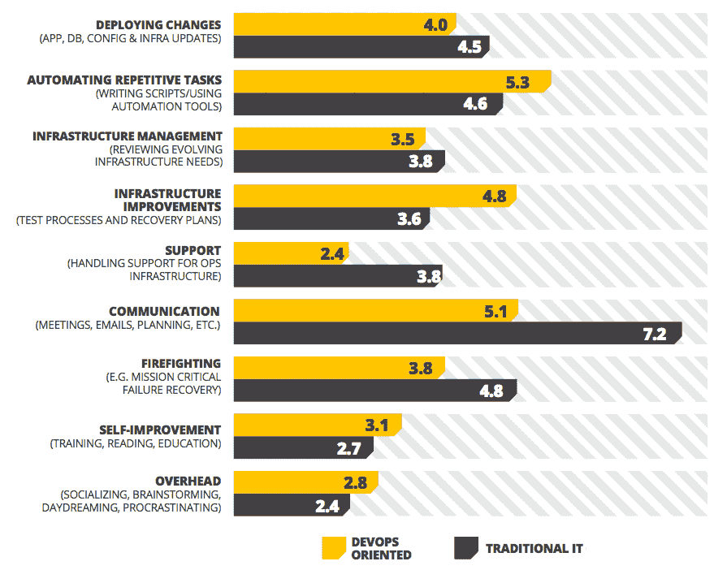

# 比较传统 IT 和面向开发运维的生产力的最新统计数据

> 原文：<https://devops.com/fresh-stats-comparing-traditional-it-and-devops-oriented-productivity/>

*这是一篇[由 Krishnan Badrinarayanan(](https://devops.com/guest-posting-guidelines/ "Guest Posting Guidelines ")[@ bkrishz](https://twitter.com/bkrishz))，ZeroTurnaround* 发表的客座博文

“DevOps”这个词最近被频繁使用。工作公告板上充斥着各种描述的“开发工程师”申请。DevOps 到底是什么？

为了更好地了解这些大惊小怪的事情，我们调查了 620 名工程师，看看他们是如何保持一切正常运转的——从日常活动、关键流程、工具到他们面临的挑战。调查要求反馈在改善基础设施和为重复性任务设置自动化上花费了多少时间；灭火和沟通通常花费多少时间；以及如何让灯一直亮着。然后，我们比较了来自传统 IT 和 DevOps 团队的响应。以下是每周进行关键活动所花时间的结果:

## 我们可以从结果中得出的结论

**面向开发运维的团队花在自动化任务上的时间略多**

几十年来，编写脚本和自动化流程一直是 Ops 剧本的一部分。shell 脚本、Python 和 PERL 等经常用于自动化重复的配置任务，但使用 Chef 和 Puppet 等更新的工具，运营人员可以执行更复杂的自动化，例如[使用 Chef 或 Puppet 食谱启动虚拟机并根据应用程序的需求定制它们](http://zeroturnaround.com/labs/pragmatic-devops-virtualization-provisioning-with-vagrant-chef/)。

**面向传统 IT 和开发运维的团队都积极沟通**

属于开发运维团队的受访者每周花在沟通上的时间少了 2 个小时，这可能是因为开发运维促进了更好的协作，并使开发和运营团队保持同步。然而，传统 IT 团队中的开发人员和运营人员每周要花 7 个多小时进行沟通。这种积极的对话有助于他们更好地理解挑战、设定期望和分类问题。这种交流有多少被认为是低效的是主观的，但是让两个团队都参与进来是必要的。如今，共享工具、即时消息、任务管理器和社交工具也有助于实时拉近每个人的距离。

**以开发为导向的团队救火频率降低**

DevOps 方法的一个关键原则是拥抱失败的可能性，并为此做好准备。通过揭示漏洞和关键指标的警报、持续测试、监控和反馈循环，团队能够快速、主动地采取行动。可编程基础架构和自动化部署提供了快速恢复，同时最大限度地减少了对用户的影响。

**面向开发运维的团队在管理支持上花费的时间更少**

这可能是由于更好的沟通、更高的自动化水平以及大多数支持任务的自助服务工具和脚本的可用性。如果有高水平的配置和自动化，没有理由不将管理支持缩减到非常小的时间消耗。这也可能意味着面向 DevOps 的团队成员比期望得到系统管理员的支持更经常地自助。

**面向开发的团队在下班后工作的天数更少**

我们询问了我们的调查对象，他们每周有多少天在正常工作时间之外工作。以下是我们了解到的情况:

| **下班后的工作日** | **传统 IT** | **面向 DevOps】** |
| 平均的 | Two point three | One point five |
| 标准偏差 | One point seven | One point seven |

根据这些结果，DevOps 团队成员过着更平衡的生活，在自动化和基础设施改善上花费更多时间，在救火上花费更少时间，工作时间更少(尤其是在正常工作时间之外)。

根据我们的调查，与 DevOps 相关的计划在 2012 年和 2013 年名列前茅。人们强烈需要敏捷性来响应不断变化和扩大的市场需求。软件团队面临着帮助满足它们的压力，上面的图表证实了它的好处。

**乐观的统计数据，但难以采用**

****我们是如何来到这里的****

**IT 组织结构——通常是开发、质量保证和运营——的存在是有原因的。开发团队专注于创新和创建应用程序。QA 团队确保应用程序按预期运行。运营团队保持基础设施的运行——从应用、网络、服务器、共享资源到第三方服务。为了及时交付卓越的体验，每个团队都需要一套特殊的技能。**

****挑战****

**今天的用户越来越依赖软件，并希望软件能够全天候满足他们不断变化的需求，无论他们是在办公桌前还是在移动设备上。因此，IT 团队需要快速有效地响应变化并发布应用程序更新，而不影响质量。如果做不到这一点，他们就有将用户推向竞争对手或其他替代者的风险。**

**然而，快速发布应用程序也有其自身的缺点。它给功能上孤立的团队带来压力，并经常导致软件缺陷、延迟和压力。团队之间缺乏沟通进一步加剧了这一问题，导致了相互指责和不良情绪的滚雪球效应。**

****推动文化变革****

**开发和运营团队都为软件开发和交付带来了一套独特的技能和经验。DevOps 仅仅是一种文化，它将开发和运营团队聚集在一起，以便通过理解彼此的观点和关注点，他们可以及时地构建和交付生产就绪的弹性软件产品。DevOps 不是 NoOps。这也不像让一个开发者穿上 Ops 的衣服。DevOps 是协同的，而不是自相残杀的。**

****DevOps 是一段旅程****

**在你的组织中灌输 DevOps 导向的文化并不是你着手去做的事情，也不是你最后成功的事情。采用 DevOps 需要纪律和主动性来将开发和运营团队聚集在一起。阅读其他组织如何将 DevOps 作为一种文化，并从他们的成功和失败中学习。在你的团队中实践有意义的事情。开发一个成熟度模型，可以引导你完成你的旅程。**

**目标是确保开发人员和运营人员在同一页上，在所有事情上一起工作，朝着一个共同的目标:没有交接、洗手或指责的工作软件的连续交付。**

****支持社区和事业****

**开发人员和运营人员需要内省，了解他们的优势和挑战，并寻找有助于打破孤岛的方法。他们应该一起寻求相互教育，从文化上发展角色、关系、激励和流程，并将最终用户体验放在第一位。**

**DevOps 社区很小，但正在蓬勃发展，很容易找到参与的方式，例如在世界各地举行的由社区推动的 DevOpsDays 会议。**

****设定小目标要牛逼****

**团队应该合作设定可实现的目标和里程碑，使他们走上拥抱 DevOps 文化的道路。庆祝小的成功，关注持续改进。在您知道之前，您肯定会逐渐获得将 DevOps 方法引入应用程序开发和交付的好处。**

****从这里开始****

****要更深入地了解以人员、方法和工具为重点的 IT Ops 和 DevOps 工作效率，[下载一份 35 页的报告](http://zeroturnaround.com/rebellabs/ops/it-ops-devops-productivity-report-2013/)，其中包含统计数据和图表。****