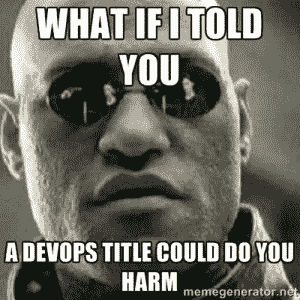

# 在你的职位上有 DevOps 对你是有害的

> 原文：<https://devops.com/having-devops-in-your-job-title-is-doing-you-harm/>

* 本帖原载于 2013 年 5 月[我的个人博客](http://blog.petecheslock.com/2013/05/03/devops-in-your-job-title-is-doing-you-harm/ "Pete Cheslock Blog")。但是我认为这个话题很重要，希望这是我对 DevOps.com 的第一份贡献*

我曾经是 DevOps 的主管…两次。两次都是后来改了标题。我甚至管理了一个 DevOps 团队…尽管在我接手的时候，这个团队已经是这么叫的了。

我已经成为滥用 DevOps 头衔的受害者，我一直看到这种情况。在 DevOps twitter 标签中，人们联系 DevOps 的工作机会…这肯定是真的，对吗？

我是说，这些天我们完全有人在做 DevOps，对吧？我知道我可以从许多类型的公司找到 DevOps 工程师的各种工作描述。

但是，有一个非常重要的原因让你在使用“DevOps”作为你职位名称的一部分之前要三思。

我的朋友们(理所当然地)让我感到悲伤，因为我自己把我在 Dyn 的头衔指定为 DevOps 的主管(对此我仍然感觉很糟糕)。总的来说，我真的很讨厌头衔，这就是当你不在乎你的头衔是什么的时候会发生的事情。

故事是这样的:当我收到 Dyn 的邀请时，我的原头衔是系统自动化和发布工程总监。因为我很确定这不适合写在名片上，所以我接受了这份工作，并要求我们以后更改标题。一晃一个月过去了，在花了大约 20 分钟的时间谈论并试图阐明我的工作描述和头衔之后，我简单地说了一句。就叫它 DevOps 吧，我还有别的事要做。“我太忙了，根本没有时间去关心一个武断的头衔。

快进到 Monitorama 的几个星期后，我和 Mike Rembetsy 聊天。谈了两分钟新工作的进展后，他说，“*哦，这提醒了我，你需要换个头衔。太可怕了。*“我试着说服了他大概三分多钟，主要是想向他表达没关系。然后，他抛出了让我顿悟的知识炸弹。

> 当你是 DevOps 的头，你就“拥有”了 DevOps。如果 DevOps 失败了，那是你的的失败，而这应该是整个公司改变、适应和接受文化转变的失败。

这是作为 DevOps“负责人”或“主管/经理/副总裁”等的主要问题。DevOps 的。”如果 DevOps 在你的公司内部失败了，高管们很容易说“ *”好吧，你是 DevOps 的负责人，所以很明显它失败了，因为你失败了。*

事实上，DevOps 是一种文化，应该被您组织的每个方面所接受。每个人都需要接受 DevOps 文化的变化，不能只有一个所有者。

在那次谈话后不久，我重新启动了我的团队，并将其命名为“DevTools 团队”(这是一个很棒的 Etsy 推荐)。我越想越觉得它准确地描述了我们所做的工作。我们为开发人员(和 Ops/QA/NetSec)构建所需的工具，让他们花更多的时间编写代码，花更少的时间处理分心的事情。

我知道有些人想有一个 DevOps 团队，或者想把自己的团队叫做 DevOps 团队。Jez Humble 去年写了一篇精彩的博文，我强烈推荐你阅读。他总结说，在某些情况下,“DevOps”团队标签是有效的，我确实同意他所说的。但不要只是给一个团队贴上 DevOps 的标签，指派一个新的 DevOps 经理，然后奇怪为什么三个月或六个月过去了，事情仍然很糟糕。事情仍然很糟糕，因为你所做的只是改变一个团队名称，或者给一个全新的团队一个名称，或者在某些情况下，只是创建了一个新的筒仓，称为“DevOps 团队筒仓”。

## 好吧，那我该叫自己什么？

以下是开放空间中出现的一些例子:

*   现场可靠性工程师
*   自动化工程师
*   发布工程师
*   开发工具工程师

我不知道为什么最近有必要改变我们过去使用的职称，好像它们有一些负面的含义。这并不是说工作真的发生了很大的变化；那就是我们正在用我们所掌握的工具变得更好、更有效率。工具发展得如此之快，它使我们能够更好地工作，但前提是你愿意学习新的东西。

*   系统管理员
*   运营工程师
*   网络工程师

最后，头衔真的不太重要，也不应该太重要。但它们实际上可以在内部产生更强大的(负面)影响，让你成为一种应该被所有人接受的文化的主人。但有一点我认为非常重要，需要重复一遍:

**如果 DevOps 失败了，那应该是整个公司的失败。**

看看我的演讲“[如何留住你需要的人](https://vimeo.com/65544302 "How To Keep The People You Need")”，我在这里讨论了招聘和留住你难以填补的职位。还可以查看 DevOps 上的[面板，上面有来自 Dyn 极客夏令营的 Twitter 的丰富信息。](https://dyn.com/geek-summer-camp-video-devops-culture-panel-twitter/)