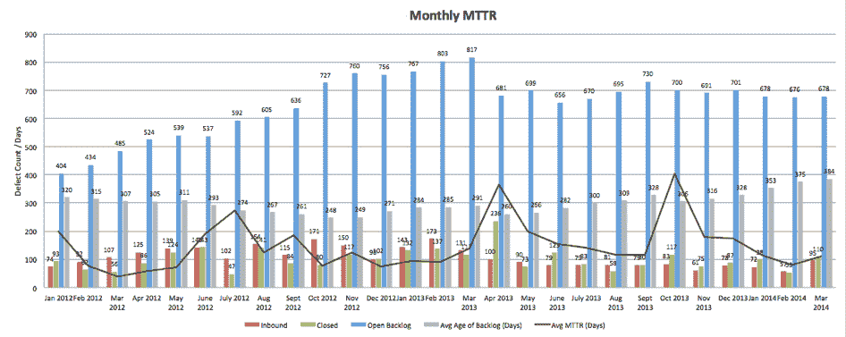

# DevOps storytime: MTTR vs .古德哈特定律

> 原文：<https://devops.com/devops-storytime-mttr-vs-goodhearts-law/>

我不喜欢度量标准。等等。这是不对的。让我再试一次。我不喜欢袖手旁观自己的单一指标。没有。这还是不对的。我讨厌袖手旁观化的单一指标，好像它们本身就是问题的解决方案。好的。那行得通。让我解释一下。

上周，我讲述了一个进入 DevOps 的秘密通道的故事，叫做平均解决时间(MTTR) ,并解释了这个微小指标的引入是如何神奇地打开了 DevOps 的大门。鉴于 MTTR 和周期时间密不可分，任何认真对待 MTTR 的商店迟早会发现自己在使用 DevOps 实践。

**度量+狡猾的人类=厄运**

这与两周前我讲的完全不同。这是一个关于 DevOps 的起源和根基如何给 DevOps 运动一个机会去做 ITIL 不能做的事情的故事。改变业务和 IT 之间的关系。在讲述这个充斥着简化论和形式主义等哲学术语的故事时，我引用了杰出的英国经济学家 [Charles Goodheart 的话，他指出“当一个衡量标准成为目标时，它就不再是一个好的衡量标准”](https://en.wikipedia.org/wiki/Goodhart's_law)。古德哈特发现，“任何观察到的统计规律性，一旦出于控制的目的对其施加压力，就会趋于崩溃。”外行人的解释是，人类是狡猾的小家伙，会找到人为击中任何目标的方法，因为定量系统总是可以被操纵。

那么 DevOps 航海家号要做什么呢？引入度量，得到改变，然后继续看 devops 慢慢死去？不，我的德沃普斯奉献者伙伴们，这不是我们的命运。我们可以避免这种命运，因为我们知道在被称为 MTTR 的秘密通道的中途，有一个岔口！

**更多指标来拯救世界！**

与其单独介绍和展示一个平淡无奇的 MTTR，我们可以自己变得狡猾一点，找到一个适当的对冲古德哈特的谎言，而不是展示一个带有其他一些关键指标的 MTTR 加权视图，以允许对 IT 工厂车间的健康状况有一个更复杂的视图。

> *应用加权平均值*–根据优先级对缺陷及其相关解决方案的 MTTR 进行加权，以有意将测量结果向优先级最高的缺陷倾斜。坚持无缺陷软件的绝对观点对于资金和时间有限的大型代码库是行不通的(除了通过 godels 证明在科学上是不可能实现的)
> 
> *跟踪入站缺陷数*–跟踪并呈现入站缺陷数，保持入站缺陷数较低很重要，但将其推至零更有可能表明商店更关注完美而非产量
> 
> *跟踪出站缺陷计数*–跟踪并展示缺陷关闭计数。保持负的进出差价是一个商店正朝着正确方向前进的标志。几周或几个月的正差异是一个警告信号，表明质量思维正滑向危险的区域。
> 
> *跟踪积压缺陷计数*–跟踪并呈现积压中的缺陷计数。在拥有大型代码库的大型企业中，维护零积压是非常困难的。根据我的经验，20 和 50 是不祥的数字。一个应用程序中的缺陷超过 20 个，积压就会变成一只可怕的野兽，只能通过停止工厂来驯服。超过 50 个，任何新缺陷的增加都显得微不足道。
> 
> 跟踪年龄缺陷——跟踪积压中缺陷的平均年龄对于任何 MTTR 的展示都是至关重要的。如果 MTTR 的一个峰值代表了一波从积压工作中清除旧缺陷的浪潮，那么它实际上可能是一件好事。

**抵制简化的冲动**

五个部分的指标回避了平衡记分卡方法和评分公式的问题，尽管我相信这种策略对于可用性和性能仪表板的价值，但我建议您强烈抵制在这里应用它的诱惑(否则，我们就又回到了我们从古德哈特定律开始的地方。该死的狡猾的人类！).

如果您决定将 MTTR 的神奇指标引入您的商店，这种类型的报告可能是从小处着手比什么都不做更糟糕的一个领域。没有细致入微的视图，就不可能真正了解商店的健康状况。更糟糕的是，对公正的 MTTR 的平淡看法有可能掩盖真正的问题并提出错误的问题。

当您将所有指标放在一个视图中时，如上图所示，真正的信息就变得清晰了。工厂车间的健康状况并不是由一个简单的数字决定的。三个、四个或五个数字也不能完全说清楚。真正的健康在趋势中变得清晰。你的商店一周比一周好吗？月复一月？游戏的名称是每天都变得更好，MTTR(以及其他一些指标)可以成为推动您的 IT 世界的杠杆。