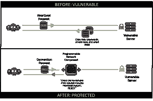

# 网络中的可编程性:停止流血的心脏…

> 原文：<https://devops.com/programmability-network-stop-heartbleed/>

 一个安全漏洞能让整个互联网议论纷纷的情况并不常见。不仅仅是互联网上的安全社区，而是所有人。最终用户和 IT 人员都在寻找答案，并试图减轻心痛。它有自己的网站和标志。这是件大事。

许多服务提供商已经修补了他们的系统，但互联网上有很多网站，估计其中有相当多的网站容易受到攻击。

[Netcraft 指出，基于 OpenSSL 的 Heartbleed，](http://news.netcraft.com/archives/2014/04/08/half-a-million-widely-trusted-websites-vulnerable-to-heartbleed-bug.html)“影响了大约 17%的 SSL 网络服务器，这些服务器使用由可信的证书颁发机构颁发的证书。”Netcraft 的“最近的 [SSL 调查](http://www.netcraft.com/internet-data-mining/ssl-survey/)发现，17.5%的 SSL 站点启用了 heartbeat 扩展，约占可信证书颁发机构颁发的 50 万份证书。”Netcraft 是关于当今使用的 web 服务器软件的最可信的数据来源之一

但可能易受攻击的不仅仅是服务器软件。数据路径中任何终止 SSL 并基于 OpenSSL 的设备都可能易受攻击。任何可能使用 OpenSSL 实现安全通信并接受连接的“东西”都可能是易受攻击的。换句话说，现在互联网上到处都是流血的心，互联网要堵住漏洞可能需要相当长的时间。

这个漏洞本身相当简单——它利用了运行在 TLS 和 DTLS 之上的看似无害的元[协议的错误处理，该协议由两种消息类型组成:**心跳请求**和**心跳响应**。它用于在安全连接中“ping”另一方，以确保对方是活动的。它可以用来补偿空闲时间，否则空闲时间可能会导致连接超时。](https://tools.ietf.org/html/rfc6520)

由于缺少对消息结构的边界检查，它还可以任意地、完全静默地获取 64 千字节的服务器内存。该内存可能包含敏感信息，如用于加密通信的私钥、密码或重要文档。

当易受攻击的软件获取内存时，内存中的任何内容都会以比猫王更快的速度离开大楼，而且不留痕迹。没有日志，没有失窃的证据，什么都没有。它很干净，互联网上的任何人都可以远程执行。这或许可以解释它目前受到的关注。

任何漏洞的答案最终都是修补它。根据受影响的服务器或系统数量，这可能需要组织花费几天时间—假设补丁程序立即可用。与此同时，心脏仍在流血，防止更多信息泄漏的唯一方法是关闭软管。

但这不是唯一的方法。

现在，数据路径中的可编程性可以缓解这一问题。就现在。就像接下来的五分钟。

让我们简单回顾一下网络中的可编程性:在数据路径中，有一个设备。该设备(或软件)能够以编程方式截取、检查和转换通过它的数据。这意味着这种系统可以拦截发起 SSL/TLS 流量的请求，对其进行检查，如果发现请求包含心跳支持，它可以拒绝连接。

有趣的是，早期 SDN 架构的主要推动因素之一是通过将新协议或实验性协议插入网络中的数据路径来支持它们的能力。虽然这是学术界的一个驱动因素，但对企业来说，更现实的驱动因素是与传输中的协议进行交互并“修复”它们的能力——特别是当“修复”涉及到防止利用漏洞时。

网络中的可编程性使得这种对威胁的快速响应成为可能。能够非常快速地部署解决方案以防止进一步的数据泄漏，为组织和与其财产交互的人(员工、合作伙伴和客户)提供了保护。这也为 It 提供了时间来修补和更新所有受影响的系统，而不会留下漏洞或采取彻底关闭的极端措施，直到情况得到解决。

通过启用“基础设施即代码”的视图，可编程性不仅实现了部署服务的更加面向软件的方法，而且实现了快速创建和部署对新出现的威胁的适当响应的面向软件的方法。

devops 方法可以促进这种能力，并将保护作为代码推入网络。