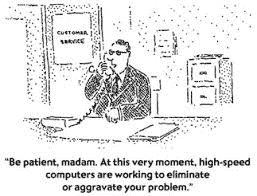

# DevOps 价值流不是 SOP

> 原文：<https://devops.com/devops-value-stream-sop/>

# devops #精益不要把做得更快和效率更高混为一谈。

开发运维的大部分重点仍停留在实施层面，即通过任务自动化和流程编排来提高效率。虽然这不是一件坏事，但这种对活动部分的微观关注可能会导致在宏观层面获得的效率损失。

及时发布周期的最大阻碍之一不是活动部分，而是执行这些活动部分的过程。有问题的不一定是投入生产的实际推进，而是当它们跨越内部组织边界时，完成某些任务所需的时间长度。

例如，许多年前，我们开始将新的应用程序推向生产的过程——web 应用程序。这显然需要改变公司的防火墙。完成这一改变的“过程”实质上是在防火墙上为预定的公共 IP 地址打开一个端口，需要网络、安全和架构团队至少五个不同的签名。只有两个安全角色被允许批准此类更改，并且该流程被记录为需要长达 15 天才能在一张纸上签名并随后更改规则。

 这不是任务等级的问题。这不是执行问题。在防火墙上做改变并不困难。这完全是一个过程。计划发布意味着不仅要考虑应用程序本身的准备情况，还要考虑其支持服务，包括网络。

这就是为什么 DevOps 应该从审查用于将应用程序发布到环境中的流程开始(无论是测试、QA 还是生产)。规划流程是找到瓶颈的第一步，这些瓶颈可能会导致应用程序延迟进入其生命周期的下一个阶段。

简单地自动化一个现有的过程可能不会提供 DevOps 支持者所期望或吹捧的价值，因为如果过程很糟糕，你最终只会做得更快。

换句话说，DevOps 的价值不一定在于简单地自动化 SOP(标准操作程序)。

> 初始价值流图捕捉当前存在的流程。这就是所谓的“现状”它是实际的流程，应该通过观察当前的流程并让流程中的人员参与进来来创建。不要犯从程序手册 中提取流程图的错误。映射的最佳技术是成为通过过程的单元(“事物”)。例如，在保险业，它可能是政策。在汽车行业，可能就是车。在每种情况下，价值流图都以请求单元开始，即保险单或汽车。[强调我的]
> 
> [http://www . golean six sigma . com/how-to-visualize-a-process-with-a-value-stream-map/](http://www.goleansixsigma.com/how-to-visualize-a-process-with-a-value-stream-map/ "http://www.goleansixsigma.com/how-to-visualize-a-process-with-a-value-stream-map/")

对于应用程序部署,“东西”是……一个应用程序，并且应该根据实际发生的情况来映射流程。只有当您绘制了流程图后，您才能评估流程中的瓶颈，并理解流程中每个团队增加价值的步骤。价值被定义为将事物(应用程序)推向最终目标的任何步骤。然后以百分比来衡量效率；具体来说，它是增值时间占完成流程所需总时间(周期时间)的百分比。

不要把做得更快和更高效混为一谈。如果循环的每一步都是自动化的，实际的流程效率并没有改变。DevOps 的最终目标应该是提高这些流程的效率，而不仅仅是更快地完成已经完成的工作。

一些提高效率的机会肯定会出现在与其他组织团体的交流中。也许是因为如果你事先有相关的数据或信息，一个过程步骤可能不会花那么长的时间。如果你浪费时间等待一些信息，那就不是增值时间。只是周期时间。更多的周期时间会因浪费时间而使整个流程超载，从而降低效率。提前收集更好的信息有助于减少等待时间，并立即提高流程效率。

正是这些改进的机会在企业领域中特别有用，在企业领域中，问题不在于试图一天完成十个部署，而在于流程的可预测性和效率，这使得团队能够根据需要完成指定的变更窗口。

DevOps 与工具或手动任务的自动化无关。这关系到全局，这意味着通过流程再造、流程编排以及自动化来提高效率。专注于 DevOps 的微观方面只会确保如果你做错了，你会做得更快。退后一步，看看大局，找到那些真正导致组织效率低下的流程步骤。