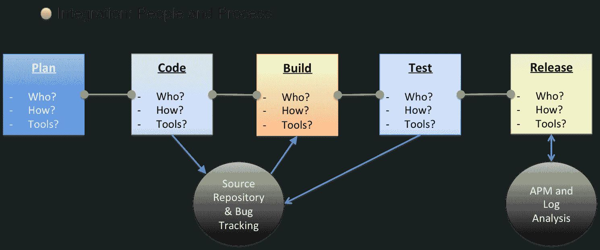

# 交付渠道是您的 DevOps 签名

> 原文：<https://devops.com/delivery-pipeline-devops-signature/>

DevOps 在哪？寻找它就像在彩虹中寻找金罐。在开发团队的生命周期中，没有任何一个元素将他们定义为支持 DevOps 的组织。如果有彩虹和黄金，那就是运输管道。部署管道以团队和流程为中心，是任何开发运维团队的标志。

每个组织都有一个部署管道。他们可能不会这样称呼它，但是要将它们从概念应用到产品，它们都要经过一系列的步骤，最终成为常规。

这些年来，部署管道已经发生了很大的变化，并且已经被几种方法管理，从瀑布到敏捷和看板。当 DevOps 演变成今天的样子时，管道自己折叠起来，从一开始就无法区分终点。

尽管每个组织都有一个管道，但许多组织并没有定义它。因此，很难就开发过程进行全面的对话。它们倾向于特定于一个组件，如 QA 或单元测试。而不是整个过程和团队。这导致了脱节的团队和过程，我的朋友们，这不是 DevOps。

定义管道的好处是:

1.  知道你拥有什么
2.  知道你没有什么
3.  了解你的瓶颈
4.  在一个地方看到您的整个操作
5.  最终有机会提高

我和几个并非自下而上的开发组织谈过。他们的操作随着他们的应用程序一起发展，结果是喜忧参半。

有些人成功地完成了迁移，有些人则没有。有些人一下子就做完了，有些人花了一些时间。我发现他们都在纠结从哪里开始。许多人会跳到某个工具上，却发现飞溅的伤害破坏了操作中的一切。

一些人决定重新组建一个全新的团队，暂时并行运行两项业务。这种方法创造了奇迹，但是政治和人力资源的混乱持续了一段时间。对于那些愿意随时间发展的人来说，从哪里开始的一致答案是记录管道并寻找自动化和改进的地方。这种方法允许他们在 DevOps 中一次构建一个部分，为团队的功能和文化快速失败和快速迭代做准备。这也允许更大的组织随着时间的推移而发展。

我不能指出确切的正确方法。虽然后两种情况持续至今，但第一种仍然是最常见的。虽然 DevOps 的想法是快速行动，但要想成功，必须有一些元级计划。工具很棒，但它们不是灵丹妙药。

管道组件通常非常相似:

1.)计划

*   a.路标
*   b.票
*   c.积压

2.)代码
3。)打造
4。)测试

*   a.单元测试
*   b.整合测试
*   c.功能测试

5.)发布

*   a.转移到舞台
*   b.到生产

6.)操作

*   a.班长
*   b.报告

7.)冲洗并重复

一些组织可能会跳过一些步骤，但是这些类别是普遍存在的。每个类别的详细信息不是。每个组织在每个类别中都有不同的团队、工具集和过程。没有 cookie cutter 管道，因为应用程序不是 cookie cutter。如果是，就不需要开发者了。

正是这些细节在他们的管道文档中被忽略了。例如，如何进行集成测试？谁做的？你使用什么工具？什么是自动化的，什么不是？你能自动化什么？关于工具的对话每天都在不同的小组和主题中偶然发生，但很少是关于综合单元的讨论。忽略这一点会导致非故意的流程变更，从而导致科学怪人。

对于管道中的每个阶段，我希望看到:

谁做的？他们是如何做到的？
效果如何？
如何改进？

每次你完成这个练习，你都有一个你整个过程的快照。随着您不断更新这个管道视图，您将看到团队是如何改进的。例如，如果您将一个自动化的组件引入到一个手动流程中——也许 Jenkins 用于自动化发布到登台——然后检查您的手动发布到生产是否仍然有效，您已经向前迈出了一大步而没有严重的中断。

围绕您的交付渠道创建、记录和构建对话是将团队过渡到开发运维的最佳方式。这将缓慢但肯定地增强你的开发过程。