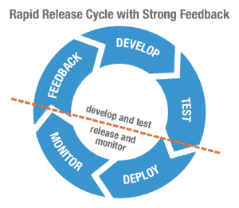

# 交付频繁、高性能版本的 DevOps 方法

> 原文：<https://devops.com/devops-approach-rapid-release-cycles/>

我们生活在一个应用驱动的世界。应用程序推动业务发展，提供连接，并帮助实现目标和满足客户需求。在竞争激烈的世界中，随着我们的用户要求更多的功能，需求会快速发展，同时希望全天候的可用性和可靠性，无论他们使用的是智能手机、平板电脑还是计算机。

### 满足用户需求

作为 IT 人员，无论我们是在开发部门还是在运营部门，我们都需要经常发布新的应用和功能来满足用户的需求，否则我们就有可能被竞争对手或替代者抢走。我们怎样做才能保持领先？我们通过以下方式更快地发布更新:

*   围绕小团队组织并交付更敏捷的版本
*   尽可能自动化(测试和发布过程)
*   将可用的更新部署到生产环境中

然而，不幸的事实是，频繁的更改经常会导致生产中的错误和不稳定。我们需要在大获成功之前仔细审视我们的流程和实践，从而降低风险。

### 为快速频繁的应用程序发布做准备

这里有两个问题(在许多其他问题中！)阻碍我们提供频繁的更新，同时确保可靠性:

*   **冗长的发布过程**:开发人员拥有大量的协作工具、看板、构建工具和敏捷实践，能够快速构建特性。但是一旦涉及到通过 QA、试运行和生产发布这些变更，这个过程就更加手动、特别和缓慢。
*   **生产中的不可靠性**:在开发中按预期运行的代码在生产中有时会失败。生产环境受到第三方服务、地区 ISP、防火墙等的限制。它们通常与开发和 QA 环境非常不同。

### 为一个单一的目标合作

开发和运营团队来自不同的思想流派。开发人员推动变革，运营人员推动稳定。虽然他们都渴望提供给用户增值的优秀软件，但他们的目标却截然相反！我们需要的是一种文化，在这种文化中，开发和运营团队从彼此的经验、观点、关注点中吸取经验，并不断改进流程，以快速构建和交付弹性应用程序，并交付到客户手中。这需要纪律、相互尊重的意识、对大局的关注以及对实现业务目标的坚定承诺。

### 简化和自动化发布

开发人员通过他们的协作和构建工具来享受简化的流程，从而有效地发布产品。然而，操作人员却没有同样的好运。通常，他们从团队的不同成员那里获得工件、脚本和资源，并按顺序运行它们，以便部署和测试应用程序。这种协调和自动化的缺乏大大减慢了发布过程。以下是你可以开始解决这个问题的方法:

*   批判你的过程 : 依赖在哪里？有没有可以整合的冗余？瓶颈在哪里，是什么造成的，它们有多贵？从能带来巨大进步的小机会开始。

*   自动化:一旦你优化了发布过程，就要开始自动化了。从重复性任务中节省下来的时间和精力可以用于创新和增值。

### 一旦发布，监控质量

通过自动化发布管道中的步骤，您可以在提高发布速度的同时确保最佳的质量。然而，再多的准备也不能保证生产中的预期结果。您无法控制的因素(如网络流量、第三方服务、本地 ISP 或浏览器)可能会影响用户体验或中断服务。许多这样的中断已经非常公开。我们需要的是一个强大的反馈循环，每个版本都要衡量性能、异常以及最重要的最终用户体验。  **小心性能的细微变化**细微的变化会改变您的应用程序的最终用户体验，让您失去客户和品牌忠诚度。这是百万针刺的死亡。缓慢的应用程序、JavaScript 错误和 404 对于拒绝用户非常有效。这就是应用程序性能监控工具(如[Riverbed steel central app internals](http://www.riverbed.com/products/performance-management-control/application-performance-management/for-transaction-tracing.html))帮助诊断降低应用程序性能和行为的问题的地方。他们从用户的设备上监控终端用户体验，通过应用层和基础架构跟踪事务，并诊断应用程序代码的性能问题。这些见解为开发人员提供了快速修复生产中出现的问题所需的可见性，而无需经历重新创建和分析这些问题的痛苦过程。

### 持续监控端到端应用性能

**监控您的应用程序在生产中的性能和行为。让这项活动在高峰和非高峰时间都持续进行。对您的应用程序和基础架构健康状况的敏锐洞察力可以发现一些原本不会被注意到的障碍。您真的想寻找损害最终用户体验的症状，例如:**

*   **我的服务器和基础架构在当前容量下表现如何？**
*   **与其他地方相比，一个地方的用户表现如何？**
*   **我的应用程序的哪些部分(内部或第三方)会影响性能？**

### **使用性能监控工具诊断问题**

**诊断这些症状出现的位置和原因。他们是因为糟糕的代码，网络条件，服务器容量，还是第三方服务？这些问题发生的背景是什么？哪个代码段、SQL 查询或 app 组件有问题？您将能够打包开发团队修复问题并防止其再次出现所需的一切。这些工具中的许多，比如 AppInternals，允许开发人员从 Eclipse 和 Visual Studio 等 ide 中查看这些信息。**

### **总之，以持续改进为目标**

**特别是在快速释放周期的情况下，持续监控是必要的。在运行时(QA 和生产中)识别症状，并使用工具捕获的诊断数据快速修复它们。这将减少积压，让您的 IT 团队高效并专注于交付新功能，让您的客户满意。**