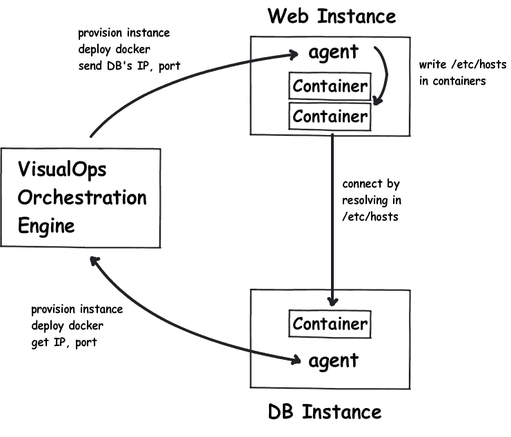
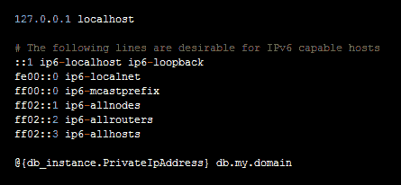

# Docker 正在离开不可变的基础设施吗？

> 原文：<https://devops.com/docker-leaving-immutable-infrastructure-2/>

根据 Chad Fowler 的定义，不可变的基础设施可以定义为:

*“服务器(或任何东西)被部署一次并且不被改变。如果它们由于某种原因被更改，它们将被标记为垃圾收集。现有服务器上的软件从不升级。取而代之的是一台新的功能相当的服务器。”*

尽管这个想法很强大，但实现起来却非常困难，尤其是对于虚拟机管理程序。因此，DevOps 社区从 Docker 发布到上市就一直支持它，因为它具有构建不可变基础设施的能力，这得益于它的分层映像方法和超快的“启动”性能。

然而，上周 Docker [向我们所有人介绍了一个新功能，允许“可写/etc/hosts、/etc/hostname 和/etc/resolv.conf”:](https://blog.docker.com/2014/08/announcing-docker-1-2-0/)

*"您现在可以在运行的容器中编辑/etc/hosts、/etc/hostname 和/etc/resolve.conf。如果您需要安装 bind 或其他可能覆盖其中一个文件的服务，这将非常有用。但是，请注意，对这些文件的更改不会在 docker 构建期间保存，因此不会保留在结果映像中。这些更改只会“粘”在运行的容器中。*

这是一个有趣的举动，因为*可写*特性打开了另一扇门。事物不再一成不变，至少不是 100%。例如，您可以更改正在运行的容器的状态。现在的问题是:Docker 下一步将走向何方？他们正在远离“不可变的基础设施”吗？如果是，那么“不可变的基础设施”是错误的吗？

答案是有也没有。

不变性本身是构建、部署和操作应用程序的一种非常有价值的方式。但是像所有的模式一样，也有一些取舍。

讨论最多的 Docker 的好处之一是跨不同部署的一致性:开发、qa、试运行、生产等。但是，总有一些特定于上下文的配置，例如 IP、dns 名称。因此，这些参数必须在运行时设置，而不是硬编码在“只读”映像中。关于如何解决这个服务发现问题，有各种各样的想法[1][2][3]。然而问题仍然是，所有这些解决方案或多或少都会对代码和应用程序造成干扰，这意味着在测试理论时需要付出相当大的努力。然后，整个事情就变成了基于个人喜好的决定。尽管我们当然都希望有更好的方法来管理基础设施，但 100%不变的工程成本对许多人来说是一个具体的难题。

—

新的*可写*特性为我们提供了在运行时非侵入性地确定配置的选项，因此不会花费您太多的精力，同时保持不变性。假设您正在部署一个 WordPress 应用程序，它涉及 web 层容器和 DB 容器。您当然不希望对数据库实例的 IP 进行硬编码，也不希望引入 *etcd* 集群，这会增加更多要管理的移动部件，并增加失败的几率。相反，编排工具可以通过利用 Docker 的*可写*特性来完成这项工作:

如上图所示，编排工具将负责所有繁重的工作，从实例供应、容器部署，到在 web 容器中正确设置 */etc/hosts* 文件。更重要的是，如果您的数据库实例的 IP 发生了变化，编排引擎将自动重写 */etc/hosts* 来修复数据库连接。而你需要做的只是在 */etc/hosts* 中指定以下内容:

很简单，对吧？

**总之**

虽然 Docker 为代码部署奠定了良好的基础，并且在尽可能保持单元不变方面特别有用，但是部署上下文在服务发现中起着重要的作用。通过利用新的 ***可写*** 特性和 ***编排*** 工具，人们可以真正受益于不变性，同时避免必须进行太多的更改。

[1][smart tack](https://nerds.airbnb.com/smartstack-service-discovery-cloud/)【2】[和 CD](https://github.com/coreos/etcd)【3】领事