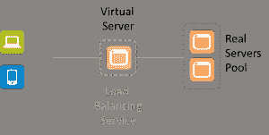

# 供应与配置示例

> 原文：<https://devops.com/provisioning-versus-configuration-example/>

几周前[,我写了关于配置和供应的区别](https://devops.com/blogs/provisioning-vs-configuration/),主要指出了两个任务之间的*区别*。这仍然是一个重要的区别，因为它确实是橡胶遇到道路(或应用程序遇到网络)的地方变得重要。由于基础设施/网络方面是我们集中精力应用 DevOps 的地方，因此有必要更深入地探讨这个主题。

因此，今天我们将研究两个具体的例子来说明这种差异，以及它的重要性。

您的应用程序正在部署，它需要一个负载平衡器，这是奇迹中的奇迹。原因，弹性。规模。你知道，多云的东西。

因此，您可以抓取黄金映像，并使用您最喜欢的负载平衡工具(HA 代理、Nginx、F5 等)启动虚拟机。瞧啊。你准备好了，对吗？

一点也不。是的，您已经提供了负载平衡服务。但是配置好了吗？大概不会。除了所需的基本网络(IP 地址、VLANs 等)，还有一大堆非常**应用特定的**东西必须进行**配置。**没有“黄金”负载平衡服务可以通用于您的应用。句号。虚拟服务器(向外界展示您的应用程序)至少需要两样东西:一个 IP 地址和一个可供选择的应用程序实例池。

这意味着在供应之后必须进行一些**配置**。没有一个单一的 LB 映像适用于所有应用程序。即使所有其他设置都相同(LB 算法、L7 应用程序路由规则、TCP 选项等..)您仍然必须告诉它从哪个真实服务器池中选择，以及使用哪个 IP 地址，以便客户端可以连接。

几乎所有支持应用程序部署的应用程序服务(基础设施)都是如此。因为没有一个黄金映像可以“适用于”所有情况，也没有办法对所有情况使用动态配置选项(用于 IP 地址的 DHCP 是一回事，但目前还没有“动态负载平衡算法选择”服务)，所以在供应发生后，仍有一组选项必须进行配置。考虑像 web 应用程序防火墙(WAF)这样的应用程序安全性。必须对其进行配置以保护特定的应用程序。它必须学习 URIs 和预期要交换的数据，这样它才能识别某些交互何时超出界限并具有潜在的危险。这是应用程序特有的，因此在**供应**之后，它需要一些特定的**配置**。

注意到这一区别很重要，以免我们陷入这样一种信念，即我们可以简单地创建所有网络基础设施和服务的黄金映像，然后只需按一下按钮就可以投入生产。

这个小事实也有助于理解为什么所讨论的网络服务是在定制硬件上启动还是在现成的服务器上启动并不重要。自动化网络服务部署的大部分工作是在**配置**中，而不是在供应中。

虽然您可以最大限度地减少所需的调配后配置量，但您无法完全消除这种情况。这就是为什么支持 API 的可编程基础设施是更大的 DevOps 图景中的一个关键部分。正是 API、可编程模板和类似的功能使得配置能够自动化和协调，从而不会成为部署过程中的瓶颈。