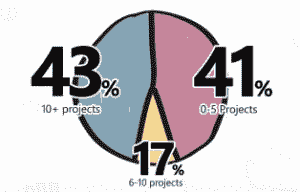

# 正确选择要开发的第一个项目

> 原文：<https://devops.com/right-picking-first-project-go-devops/>

当开始一项新计划时，最难做的事情之一就是选择正确的项目去做。我应该从 App A 开始吗？App B？只要我开始做 DevOps 的事情，并向管理层证明它的价值，这真的重要吗？

是的，实际上，有可能。

如果你仔细想想，你做 DevOps 的原因之一不仅仅是因为它很酷(当然，它很酷，但很少被业务人员接受)，而是因为它将通过缩短上市时间、降低风险和降低运营成本以一种或多种方式增加价值。如果你选择开发的项目不能展示这些好处(或者不能在合理的时间框架内展示这些好处)，那么你可能一开始就选择了错误的项目。

那么如何选择呢？那么，从使用敏捷方法开发的应用程序开始怎么样？

根据 VersionOne 的[“第八届年度敏捷状态](http://www.versionone.com/pdf/2013-state-of-agile-survey.pdf)”调查，88%的受访者正在实践敏捷开发，这意味着你应该不难找到一个。

除非，如果你不注意的话。然而，高采用率并不一定意味着高饱和率。

 深入调查一下，你会发现敏捷并不用于每个项目。相反，敏捷和传统(瀑布)方法学得到了很好的应用。超过一半的受访者使用敏捷来管理超过 50%的项目，而另外 48%的受访者使用其他方法。

其中提供了一些有趣的策略，帮助您在墙的另一边(也就是您，在 operations land)开始使用 DevOps。

一方面，最需要提高部署速度(上市时间)的项目可能是那些使用敏捷方法开发的项目。前面提到的调查证实了这种方法，采用敏捷的首要原因是“加速上市时间”敏捷的一般前提是快速、频繁的更新，这使得部署到生产中的需求成为更紧迫的优先事项。选择使用敏捷方法开发的应用程序意味着您将能够在工作时实践、改进和优化流程，以实现部署自动化。由于敏捷开发的项目往往需要部署的频率，这给了你在自动化和优化上实践类似技术的机会。

你将能够自动完成单个任务，并在进入下一个、下一个、下一个任务之前彻底测试它们，直到你协调好整个过程([是的，弗吉尼亚，这是有区别的](https://devops.com/blogs/enterprise-devops/automation-versus-orchestration/))。然后，您将有充分的机会优化流程，发现信息收集和传播到流程中的冗余或低效之处。流程的优化意味着更高的效率，尤其是如果你能消除任务之间那些[所有重要的等待时间。](http://www.informationweek.com/strategic-cio/enterprise-agility/youre-fast-great-are-you-efficient/a/d-id/1278911)

这里的关键是你必须知道哪些项目是使用敏捷方法开发的，哪些不是。这意味着与开发者交流。不仅仅是发一封电子邮件，索要一份清单，而是真正地与他们交谈，了解哪些项目可以从缩短上市时间中受益。与只有少数人用于非关键用途的应用相比，让一个作为竞争优势载体的应用更快上市，似乎能获得更大的投资回报。您必须深入研究并确定哪些敏捷项目最需要敏捷部署，然后决定从哪里着手。

这并不意味着不常部署的应用程序不会从敏捷中受益。他们肯定会，尽管 DevOps 给这些应用带来的好处更多的是稳定性和一致性，而不是缩短上市时间。

重要的是决定你的 DevOps 目标是什么，以及哪些好处最值得(因为从时间投资的角度来看，它不会很便宜)。在不经常使用但任务关键的应用程序上获取 DevOps 可以降低与生锈流程相关的风险，并提高整体稳定性。自动化此类应用程序的部署肯定可以节省时间和资源，这些时间和资源可以重新分配给需要更高部署速度的敏捷项目。

但是如果你想展示价值和投资回报，你可能会选择一个敏捷开发的项目，这个项目已经存在并且需要一些关注。不仅因为它将更快地显示价值，而且因为它的发布足够频繁，以至于您实际上有机会改进(并且希望优化)您的自动化和编排。