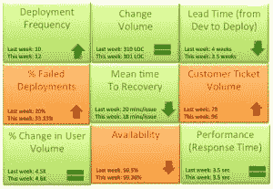

# DevOps 记分卡

> 原文：<https://devops.com/devops-scorecard/>

去年年中，我们的团队从敏捷转向开发。当我们开始尝试了解 DevOps 并同时实践它时，团队中出现了很多问题。这与敏捷有什么不同，最重要的是*我们如何取得成功？*

那时，我们写下了我们团队的成功标准:***频繁发布代码而不导致客户中断***。

随着团队的成熟，我们开始评估一种更精细的方法来跟踪成功。团队口号可以分解成可以用记分卡表示的可量化的成功指标吗？根据我们的经验，DevOps 记分卡应该包含这些 **9 个指标来跟踪 DevOps 团队的成功:**

1.  **部署频率**:我们多长时间部署一次代码，并从客户手中获得新代码？这一指标应该每周都呈上升趋势或保持稳定。例如:每周两次，每天 50 次
2.  **变更量**:对于每个部署，我们交付了多少用户故事和新代码行？例如:每天 3 个新特性，平均每周 500 行新代码。除了数量之外，另一个要考虑的参数是变更的复杂性。
3.  **交付时间(从开发到部署):**从 A/B 测试到生产中 100%部署和升级，从开发到完成代码平均需要多长时间？随着团队更好地把握生命周期，交付时间应该会减少。
4.  **部署失败的百分比:**导致停机或用户负面反应的部署失败的百分比是多少？这一指标应该会随着时间的推移而降低。例如:本月 9%的部署失败，而上个月为 15%。该指标应结合变更量进行审查。如果变更量很低或者保持不变，但是部署失败的百分比增加了，那么可能在某个地方出现了故障。
5.  **平均恢复时间:**当我们确实失败时，我们需要多长时间才能恢复？这是一个真实的指标，表明我们在处理变化方面做得有多好，并且随着时间的推移，这种情况应该会理想地减少。由于以前没有遇到过的复杂问题，您可以预期这个数字会出现一些峰值。示例:上周，团队平均花费 15 分钟解决每个问题，本周花费 14 分钟。
6.  **客户票据量**:客户产生的提示服务问题的数量。这是客户满意度的一个基本指标。例子:本周生成了 54 张票，而不是 38 张，而用户量保持稳定不是一件好事
7.  **%随着新用户的加入，我的基础架构能够满足需求吗？示例:本周，由于外部事件导致请求量上升，客户数量激增了 30%**
8.  **可用性**:我的服务的总体正常运行时间是多少，我是否违反了任何 SLA？例如:即使用户量发生变化，过去 3 个月的正常运行时间仍保持在 99.9%
9.  **性能(响应时间):**我的服务是否在我预定的阈值内运行？无论用户量的百分比变化或任何新的部署，此指标都应保持稳定。示例:所有地区和设备的响应时间不到 5 秒

想听听 DevOps 团队使用的其他关键指标的想法