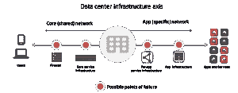

# 部署频率如何影响基础设施的稳定性

> 原文：<https://devops.com/how-deploy-frequency-impacts-infrastructure-stability/>

最近，我在阅读互联网的同时，花了一些时间阅读了我在互联网上从 IDC 找到的一份非常具体的研究报告，确切地说是它的“ [DevOps 和停机成本](https://t.co/SV8uiN5J3G)”。由 AppDynamics 赞助，这份引人入胜的阅读材料包括各种统计数据，有助于了解 DevOps 对组织的影响(或缺乏 devo PS ),以及特定的财务和竞争影响。

我不会重复您自己很容易读懂的内容，以免让您感到厌烦，但我已经提取了一些值得进一步研究的关键统计数据，即业务稳定性的失败和部署频率的预计增加。

*   基础设施故障的平均每小时成本为 100，000 美元。
*   关键应用程序故障的平均每小时成本为 50 万至 100 万美元。
*   预计每月的平均部署数量将在两年内翻一番。

有趣的是，对部署频率的预测是一件好事，并且有可能确保与其他两项相关的成本很少(如果有的话)发生。

我们已经到达了这样一个点，即 DevOps 的“速度”实际上等同于“上市时间”。但是，另一个衡量“速度”的标准也同样重要，尤其是当我们将它应用于维护基础架构的稳定性时。这个标准就是 MTTR(平均解决时间)。根据 ZeroTurnaround 的[研究，考虑到 60%的生产失败是由人为错误或缺乏自动化造成的，这一措施非常重要。因此，DevOps 的一个目标应该是尽可能地减少这个数字，并为环境引入更多的稳定性。部署频率实际上有助于实现这一目标。](http://zeroturnaround.com/rebellabs/download/?token=80eb432c1d5edfc886f91ad2169c139196a99127)

那么，部署频率如何帮助做到这一点呢？

 首先让我们考虑一下可能导致应用和核心网络基础设施停机的故障点的数量。那么让我们考虑这些可能的故障点中的每一个也有多个潜在的故障原因。例如，核心服务基础设施内逻辑关键数据路径中的单个服务很容易导致“停机”，在 IDC 的情况下，这将被描述为“基础设施故障”，每小时运行 10 万美元。

如果该应用程序是一个关键的业务应用程序，该选项卡每小时运行的时间要长得多。

显然，在这种情况下，我们恢复稳定性(服务)的速度是对业务总体影响的一个因素。

这就是 DevOps 的用武之地，在这种情况下，操作化可以通过帮助更快地解决问题，在减轻停机影响方面发挥重要作用。

考虑到网络中最困难的任务之一不是供应或配置，而是故障排除。公平地说，应用程序开发中的故障排除也是更耗时和令人沮丧的任务之一，消耗了开发人员 75%的时间(根据 InitialState 的研究[)。这接近 65%的网络工程师致力于“中断并修复”任务，他们花时间排除网络堆栈上上下下的网络问题。不用说，如果您刚刚部署了十个或十五个不同的配置更改，分布在核心和每个应用程序的服务基础架构上，突然出现了“问题”，那么首先要花一些时间来找出是哪个配置更改导致了问题。](http://blog.initialstate.com/what-engineers-and-developers-do/)

变更数量和部署频率之间的关系不是秘密；如果您更频繁地部署变更，那么很可能会更少。sprint 的平均周期是 3-4 个月，从逻辑上来说，变化量不会超过 12-18 个月的周期。基础设施也是如此；更频繁的部署意味着更少的更改)。

逻辑(和数学)告诉我们，更改的代码行和配置越少，在出现问题时识别问题根源所需的时间就越少，从而加快了解决问题的速度。假设敏捷、频繁的部署率会减少对环境的更改，那么这种方法也应该减少故障的数量和解决突发故障的时间。频率是通过提高整体稳定性来减少故障的一个重要因素。

Puppet Labs 在其“[DevOps 状态](https://puppetlabs.com/wp-content/uploads/2013/03/2013-state-of-devops-report.pdf)”中的调查结果有趣地证实了这一点，在该调查中，采用 devo PS 方法的组织报告故障减少了 50%，解决问题的时间缩短了 12 倍。这是工作中的稳定性，部分是由部署频率及其对 MTTR 的积极影响推动的。

因此，让我们将这种方法(和逻辑)应用于数据中心基础架构中关键数据路径上的其余服务，即应用于应用服务，如缓存、web 应用安全、负载平衡、身份管理和应用访问控制。自动化，以减少由人为错误和更小、更频繁的更改导致的错误配置，从而能够更快地识别将引入的不可避免的问题。毕竟，没有任何方法或途径能够完全消除错误。我们能达到的完美程度是有限的，这很像是一个[芝诺悖论](http://platonicrealms.com/encyclopedia/zenos-paradox-of-the-tortoise-and-achilles)类型的问题。在我们不断解决当前问题的同时，更多的配置和代码被部署，这些配置和代码很可能包含另一个错误，等等。

但是目标不一定是消除所有的错误(虽然这很好，但这根本不实际，这也是我们的正常运行时间目标被称为“5 个 9”而不是“1 加 2 个 0”的主要原因)，而是为了*减少*错误的数量及其对停机时间的影响。这是我们可以实现的，而不会与芝诺和他的悖论发生冲突。

更小、更频繁的部署可以带来更稳定的环境，其中停机时间减少到与可接受风险一致的水平。

无论是否直接应用于基础架构，DevOps 都将在提高其稳定性方面发挥作用，这反过来又会通过更频繁的部署消除(一些)停机时间，从而对业务产生直接而切实的影响。