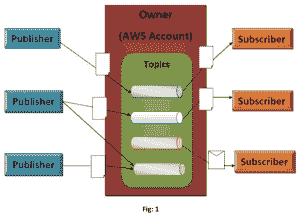
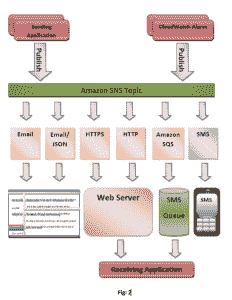
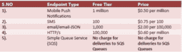

# 亚马逊简单通知服务(SNS)

> 原文：<https://devops.com/amazon-simple-notification-service-sns/>

亚马逊已经打包了一个装满服务的盒子，几乎涵盖了让云成为开发者在 AWS 上构建极其复杂的操作和结构应用的流畅体验的每个方面。大量基于云的系统迫切需要或依赖于在订阅的基础上向最终用户发送电子邮件。但不幸的是，今天的互联网上充斥着垃圾邮件发送者，他们拒绝停止从具有令人讨厌的 SPF 配置的服务器发送请求和延迟电子邮件。

考虑到上述问题，AWS 推出了一项非常出色的服务，称为简单通知服务(SNS)，旨在满足真正通知交付的需求。

**什么是亚马逊简单通知服务(SNS)？**

Amazon Simple Notification Service(SNS)让您以自己的方式构建和组装应用程序变得简单易行。

Amazon SNS 是一种快速、适应性强、灵活、完全由命令和管理的推送消息服务，允许您毫无困难地设置、操作并向所有订户发送通知。它为苹果，谷歌，Fire OS，甚至 Windows 设备带来了简单而划算的推送通知服务，包括中国所有使用百度云推送的 Android 设备。它还可以用于将通知推送到与所有分布式服务和智能设备连接的互联网。

它能够创建主题，订阅主题，甚至以一种极其可扩展、灵活和有益的方式发布主题。通过 Amazon SNS，你可以将事件驱动的消息从你的应用程序发送给你的用户。为了阻止和避免任何类型的消息丢失，所有跨多个可用性区域广播到 Amazon SNS 的消息都会被持续存储。

让我们深入了解一下图中显示的块:

1.  **主题:**这些是访问点或命名的事件组，用于识别特定的主题、内容或事件类型。每个主题都带有一个唯一的标识符(UI ),它有助于识别发布和订阅的 SNS 端点。
2.  **拥有者:**拥有者是那些创建话题并对话题有完全准入和访问权的人。
3.  **订阅者:**这些是客户端，通常是终端用户、服务器、应用程序或其他设备，它们希望接收关于它们感兴趣的特定主题的通知。
4.  **发布者:**他们负责给话题发送消息。现在，SNS 将主题与对该主题感兴趣的订阅者列表进行匹配，并将消息分发给每个订阅者。

**特点和优点:**

Amazon SNS 已经提供了足够大的好处，克服了开发定制消息传递解决方案的复杂性，以支持需要在现场监督、管理和维护的系统。以下是亚马逊社交网络的一些主要优势和功能。

1.  **可靠:**每当亚马逊社交网络在亚马逊经过验证的网络基础设施和数据中心内流动时，应用程序每次调用它们时，所有主题都将可用。所有广播到 Amazon SNS 的消息都冗余地存储在众多服务器和数据中心，以防止消息丢失。
2.  **可扩展:** Amazon SNS 的建模是为了满足最需要和最苛刻的应用程序的需求，这些应用程序允许事件驱动的无限量的消息在任何时候出现。
3.  **简单:**在大多数情况下，开发者只需使用三个 API，就可以开始使用亚马逊社交网站，它们是:创建主题、订阅和发布。为了向您提供直观的功能，还提供了额外的 API。
4.  **灵活:**通过亚马逊社交网络，不同设备上的应用程序和最终用户能够借助移动推送通知(苹果、谷歌和 Kindle Fire 设备)、电子邮件/电子邮件-JSON、HTTP/HTTPS、短信或亚马逊简单队列服务(SQS)队列接收通知。
5.  **安全:**亚马逊社交网站是一项安全的服务，确保主题和消息不会受到任何未经授权的访问。所有主题持有者都有全权为每个主题设置策略，以限制谁可以发布或订阅主题，甚至可以通过标记传递过程应该在 HTTPS 来确保加密。
6.  **便宜:**现收现付的方式帮助亚马逊 SNS 客户节省了很多钱。没有预先的费用或承诺。它只对通过 Amazon SNS 发送的消息、通知传递和转账按请求收费。

**亚马逊简单通知服务也支持 SMS(简单消息服务)**

Amazon SNS 没有留下任何未触及的通知方式，并带有 SMS 功能，可以通过 SNS 主题订阅电话号码。通知可以作为短信直接发送到手机、智能手机以及任何其他支持短信的设备上。Amazon CloudWatch 用户实际上负责监视和控制他们在 AWS 上运行的应用程序，他们能够及时收到感兴趣的操作或警报的更新。内容也可以通过电子邮件发送给现有的 Amazon SNS 用户。开发者可以将移动应用与 Amazon SNS 结合起来，不仅可以发送消息，甚至可以通过 SMS 接收通知。

这里有一张图可以更好地解释亚马逊 SNS 是如何支持短信的

**定价:**

对于亚马逊社交网络的使用，你可以按需付费，没有前期费用。您根据发布和发送的通知数量付费。如果您使用额外的 API 来管理主题和订阅，您甚至需要付费。发送这些通知的价格因终端类型而异。

以下表格将为您提供完整的详细信息:

**出版商:**

目前，Amazon SNS 发布的消息最多不超过 256 KB。每个 64KB 的发布数据块按 1 个请求计费。

**图 3**

**通知交付:**

****

**图 4**

**数据传输:**数据传输“IN”是针对**的，每 GB 0.000 美元。**

以下是数据传输“输出”的价格表:

**图:5**

**结论:**

亚马逊 SNS 旨在与其他亚马逊网络服务一起使用，如亚马逊 SQS 和 EC2。例如，在 EC2 中运行的应用程序能够将事件/信息更新发布到 Amazon SNS，并立即传送给所有其他最终用户。除此之外，用户还可以选择亚马逊 SQS 作为一种交付协议，以并行格式向多个 SQS 队列交付通知，同时牢记消息的持久性以及消息将被交付的正式保证。如果您是 Amazon SNS 用户，那么使用必须在您的移动设备上启用这项服务，并体验它的好处。