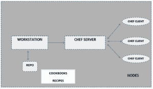
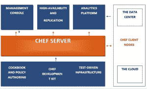

# 自动化、供应和配置管理(CHEF)

> 原文：<https://devops.com/automation-provisioning-configuration-management-chef/>

**简介**

Chef 是一个有影响力的配置管理和自动化平台，它通过赋予您的服务器和服务生命来改变复杂的基础设施，并帮助您用代码描述您的基础设施。由于您的基础设施是由代码控制和管理的，因此可以高效、轻松地实现自动化、测试和复制。

Chef 可在您的整个网络中自动进行应用程序配置、部署和管理，无论其规模如何，即使您在云中、内部或混合环境中运行也是如此。

Chef 是围绕简单的概念构建的:实现期望的状态、IT 基础设施的集中建模和充当构建块的资源原语。Chef 最大的优点是节省了设置虚拟服务器和其他任务的时间。通过一个多部分系列，我将与 CHEF 一起介绍自动化、供应和配置管理方面的最佳实践。

**为什么是厨师？**

做一名系统管理员既令人鼓舞又令人厌烦，另一方面，为您的组织带来最佳效果的想法与您需要帮助来保持其正常运行的想法是相辅相成的。一个人对每一个复杂的问题及其基本解决方案都很熟悉，这是非常罕见的。工具也是如此。Chef 为您提供了一个框架，有助于避免这些旧工具问题。它甚至改进了基础设施管理，可以帮助您解决每一个复杂的问题。

使用 Chef 的原因有很多:

**1)。Chef 极大地减少了您应该编写的文档数量。**

**2)。** Chef 没有改变 Bash 的可扩展性。

**3)。**厨师想出了绝妙的技术方法。

**4)。**大厨是伴随你成长的工具。

**5)。**厨师可以帮你打抱不平，阻止你多此一举。

基本原则是什么？

Chef 的主要原则是让用户最了解他们的环境，应该做什么，应该如何维护。主厨-客户不提出任何假设。只有个人，即您和您在现场的团队成员能够理解技术和人员问题，包括审计跟踪、技能水平和您组织特有的其他内部问题，以及解决这些问题所需的解决方案以及任何单一技术解决方案是否可行。

**主厨的主要组成**

Chef 环境通常由三部分组成:

1.  **厨师服务器**
2.  **工作站**
3.  **厨师节点**

**厨师服务器:**

Chef 服务器是操作的大脑，充当存储每个节点可用的配置数据以及管理访问权限的中枢。它保留了关于您的基础设施的所有信息。所有客户端节点都在服务器中注册。

Chef 服务器存储并保存所有说明由 chef-client 管理的每个注册节点以及应用于节点的策略的食谱、食谱和元数据。客户端与服务器通信，以便从服务器获得正确的配置细节，例如配方、模板、文件分发，并将其应用到节点。这种灵活且可伸缩的方法将配置工作分布在整个组织中。

**工作站:**

工作站是开发机器，用户从这里运行所有与配置相关的任务，包括创建食谱和食谱、更新 chef-repo、与单个 chef 服务器交互等等。工作站是用户花大部分时间和厨师在一起的地方，也是他们完成大部分工作的地方，包括:

*   烹饪书和食谱的发展
*   保留 chef-repo 与版本源代码控制的同步
*   使用 knife 将项目从 chef-repo 上传到 chef 服务器
*   配置组织策略，即定义角色和环境，并确保关键数据存储在数据包中
*   需要时与节点通信，例如执行引导操作

**厨师节点:**

节点可以是包含执行所有基础架构自动化的 chef-client 的物理、虚拟或云机器。节点是我们使用 chef 管理的计算机，它在我们的基础架构中充当服务器。

 **图 1**

**大厨如何工作？**

如上所述，Chef 将基础设施转换为代码，使您的基础设施像应用程序代码一样易于版本化、可测试和可重复。

Chef 完全依赖并确定名为 recipes 的可重用定义来自动化基础设施任务。菜谱利用了被称为**资源**的构建模块。这些资源解释了基础设施的某些部分，如要安装的文件、模板或软件包。您可以在任何需要的时候利用这些资源，甚至构建自己的资源，以便管理和完成独特的配置和遗留系统。总的来说，配方完全负责描述您的基础架构由什么组成，以及您的基础架构的每个部分应该如何部署、配置和管理。

Chef 服务器保存所有的食谱和其他配置数据。现在，Chef 客户机已安装在网络中的所有节点上。如前所述，这些节点可以是物理服务器、虚拟服务器或容器实例。Chef 客户端定期向 Chef 服务器轮询最新的配方，并检查节点是否符合这些配方定义的策略。如果出现某个节点过时的情况，那么 Chef 客户端会在该节点上运行它们，以便使其保持最新。

**图二**

**结论:**

通过 Chef，您将能够:

*   通过编写食谱来管理服务器。
*   与应用程序、数据库等紧密集成。
*   配置需要了解整个基础架构的应用程序
*   创建 QA 环境、生产前环境、合作伙伴预览环境等的完美克隆。

Chef 发展很快，迈出第一步可能会有点困难。Chef 提出了要学习的新概念和要理解的最佳实践。Chef 为您提供基础设施管理方面的帮助，并解决复杂的问题。