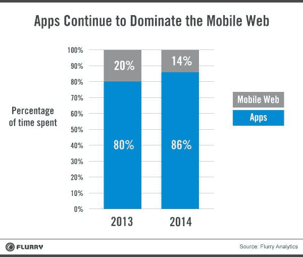

# 要获得 Jammin 的移动下载，抛弃 40 年的传统

> 原文：<https://devops.com/to-get-jammin-mobile-downloads-toss-out-40-years-of-tradition/>

全球智能手机使用的统计数据令人麻木:甚至早在 2012 年，地球上有手机的人比有牙刷的人还多。更令人麻木的是，数以百万计的移动设备用户在任何时候都处于各种愤怒状态，等待他们的内容下载完毕。玛丽·米克尔 2014 年“网络状况”报告指出 [30%的手机是智能手机](http://www.businessinsider.com/mary-meekers-2014-internet-presentation-2014-5#-6)。智能手机的使用正以复合方式增长。

我相信，我自己的挫败感会引起数百万用户的共鸣。而且只会越来越糟。我想到了下一个 N 亿移动用户的困境，他们将依赖于世界各地持续超负荷的移动网络。

当我创建 PacketZoom 时，我很幸运能够将这种沮丧转化为一种使命。在谷歌工作时，我就已经开发出了一个补救方法的想法蓝图，然后花了两年时间，从 2013 年开始，在 PacketZoom 的重度 R&D 阶段对这项技术进行了产品化和试验。但是我们并不满足于调整现有的协议来节省几毫秒的时间——世界各地无数面临同样难题的应用开发者也不满足。为什么不呢？统计数据证明，移动下载时间超过 6 秒会导致大约一半的用户退出他们正在使用的应用程序——不知道是网络而不是应用程序造成的。用渐进的方法来解决问题的时间早就过去了。【引文:[https://blog.kissmetrics.com/loading-time/](https://blog.kissmetrics.com/loading-time/)

对我来说，转折点是我在一次印度之旅中的第一次经历，当时我在行驶的地铁上试图加载一个应用程序的第一个屏幕。只有在极度克制的情况下，我才没有用大头棒砸我的手机——当然，这不是罪魁祸首。很明显，使用流行的技术是无法解决这个问题的，这种技术在过去 40 年中被人为操纵，以服务于出现的每一个新用例。也许这种历史悠久但陈旧的技术必须被取代！

在过去的几年里，我们看到了手机应用的爆炸式增长。在接下来的几年里，为了应对“物联网”现象，有望带来数量级更大的设备。如果我们继续使用同样的旧协议，对移动内容的无休止的等待将变得无法忍受。

**失去四十年损失的时间**

那么遗留协议到底有什么问题呢？毕竟，它们是为今天的用例而设计的。请允许我解释一下。

先说 IP(互联网协议)。IP 地址应该永远牢固可靠地附在计算机上，就像街道地址牢固可靠地附在每栋房子上一样。(注意，智能手机只是另一台电脑。)发送到那个地址的数据包只能到达一个地方(一所房子——或者，用我们的比喻，一台电脑)。但是现在，在 2015 年，IP 地址只是移动设备的短暂财产。就好像现在每个人都住在一辆货车里，你的地址取决于你一天结束时把货车停在哪里。

今天，当你从办公室走到停车场时，你的移动设备的 IP 地址可能会改变。当您从办公室的 WiFi 移动到办公室外的 LTE 连接时，当您在乘坐个人或公共交通工具时经历无数次断开和重新连接时，您可能会在通勤过程中“获取”和“释放”数十个 IP 地址。

结果是，当移动设备上的应用程序开始与云通信时，IP 地址的每次更改都会导致应用程序从头开始通信——所谓的“冷启动”)，而不是从之前的通信在断开点暂停的点开始。这是一个非常大的问题，由于重复传输导致时间损失。

此外，每次重新连接到网络都需要建立一个新的 TCP 会话，该会话利用了已有 40 年历史的技术 TCP(或传输通信协议)。但是你猜怎么着？每个新的 TCP 会话都是冷启动的，并且根据 TCP 算法，每次都必须逐渐加速到全速。并且由于这些延迟造成的损失时间增加了在所有移动环境中发生的连续断开和重新连接所造成的损失时间。

TCP 经过多年的磨练，在所有可能的网络上都能“相当好地”通用。它最初是为了连接大型计算机而设计的，由专业的系统管理员管理，位于精心维护的设施中，具有三重冗余电源。它完成了最小公分母设计应该完成的工作，即可靠地将数据流从一台计算机传输到另一台计算机(即从一个 IP 地址传输到另一个 IP 地址)。

这些是 TCP 协议的保证。然而，它不能保证，甚至不能解决的是速度。它使用最保守的方法把你的数据包从一个地方传到另一个地方。结果，用户级协议(例如 HTTP)被其他黑客搞得乱七八糟，试图绕过 TCP 不关心速度的问题。

**将 TCP 和 HTTP 放回它们应有的位置**

现在想象一下 2000 年早期来自网络浏览器公司的科学家之间的对话:

**博芬答:**“TCP 不允许我们使用可用信道的全部可用带宽(DSL、拨号或那些新式的电缆调制解调器)。”

博芬 B :“没问题！我们同时打开六个 TCP 连接怎么样？让他们互相斗争到底。”

博芬答:“搞定。”

博芬乙:“我们是天才！”

事实上，自从那不幸的一天开始，web 浏览器就一直围绕这种方法构建。但是在过去的 15 年里，网络运行在超文本传输协议，也就是 HTTP，1.1 版本之上！HTTP 作为应用层协议，对速度也一无所知。因此，多年来，浏览器厂商想出了一套基于民间传说的技巧、窍门和窍门的大杂烩，以某种方式保持这列火车的运行。

快进一点，这些技巧和窍门中的许多已经被提炼并编入 HTTP，version 2 的最新修订版中。旧的协议，保持其活力的方法，以及现在新版本的协议，都致力于使*网络*更快。问题？在智能手机的使用中，上网仅占 14%。

[http://www . flurry . com/bid/109749/Apps-Solidify-Leadership-六年的移动革命](http://www.flurry.com/bid/109749/Apps-Solidify-Leadership-Six-Years-into-the-Mobile-Revolution)

这就是脱节之处。近二十年来，网络一直是占主导地位的应用平台。巨大的硬件和软件平台(和公司)已经被建造来服务网络。(注意世界上最大的云平台是如何被称为“亚马逊 *Web* Services”)的)。TCP/HTTP 对于 web 访问来说已经足够了，但是在 web 浏览器中所能做的事情的限制阻碍了我们发展到为当今互联网的主要应用程序设计的协议:本地移动应用程序。

很简单，对于任何在 web 浏览器中运行的应用程序，作为应用程序开发人员，您无法修复底层的网络传输。但是新的黎明即将来临。应用程序的主导平台不再是网络。它是移动设备上的本地应用。就这样，我们摆脱了 HTTP 甚至 TCP 的束缚。作为应用开发者和我们的支持者，我们可以自由地发明协议，为这个连接不稳定、数据包丢失、高延迟的移动世界做出贡献。从本质上来说，进化的速度非常缓慢。现在是发明的时候了——甚至可能是一些量子跳跃。Packetzoom 已经为解决这些问题迈出了第一步，它设计了一个更现代的协议，专门用于移动应用。在 https://packetzoom.com/learn.html 了解更多信息。下面是一个展示 PacketZoom 差异的短片:

[https://www.youtube.com/embed/6tI175irzbY](https://www.youtube.com/embed/6tI175irzbY)

* * *

***关于作者/Chetan AHU ja***

 Chetan Ahuja 是移动网络初创公司 [Packetzoom](https://packetzoom.com/) Inc .的创始人/首席执行官/首席技术官。在 2013 年创办 Packetzoom 之前，Chetan 曾在 Google、Admob 和 Riverbed 等公司从事软件和网络性能方面的工作，在那里他深刻体会到了网络速度对应用性能以及用户满意度的关键作用。他拥有密歇根州立大学的计算机科学硕士学位和孟买印度理工学院的计算化学硕士学位。他喜欢把所有的空闲时间都用来和家人一起看《巨蟒之灾》和《TNG 迷航》，或者和同事一起打乒乓球。