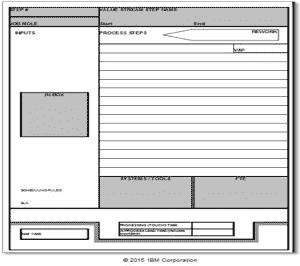

# DevOps 的精益价值流图

> 原文：<https://devops.com/lean-value-stream-mapping-for-devops/>

价值流图是评估组织开发运维能力的关键步骤。我们在任何 DevOps 项目的早期创建软件开发生命周期的价值流图，因为它帮助我们-

*   为我们的架构师和技术专家提供背景，他们同时也在检查工具和技术。
*   *建立一个性能基线，用于衡量采用 DevOps 所带来的改进。(详见* [*我的另一篇博文*](https://devops.com/2015/04/09/why-do-devops-winning-hearts-and-minds-with-a-lean-boxscore/) *关于 Box 分数的更多内容)。*
*   开始赢得人心的过程，并引发文化变革。通过在研讨会中并肩工作，开发和运营资源，以及那些参与计划、测试调度和其他活动的人员，开始了解他们所做的工作是如何与上游和下游步骤相联系的。这为将来这些活动的更紧密结合奠定了基础。

有趣的是，我们用于 DevOps 价值流图的模板与我们用于其他服务流程的模板几乎相同。IBM 精益教练使用它来评估各种各样的过程，如营销活动开发、订单到现金、抵押申请和生产支持等等。这个模板是从更传统的用于捕捉制造流程的价值流图演变而来的，对于创新或产品开发流程也有一个稍微不同的模板。

在每个精益项目的开始，无论是开发运营、保险索赔、新产品开发还是财务预测，我都会审核价值流图模板。我问自己和我的团队，这些问题对这个过程是否有意义，我们要填充的方框是否相关。有些语言可能稍有不同，输出肯定会有所不同——从一个步骤需要几分钟甚至几秒钟的高频率过程，到一个步骤可能需要几周的创造性过程。但几乎无一例外，模板保持不变。

我们在所有这些类型的过程中问同样的问题——现在我们问软件开发生命周期的那些问题。这些问题是:

*   正在进行什么活动？
*   谁提供这些活动？他们花了多少时间在这些活动上？
*   什么是收益率，即“第一次正确”？返工产生的百分比是多少？什么原因导致返工？
*   完成该步骤需要什么工具？还需要哪些其他输入？
*   这个步骤中有多少单元(例如工作包)是“进行中的工作”?
*   “收件箱”中有多少单位在等待？它们将如何被优先排序或安排？他们通常会等多久？
*   这一步需要多长时间？其中有多少时间是努力或接触时间，而不是持续时间或过程中的交付时间？

总而言之，所有价值流图都有一个基本的共同点:它们都是关于流动的，DevOps 也不例外。

***作者简介/凯蒂·索瑟兰***

凯蒂  是位于加州洛杉矶的 IBM 精益大师。Katie 多年来一直将精益原则应用于各种流程，如西班牙的饮料分销、荷兰的润滑油产品开发、英国的保险销售……以及世界各地的 IT 运营。