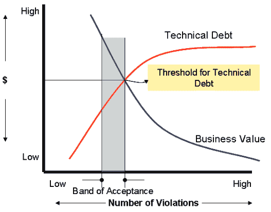

# DevOps 的成本:27 个消声器

> 原文：<https://devops.com/cost-devops-27-mufflers/>

## **想象一下**

想象一下，你正在设计 2016 款揽胜系列运动型多功能车。像所有的气体动力汽车，每一个都需要一个排气消声器。揽胜很可能已经锁定了消声器的首选供应商。但是想象一下，如果设计师和生产线工人可以从他们的首选供应商为新车型年提供的 27 个过去版本的消声器中选择任何一个，将会发生什么。是的，选择任何一个——即使它已经过时，性能降低，不符合当前的排放标准，或者有已知的缺陷。订购，放在车上，然后发货。

我们都意识到这种情况永远不会发生。没有人会为他们正在制造的产品选择一个已知的缺陷部件。谁会故意选择 10 岁版本的消声器，没有最新的进步，以支持空气质量？没有一个组织会让他们的设计师和生产线工人自由采购 27 种不同消声器中的任何一种。想象一下测试不同消声器的运行成本。想象一下运送不同版本的相同零件的维护成本。更糟糕的是，想象一下运输有已知缺陷的零件的责任。

路虎没有采取这种方法，但软件开发团队采取了这种方法。

## **27 个版本**

我最新的研究报告《2015 年软件供应链状态报告》显示，大型软件开发组织去年平均采购了 27 种不同版本的开源组件。更具体地说，在这些公司 2014 年从互联网下载的前 100 个开源组件中，每个组件平均有 27 个版本。

虽然像路虎这样的汽车制造商更喜欢经过审查的零部件供应商，但开源组件的采购往往更像是一场混战。如果一个组织有 300 名开发人员，他们实际上有一个 300 人的采购部门来采购外部开发的软件组件。如果你有 4000 名开发人员，你有 4000 名执行采购。即使我们都知道只有最新版本的组件才是功能最丰富、质量和完整性最高的。

并非所有组织都允许自由采购组件。[百分之五十七(57%)的公司制定了开源政策](http://www.sonatype.com/about/2014-open-source-software-development-survey),引导开发人员开发质量更高、已知缺陷或安全漏洞最少的部件。像 Google 这样的组织要求在他们的开发团队中使用不超过两个版本的开源组件。

## **好成本，坏成本**

这对一个软件开发组织来说意味着什么——尤其是一个专注于改进它的 DevOps 实践的组织？首先是好消息:开发人员正在使用开源组件来加速发布和改进创新。都是好事。

坏消息:组织正在通过糟糕的软件供应链实践建立堆积如山的技术债务，平均采购相同组件的 27 个版本，影响质量、复杂性、可维护性、可支持性等。他们在一年内下载了前 100 个组件，这相当于管理超过 2700 个不同的版本(而优化的实践只需要 100 个最好的)。

组织正在采购组件“部件”用于他们的应用程序，这些应用程序有多达 26 个已知的更好的版本(更多的功能、更少的错误、改进的性能等)。).

组织正在下载和使用一些已经使用了 9 年甚至更久的部件(简单的数学:开源项目每年发布 3-4 个新版本的组件)。他们选择性地使用过时的零件。

组织也在下载一些已知的、记录在案的安全漏洞版本。他们有选择地使用已知的易损部件。

## **通过改进采购实现净创新**

虽然我们经常听到人们吹捧 DevOps 的口头禅“更快”，但不惜任何代价追求速度的后果是:技术和安全债务。

开源组件是速度的推动者。但是，免费的采购和使用做法增加了技术和安全债务，从而减少了“净创新”并增加了运营成本。随着技术债务的增长，净创新和商业价值下降。

Image source: http://joapen.com/blog/2014/06/17/how-to-monetize-application-technical-debt/

如果减少 100 个组件的 2700 个版本的使用还不够，考虑一下这个:[研究](http://www.sonatype.com/speedbumps)还揭示了大型开发团队正在使用来自超过 7600 个外部开源项目(供应商)的软件组件。包括这些组件的所有版本，他们在 2014 年平均消耗了近 19，000 个独特的组件。

改进采购实践只是提高净创新和增加商业价值的全部故事的一部分。改进的采购实践还可以实现更高效的运营，减少平均补救时间，并消除许多开发运维实践的计划外工作。许多行业都采用了改进的采购实践，从而获得了持续的竞争优势。改进的采购实践是更广泛的[软件供应链管理战略](https://img.en25.com/Web/SonatypeInc/%7Bd995a41e-07bc-4b94-b8c4-613ce56bbc9c%7D_eBook-Hidden-Speed-Bumps-on-the-Road-to-Continuous-Final.pdf)的一部分。

## **持续学习**

我们可以从其他已经实现供应链自动化和优化的行业学到很多经验，比如路虎和其他汽车制造商。今年夏天，我将在这里分享更多来自 [2015 年软件供应链状态](http://www.sonatype.com/speedbumps)的经验和观点，并围绕“网络创新”展开讨论。敬请关注。