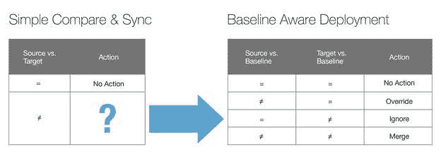

# 为什么数据库开发运维必须包括三方面分析

> 原文：<https://devops.com/why-devops-for-the-database-must-include-three-way-analysis-2/>

部署自动化对于实施有效的开发运维至关重要。如果没有部署自动化，发布仍然需要大量的手动步骤和过程。流程和步骤不能可靠地重复，容易出现人为错误，并且不能以高频率一致地处理。

然而，软件最佳实践不能简单地移植到数据库部署中。与软件代码不同，数据库不仅仅是文件的集合。您不能简单地在不同的开发、测试和生产环境中复制数据库。部署数据库也会带来更大的业务风险，因为它保存着您最宝贵的资产—您的数据。

为了利用数据库的 DevOp 自动化优势并安全快速地促进数据库更改，数据库的所有特定组件；它的表、函数和内容都需要保护。

任何成功的 DevOps 数据库自动化解决方案都必须能够智能地处理代码的冲突和合并以及来自其他团队的交叉更新。该解决方案必须能够忽略错误的代码覆盖，并让用户最终控制推出哪些更改和合并。

为了实现这些目标，数据库解决方案的 DevOps 必须能够对源(即开发工作完成后的对象)、原始(或“基线”)状态和目标(或“生产”)环境进行三方分析，确定这三种状态之间的差异。团队成员从分析中全面了解项目的完整范围，可以查看解决方案提供的结果和选项，以解决任何差异。用户选择应该对数据库采取什么动作(如果有的话)。然后，该解决方案会自动生成脚本来执行所选择的操作。

这样，该解决方案使用自动三向分析和自动脚本生成来消除手动脚本编写中的潜在人为错误，以及自动对象覆盖中的潜在技术错误。

**收获回报**
实施包含所有这些自动化功能的解决方案来应对数据库部署的特殊挑战，将使公司能够实践 DevOps 方法来实现有效的数据库自动化，并实现以下优势:

**通过简化开发流程管理降低部署成本**

**通过实施变更策略和最佳实践以及配置管理和一致性，最大限度地降低部署风险**

**提高对客户和市场需求的响应能力**,更快地推出基于任务的开发更新

**增强跨团队沟通**通过清晰的审计跟踪和对对象所做工作的透明度以及不同环境的状态

你能承受没有它吗？

## 关于作者 Yaniv Yehuda，CTO，DBmaestro

Yaniv 是 [DBmaestro、](http://www.dbmaestro.com/)的联合创始人兼首席技术官，DBmaestro 是数据库解决方案 DevOps 的领先提供商，能够控制数据库开发和部署。Yaniv 还是领先的 IT 服务解决方案提供商集团 Extreme group 的联合创始人和开发主管。