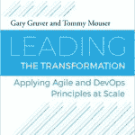

# DevOps 新书:引领变革

> 原文：<https://devops.com/new-devops-book-leading-the-transformation/>

当我第一次开始研究 DevOps 并寻找成功但不是“独角兽”的早期企业时，我被介绍给了 Gary Gruver。当时，Gary 领导了梅西百货的变革，他在 DevOps 的几个活动中谈到了这一点。对我来说，这有力地证明了 DevOps 可以超越原生云公司和初创公司。此前，加里曾在梅西百货和惠普公司让它发挥作用。事实上，Gary 与人合著了一本关于他在惠普工作经历的书，书名为《大规模敏捷开发的实用方法:惠普如何改变 LaserJet FutureSmart 固件(敏捷软件开发系列)

我很幸运在那时候遇到了加里，从那以后一直保持着联系。他离开了梅西百货，开始提供咨询服务，帮助公司从瀑布式转型到敏捷和 DevOps。我知道他正在写另一本书。最后，我很高兴地宣布，加里的新书现已上市:

** 引领变革:大规模应用敏捷和 DevOps 原则。**实际上，加里和汤米·毛瑟是这本书的合著者。该书由吉恩·金撰写，由吉恩的 IT 革命出版社出版。我刚开始读这本书，但是根据我对加里的了解和我所读到的，这本书应该是你 DevOps 书单上的必读书目。

作为对 DevOps.com 读者的特别款待，我们非常高兴和自豪地让我们的读者先睹为快这本激动人心的新书。在这篇文章的底部有一个 PDF 的链接，这本书的前两章可以免费阅读。当然，我们确信一旦你阅读了前两章，你会前往 [IT 革命](http://itrevolution.com/books/leading-the-transformation/)并购买完整版本。

顺便说一句，不要相信我们说的加里的书有多好。下面是什么 ***Jez Humble** ，* VP Chef，作者兼 DevOps 领导说:

“如果你想了解如何领导公司的持续交付或开发运维转型，没有比这本书更好的了。简明、实用，并基于来之不易的管理经验，这本书是每个 IT 管理人员的必读之作。”

所以点击链接，享受吧！

## [引领变革](https://devops.com/wp-content/uploads/2015/08/Leading-the-Transformation.pdf)