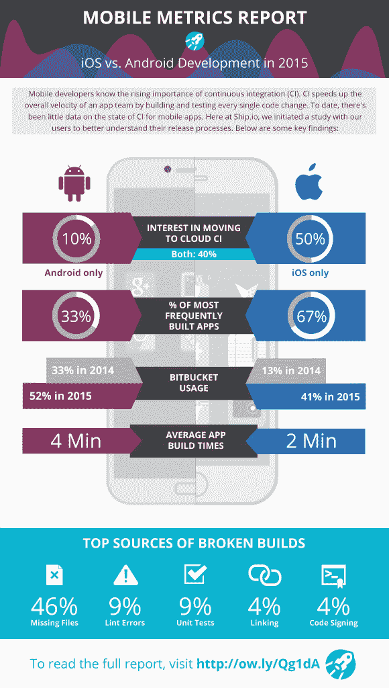
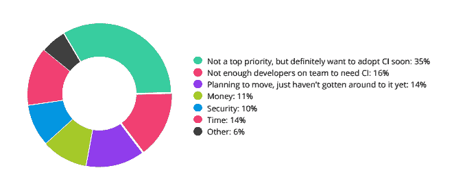
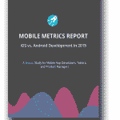

# CI 和云的移动开发人员趋势

> 原文：<https://devops.com/mobile-developer-trends-for-ci-and-the-cloud/>

移动开发人员理解持续集成(CI)日益增长的重要性。CI 的承诺是通过构建和测试每一个代码变更来加快应用团队的整体速度。这种快速变化的环境意味着代码集成问题被及早发现，测试人员和测试版用户可以尽快对这些变化提供反馈。随着 CI 对于应用程序开发团队来说变得司空见惯，并且许多人正在将他们的 CI 基础设施转移到云上，构建和回归测试自动化的重要性已经增加。

为此，我们认为通过检查来自 500 多名移动应用程序开发人员的调查数据以及来自 Ship.io 平台上超过 250，000 个自动化构建、测试和发布的基准使用数据来生成研究报告非常重要。这份移动指标评测报告分享了关于移动应用开发的持续集成(CI)前景的见解和趋势。该报告的主要关注领域包括主要移动操作系统(iOS、Android)的 CI 采用情况、测试、发布和检查代码的频率、应用构建时间和频率，以及全球各地常见的构建失败原因。

整体 CI 采用情况
在接受调查的应用团队中，大多数都在利用 CI。那些没有利用 CI 的人，当他们想要测试一个构建时，通常只按需构建，或者使用一个简单的定期安排的每夜或每周构建调度程序来构建。在利用 CI 过程的团队中，大多数都在每个构建上运行某种形式的测试自动化。这里有一个突破:

*   每周少于 5 次:15%
*   每周 5 至 25 次:33%
*   每周 25-50 次:33%
*   每周 50 次以上:19%
*   不，现在不做 CI:37%
*   是的，进行 CI 构建*和*测试:35%
*   是的，进行 CI 构建:28%

云 CI 采用前景:云 CI 采用:iOS 与 Android
许多应用团队已经将持续集成作为其工程流程的一部分。一些团队已经将 CI 设置为本地服务，但是出于成本节约、关注和 CI 系统可靠性等原因，许多团队正在将 CI 迁移到云中。转移到由他人管理的云 CI 系统的一个经常提到的原因是，跟上 iOS 和 Android 构建和测试生态系统中所有变化的复杂性和成本。

在所有对云 CI 感兴趣但不一定使用 CI 系统的受访开发人员中，大多数(50%)只关注 iOS，完全忽略了 Android。其他开发者专注于这两个平台，有一小部分只专注于 Android。

公共与私有应用程序
对竞争情报感兴趣的开发者正在为 Google Play 和 App Store 开发应用程序。这些开发者中只有一小部分在开发供内部使用的应用程序，或者只面向有限数量的客户。许多面向内部的应用程序团队都有更小的应用程序团队和更长的发布周期，这大概减少了他们对持续集成系统的需求和兴趣。

为什么构建会中断和构建速度指标
随着许多应用程序团队转向持续集成(CI)模型进行开发，他们产生了更多的构建。构建频率的增加意味着花费在构建上的时间要多得多，而不完整的构建会随机化和延迟产品的进展。数据显示，大多数构建中断是可以避免的，花在构建应用程序上的时间很少，但 iOS 的构建速度平均是 Android 的两倍左右。

分析 iOS 和 Android 版本中断的来源，可以发现，正如许多工程师所怀疑的那样，版本中断有一条很长的尾巴。构建经常由于各种开发人员代码语法问题而中断，但是几个构建中断占云 CI 构建中所有中断的绝大部分(74%):

*   缺少文件或目录:开发人员经常忘记将依赖项和新文件签入代码库中。
*   Lint 错误:当在构建中启用“lint”时，它通常会捕获常见的编程错误。
*   单元测试:许多应用都有单元级的回归测试自动化。这些测试在构建过程中会失败，要么捕捉到应用程序中的变化，要么捕捉到回归。
*   链接:构建经常在链接时失败，因为引用的第三方库没有添加到依赖项列表中，或者项目依赖项没有更新。
*   代码签名:应用程序的签名过程仍然容易出错。由于缺少签名文件，或者调试与发布版本配置的差异，代码签名导致了许多 CI 难题。

好消息是，开发人员可以通过单独的“干净”登记并在本地构建和运行 lint 来捕获所有这些构建中断。如果开发人员在提交新代码之前简单地执行单元测试，更多的中断可能会被阻止。除此之外，云 CI 系统很容易捕捉到所有这些问题，并将构建标记为失败，直到开发人员解决这个问题。

构建时间:iOS 与 ANDROID
当应用构建中断时，团队通常会被阻塞，等待新的构建。构建时间现在是应用团队的一个关键路径。对 iOS 和 Android 构建时间的分析表明，尽管 iOS 应用程序的构建时间平均快了大约两倍，但构建时间仍然相当短，平均分别为 2 分钟和 4 分钟。对构建时间数据的深入研究表明，无论平台如何，很少有应用程序的构建时间超过 30 分钟。大多数应用程序的构建时间不到一分钟。构建时间的一个有趣的方面是，在不到 2 分钟的时间内完成的 Android 应用程序比 iOS 应用程序多。但在所有大型/复杂的应用构建(超过 2 分钟)中，iOS 应用构建时间通常快 2 倍。

iOS 与 ANDROID 云 CI 团队的提交频率
在研究数据中提交频率最高的前 40 个应用中，67%是 IOS 应用。值得注意的是，研究数据来自应用团队，他们开发了 Android 和 iOS 版本的应用。iOS 开发人员似乎更频繁地提交代码，并采用小规模连续提交的 CI 模型。

提交频率:IOS 与 ANDROID
iOS 开发者比 ANDROID 开发者做的修改要多得多。在整个提交频率范围内，iOS 开发人员的平均提交次数是 Android 开发人员的两倍。大多数应用程序每周提交一次，或者更少。在那些非常活跃(定义为每周提交代码超过 3 次)的开发者中，大约有三分之二的人从事 iOS 工作。Android 开发人员每周构建 6 次的异常是由于一个应用程序供应商拥有许多应用程序，所有应用程序都与许多 Android 应用程序共享一个公共代码库(提交频率为每周 6 次)。一般来说，iOS 开发人员每周提交 3 次以上的可能性是 Android 开发人员的两倍。总体而言，iOS 开发者的平均提交量是 Android 开发者的两倍。

首要任务包括更快的发布
在应用团队希望在未来一年优先考虑的所有事情中，更快的发布和更新频率(41%)仅次于提高应用整体性能(48%)。团队正在快速迁移到云 CI 系统，以此来加快他们的整体速度。云 CI 使团队能够将时间和资金集中在其他优先事项上，如性能和安全性。

为什么不是 CI？团队没有采用 CI 的原因千差万别。49%的人有兴趣并计划最终转向竞争情报，但由于优先顺序问题而没有这样做。一些团队认为他们太小了，不能从 CI 的价值中受益，因为他们的团队只有一两个人在构建上工作，或者他们的代码修订很少，以至于他们更喜欢手动处理构建。少数应用程序团队担心迁移到 CI 系统的金钱或时间成本。

结论
这些 Ship.io 研究结果表明，应用程序团队的 CI 世界正在快速变化，并因 iOS 和 Android 应用程序团队而异。了解宏观趋势并从中学习，可以极大地影响你的应用团队的效率。随着应用程序团队因 CI 采用和敏捷实践而加速，团队通常会花费过多的时间专注于本地和定制的构建和测试基础架构。那些已经迁移到云的应用程序团队正在节省资金和时间，并且更加专注于他们的应用程序设计和实施。

*   CI 采用:云 CI 采用正在上升，尤其是在 iOS 社区。iOS 开发者比 Android 开发者更积极地采用云 CI。采用云 CI 的团队数量每 6 个月翻一番。
*   提交频率:iOS 和 Android 的提交频率差异很大。iOS 应用开发者的提交量一般是 Android 开发者的两倍。提交频率和构建数量的范围从每天大约 16 次到每隔一周一次。
*   源码控制普及:两个云源码控制库代表了几乎所有的云 CI 系统:GitHub 和 Bitbucket。Bitbucket 的势头很强劲，仅在过去 4 个月里，它的使用份额就翻了一番。Android 用户似乎更积极地转向 Bitbucket，但 iOS 开发者也不甘落后。
*   构建中断:几个常见的问题占了构建中断的大部分，但是有一个非常长的构建中断原因的尾巴。好消息是其中许多是可以避免的。
*   构建时间:iOS 和 Android 上的构建时间相似，对于具有较大代码库和依赖性的应用程序，构建时间从几秒钟到 40 多分钟不等。

[点击此处下载完整报告](http://ow.ly/Qg1dA)

***关于作者/Prathap Dendi***

Prathap 是 Ship.io 的总经理，也是电子云的业务发展副总裁。他推动战略合作伙伴关系，帮助我们为客户提供更广泛的解决方案。Electric Cloud 与提供行业领先工具和服务的公司建立了战略合作伙伴关系，以便为我们的客户提供软件生产自动化。