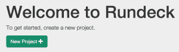
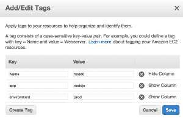

# 使用 Rundeck 滚动更新

> 原文：<https://devops.com/rolling-updates-rundeck/>

***CAUTION:*** If you haven’t used [Rundeck](http://rundeck.org) yet, clear your calendar for next Valentine’s Day because you’re about to fall in love… How many times have you written a shell script that runs via cron, or a PowerShell script that lives in the Windows Task Scheduler? How many times have you struggled to remember *which* server you built that script on? Let’s take it one step further: *when was the last time that job ran successfully?* I’ve used multiple solutions to address this problem in the past: jump boxes, dedicated scripting boxes, puppet manifests, the list goes on- but each left me feeling like I could have done something better. Recently, I discovered Rundeck and have been jump-in-the-air-click-my-heels-happy with it.**What is Rundeck?**Rundeck is a web application server that allows you to define jobs and tasks. It’s that simple. Where it excels is in its ability to automate those jobs, hand those jobs off to other people to run (without giving them access to the servers), call those jobs via API, monitor the progress and status of those jobs, and log all of the above for auditing purposes.Some common use cases I’ve personally used Rundeck for include:

*   在 AWS 中部署 EC2 实例
*   创建在远程服务器上运行的计划作业
*   从集中位置实施蓝/绿部署
*   滚动更新以确保一次只更新一台服务器

I’m sure that gets your mind going with all kinds of ideas, so let’s not waste any more time and get right to**Setting up Rundeck**Rundeck is a java web application and as such, requires your host system to have java installed. Java 1.7 is the minimum, and either Open JDK or Sun/Oracle Java will work just fine. If you have a system that supports RPM or Debian packages, installation can’t get any easier as both package formats are available and not only handle the installation process, but shell tools and init.d scripts for startup and shutdown as well. Users of other Operating Systems can use the Launcher for running the app, but installation details are left up to you. Finally, Rundeck can also install as a war file for use in an external container like Tomcat. With the server up and running, it’s time to:**Build our first project:**When getting started with Rundeck, I was expecting a lot more configuration prior to building a project. I actually struggled a bit when I couldn’t find out where to plug-in my AWS details at a system level. Turns out, you can’t because it’s configured on a project-by-project basis. This actually works out well, allowing you to isolate which jobs can be run against which servers, preventing mishaps such as running a script intended for your public-facing web servers on your finance servers!Creating a new project is done by clicking the big, green “New Project” button on the main screen. On the “Create New Project” screen, filling out the Project Name and Description details are pretty straight forward. The Resource Model Source is where things really start happening. In Rundeck, the Resource Model Source is how you specify the list of servers for the project. In its simplest form, Rundeck receives the list of nodes in XML or YAML format and can receive this data from a variety of sources ranging from hand-crafted files, CMDB, hosted virtual machine service, or a number of available plugins. More information about the Resource Model Source can be found in the Rundeck documentation [here](http://rundeck.org/docs/administration/managing-node-sources.html). If you are using AWS, the Rundeck EC2 Nodes Plugin allows you to specify nodes (a.k.a. ec2 instance) by tags. Installation is as easy as installing the plugin from the github [repo](https://github.com/rundeck-plugins/rundeck-ec2-nodes-plugin) into the $RDECK_BASE/libext directory (/var/lib/rundeck/ if you installed from rpm on RedHat based systems).You will want to create a new set of access keys for Rundeck. This will allow you to control what permissions Rundeck has in AWS via IAM policies, and make it easier to rotate keys as the keys will only be used in one place. Using the “Filter Params” textbox allows you to filter the AWS nodes to match your criteria. For example, I have all of my node.js servers tagged in AWS with a tag named “app” and the value set to “nodejs”.Mapping Params is another area worth noting. Use this field to adjust the mapping of the values returned by AWS to the fields used in Rundeck. For example, this is a mapping I use:

> hostname . selector = private IP address，privateDnsNameenvironment.selector =标记/环境；用户名.默认值= ec2-用户

First I have the hostname.selector field set to “privateIpAddress,privateDnsName”. This allows me to use either the IP address or DNS name of the instance when selecting nodes. It also uses the same data for displaying which nodes a given project will run on (much more insightful than seeing a list of instance IDs!).Next I have an “environment.selector” set to “tags/environment”. As you can see in the screenshot above, I use a tag named “environment” and set values to “prod”, “staging”, and “dev”. This allows me to further filter jobs by selecting the environment from a selector at runtime to determine which environment the job will run on.Finally, the username is set to “ec2-user”. This tells Rundeck who it should log in as when opening an ssh session to the node.If you are using ssh as the default node executor and file copier, you’ll need to upload keys with appropriate permissions as well. With all of that done (it seems like a lot- but it packs a lot of power in those steps, and it only needs to be done once for the project), it is finally time to:**Create A Job:**Creating a job is much simpler than configuring the project. Most of the options on this screen are pretty straightforward. I’ve had so much success with the “Script” step, I find it is my go-to favorite. It allows you to define a script and run it directly on the host. For example, I need to restart node.js on all my servers but don’t want to take them all down at the same time. To accomplish this, I would use a Bash script similar to the following:*(A couple of notes here:**– I’m using pm2 to manage the node process, so that is the application the script targets**– My node.js servers have a /ping endpoint that returns OK when the server is up and running)*

> #关闭本地节点echo "正在关闭 node.js on $(主机名)/usr/bin/PM2 killsleep 15# Start node . jsecho " Starting node . js on $(主机名)/usr/bin/PM2 Start/etc/PM2/ecosystem . JSONsleep 30doSTATUS = $(curl-s http://localhost:3000/ping)echo " $(date):$ STATUS "if[" $ STATUS " = " OK "]；然后击破fi睡眠 10完成回显“完成与$(主机名)

Boom. This script will now sequentially roll through all of my servers tagged “nodejs” in AWS, terminate the node process (via pm2), and wait for the server to come back online before moving to the next server. If the node doesn’t come back online, the Rundeck script for that node will not continue, preventing an unidentified error from taking all of my node.js servers offline! The key to this is ensuring that the Workflow Strategy is “Node-oriented”. This tells Rundeck to perform all steps on a given node before moving on, fully allowing the job to fail if something goes wrong. It’s also noteworthy to point out that Rundeck can email the results to you as well as logging all job executions. With our job in place and ready for action, it’s time to do what all DevOps people do best:**Sit back and troll hacker news:******Seriously. Rundeck can be an integral part of your DevOps toolkit. Using it for rolling updates, patching, and deployments are just the start. Imagine taking it a step further so that it integrates into your monitoring system and executes jobs as a result of alert conditions, or use it as a stand-in replacement for a complete DIY provisioning system for AWS OpsWorks. With a little work upfront, you may never have to minimize hacker news again!