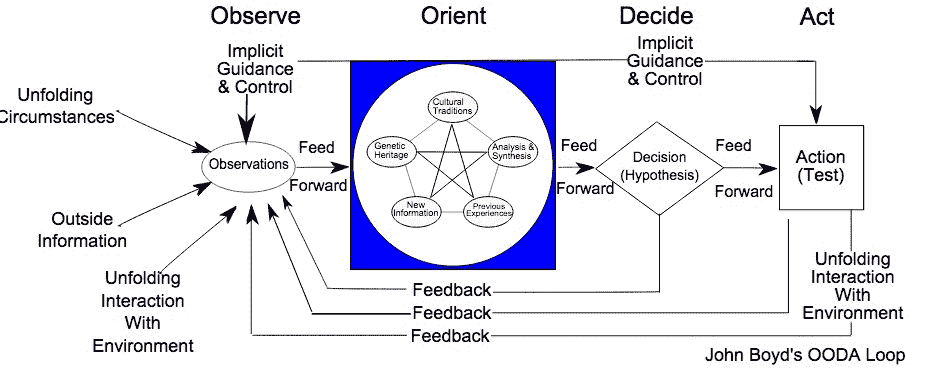

# 足够的监控。行动！

> 原文：<https://devops.com/enough-monitoring-act/>

> *或者我是如何学会不再担心并爱上自动修复的*

如今，StackStorm 以及其他自动补救和事件驱动自动化的方法正被广泛采用。

从脸书到网飞和 WebEx 的每个人(耶用户！)不仅仅是更好地“管理”他们的 2am 页面(尽管这也很酷)——他们是 *消灭* 他们。

随着他们采用 StackStorm 进行补救，不可避免地会出现一场关于监控与修复的讨论。为什么？

在某种程度上，这是因为最近在应对糟糕的监控方面所做的出色工作。感谢 Sensu，感谢 SignalFX，NewRelic，DataDog，AppDynamic，Splunk，整个 ELK stack，以及其他我漏掉的> 150 个监控解决方案。

但是在另一个层面上，这是因为 OODA 告诉我们，所有的观察和定位都取决于你做出的决定和行动。

事情是这样的，尽管人们逐渐意识到好的事件驱动自动化包括其中的 D——并且不纯粹依赖于智能监控，因为有了事件驱动自动化，就有可能运行一个例行程序，在对事件采取行动之前验证事件，但大多数人仍然错过了 ODDA 的基本洞察力。这是一种至关重要的洞察力，特别是如果你像上面的那些用户和积极网络防御世界中的许多人一样，正在与聪明的演员携手合作，否则就处于一个出错的地方正在改变的世界中。

这是我从生活在 OODA 中的人们那里学到的，也许是非直觉的洞察力，他们每天都在对抗狡猾的演员(人类、规模熵和蔓延的复杂性):

降低误报、创建和控制操作的成本，这样你就可以在根本原因分析(RCA)完成之前快速修复。

一些甚至是 ODDA[维基百科上的](https://en.wikipedia.org/wiki/OODA_loop) 也为使用 ODDA 的实战战士重复的提示是“拥抱混乱”——不要等到行动之前才知道发生了什么，因为你行动的速度本身就是决定你是否成功的关键。

一种思考方式是，你有一个从 O 到 A 的预算，这些步骤的总和就是你的平均恢复时间(MTTR)。

如果你把所有的 MTTR 预算都花在 O and O，那么你的 D 和 A 将会太少，太晚。

回到基础设施和开发的世界——这里有一些驱动因素促使我们更多地关注 D 和 A，而不是 O 和其他 O:

*   Docker 和 containers 和 cloud 本身。 现在的计算可以是短暂的(有时)。软件定义的许多其他产品也是如此。甚至存储！(嗨 Nexenta))

*   通过 API 和声明性系统公开的命令性内容。 是的，这是一个 StackStorm 插头。 *U R 惊喜？检查一下——当网飞知道有一个令人高兴的 API 可以可靠地照顾和喂养他们的卡珊德拉，即使 AWS 正在跳 AWS 熵舞，他们也可以稍微少纠结于 RCA，而更多地关注确保 StackStorm 有它需要的资源来修复、修复、修复、再修复，以免我们任何人开始注意到网飞的奇怪行为。(您想了解网飞如何自动修复他们的 Cassandra 环境吗？在这里用代码示例[实践教程。)](https://stackstorm.com/2015/09/22/auto-remediating-bad-hosts-in-cassandra-cluster-with-stackstorm/)*

*   基础设施即代码。 如果没有基础设施作为代码，改变事件驱动自动化中的集成和自动化的成本将是天文数字。在传统 run book 的世界中，需要调整自动化来响应 RIAK 打嗝，而不是 Cassandra 打嗝，这是一堆完美执行的鼠标点击(有意讽刺)或一组漂亮的专有代码。在我们的世界中，所有的胶水、规则和工作流程本身就是代码。

*   很抱歉扩展了这一点，但这是至关重要的，代码是 YAML，或者只是你手头的任何脚本，或者是你已经部署的配置管理系统。像 StackStorm 这样的系统可以从您已经拥有的一堆脚本开始，这些脚本与许多人类活动一起构成了您的 D 和 A，并摄取它们。(yum，yum，Java，Python，Bash 和 Ruby)然后这些脚本，这些配置管理系统，所有这些加上您的监控等等，都可以让您绑定到一个自动化整个 OODA 循环的系统中。然后好的事情发生了，因为你有令人难以置信的快速 MTTR(甚至是主动 MTTR，在中断发生之前就阻止了它)。

*   工作流程。 通过工作流你可以看到正在发生的事情。特别是如果通过流动暴露(另一个音高，我知道)。但不仅仅是流量和堆栈风暴。工作流的回归是真实而普遍的。点击这里 ，阅读今年春天 DevOps.com[上发布的许多项目的概述。](https://devops.com/2015/04/09/return-workflows/)

*   反馈循环 也许不言而喻——但是一旦你自动化了你的整个 OODA 并把它作为代码——你就能更好地迭代它。如果你把从 O 到 A 的每一笔交易都记录下来，那就更是如此了。你怎么能这样做？别担心，StackStorm 开箱即用。或者只是在每个事件上设置一个唯一的执行 ID，并通过您的规则引擎将其传递给事件的每个解释，然后在您让高弹性工作流系统中的多个工作人员开始执行时保留该 ID，然后在进行事后报告时也使用该 ID；不要忘记 API、GUI 和 CLI。或者只抓 stack storm——毕竟是开源的。

总之——OODA 是一个很好的参照系。然而，我们在 DevOps 似乎过分沉迷于 O 和 O，而那些首先阐明 OODA 的人——那些在战斗中使用 OODA 的人——至少同样关注 D 和 a

对我来说，这不仅意味着(通过自动化)更快更好地完成 D 和 A，还意味着我们可能不需要另一个监控项目。世界现在可以停止改造监控，我们至少有 157 个项目。

相反，让我们转而找出如何降低误报的成本和自动化不断变化的环境的成本，这样我们就可以越来越快地迭代，远远领先于熵怪物和试图窃取和破坏我们所建立的东西的真正怪物。

如果你喜欢这种讨论，并想了解脸书、WebEx、LinkedIn 以及几周后即将到来的——网飞正在这样做——你可能想加入[事件驱动自动化会议](https://www.meetup.com/Auto-Remediation-and-Event-Driven-Automation/),这是我和我的朋友布莱恩·舍温、LinkedIn SRE 以及[补救系统护士](https://engineering.linkedin.com/sre/introducing-nurse-auto-remediation-linkedin)的作者一起帮助组织的。网飞非常友好地同意在他们位于湾区南湾的旧办公室附近的新办公室举办下一次会议。即使你认为你不能做到这一点，我们试图通过这个会议分享内容，只要有可能，我们也流会议。

此外，冒着“过于投机”的风险，StackStorm 是领先的开源项目和公司，致力于事件驱动的自动化，特别是自动修复——我们 stormers 和更广泛的 StackStorm 社区在这里与您合作，支持您，为您提供优秀的代码，征求您的意见，征求您的 PRs、反馈、集成和自动化(又名 packs)。所以 [抢点代码](http://www.stackstorm.com) ，加入我们的 Slack [基础社区](http://www.stackstorm.com/community-signup) ，出发吧。