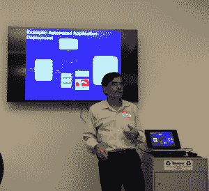
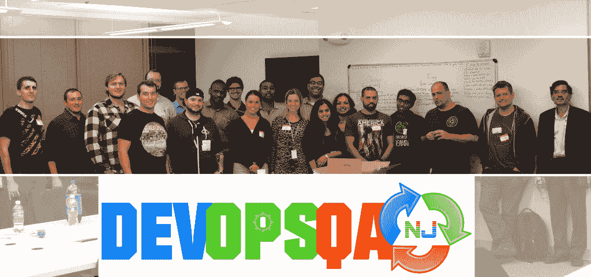

# 敏捷开发运维模式下的 NoSQL

> 原文：<https://devops.com/devopsqa-nj-meetup-nosql-agile-devops-model/>

[DevOpsQA NJ](https://www.meetup.com/DevOpsandAutomationNJ/) 刚刚在 NoSQL 举行了十月份的敏捷开发运维模式会议，来自 MongoDB 的 Shawn McCarthy、来自 Syncsort 的 Bhavna Sehgal 和 Suhas Joshi 都是会议的发言人。场地由 [ROKITT](http://www.rokittech.com/) 提供，位于一个最先进的办公场所，可以看到纽约市令人惊叹的景观。

Suhas 是一位拥有丰富 DevOps 经验的解决方案架构师，他对 NoSQL 做了很好的介绍，从从关系到 NoSQL 的历程开始，然后深入探讨了 NoSQL 数据模型，包括键值(如 CouchDB、Memcache)、文档(如 MongoDB)、宽列存储(如 Cassandra、HBase)和图表(如 Neo4J)。他还提到了大数据，称“大数据”一词用词不当，应该是“海量数据”。

Bhavna 讲述了 Syncsort 客户端如何利用 Hadoop 和 NoSQL 数据库来实现强大的结果。一些使用
案例包括将大型机数据卸载到 Hadoop、大型数据集查询和 Hadoop 上的实时分析。Bhavna 还介绍了在 Hadoop 中访问 NoSQL 的各种选项，包括 JDBC/ODBC 和 Java API 等等。

接下来，Shawn 对 MongoDB 做了一个激动人心的概述，从它是如何开始的开始，并深入探讨了它的功能。MongoDB 是一个跨平台的面向文档的数据库。虽然 MongoDB 被归类为 NoSQL 数据库，但它也支持关系结构。MongoDB 可以将数据存储在少量的文档中，而不是将数据分解成多个关系结构。Shawn 解释了为什么开发人员喜欢 Mongo 的原因，包括以下几点:1)它是由开发人员为开发人员构建的，2)非常容易设置，3)可用性，4)数据的自动分区，5)数据视图是从应用程序中抽象出来的。MongoD  B 没有交易或连接，不应该用于基于交易的银行数据，但它是一个存储日志数据、用户配置文件、用户生成的内容和基于位置的数据的伟大工具。Shawn 还讲述了丰富的查询模型以及如何将 Mongo 用于实时分析。如果你想了解更多关于 MongoDB 的信息，你可以通过[【电子邮件保护】](/cdn-cgi/l/email-protection)联系肖恩

最后，我们进行了精彩的问答和热烈的公开讨论。期待我们 11 月的下一次会议。

