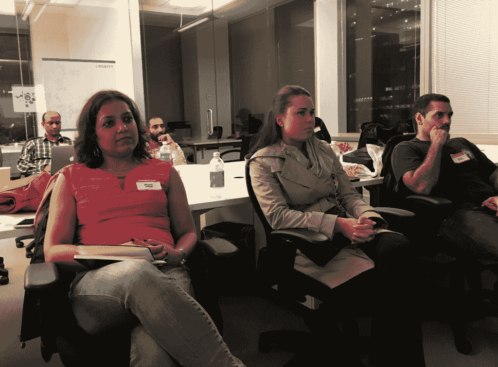
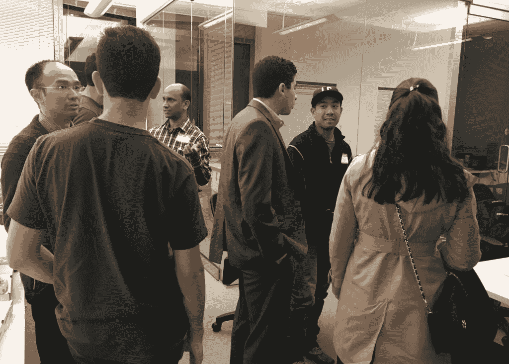
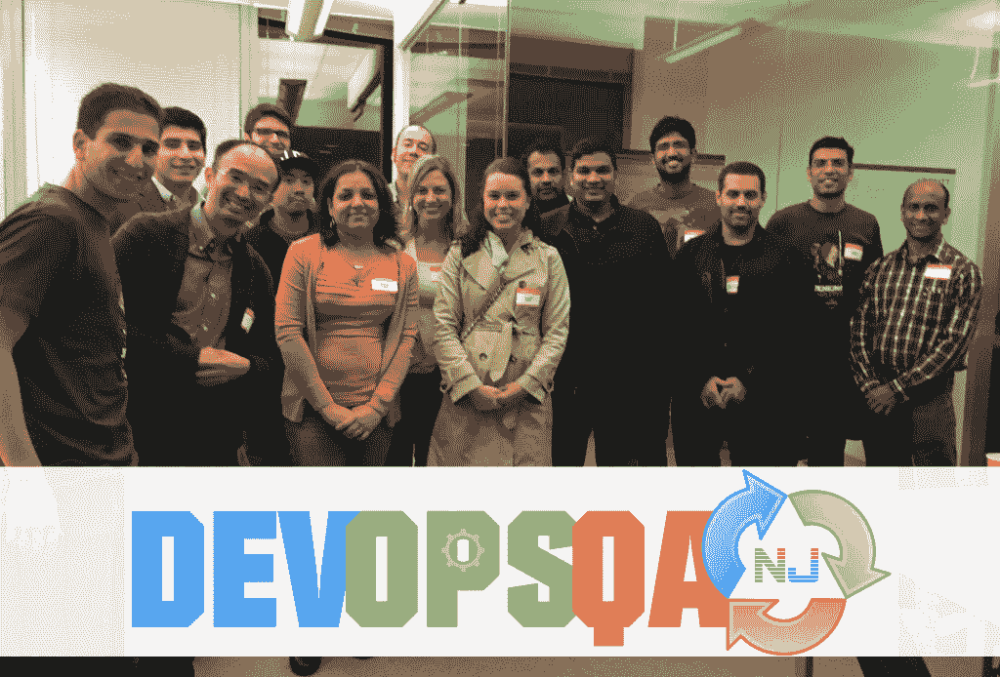

# DevOpsQA NJ Meetup–Jenkins 工作流技术讲座

> 原文：<https://devops.com/devopsqa-nj-meetup-jenkins-workflow-tech-talk/>

[DevOpsQA NJ](https://www.meetup.com/DevOpsandAutomationNJ/) 刚刚举行了关于 Jenkins 工作流的 11 月会议，来自 CloudBees 的 Kishore Bhatia 和 Isaac Cohen 担任演讲人。场地由 ROKITT提供，位于一个最先进的办公场所，可以看到纽约市令人惊叹的景观。尽管外面下着大雨，还是有很多老会员和新会员参加。

我们开始了一个有趣的速度网络，由[tek systems](http://www.teksystems.com)提供披萨和饮料。接下来，我通过 Jenkins 做了一个关于通过自动化进行转型的介绍性会议，讨论了在持续集成和部署方面取得领先的 10 个步骤。这些步骤包括识别瓶颈、建立公共存储库、自动化构建、单元测试、环境配置、测试数据管理、回归测试和报告。

接下来，Kishore 和 Isaac 介绍了 Jenkins 的工作流程，随后进行了详细的演示。

Kishore 以网景公司联合创始人马克·安德森的一句名言开始——“软件正在吞噬世界”。越来越多的事情变得自动化，每一项业务都变成了软件业务。我们正在实现运营自动化，这样我们就可以进行更多的运营，同时实现手动 QA 自动化，这样我们就可以进行真正的(有价值的)手动 QA(例如探索性测试)。

Jenkins 是协调从代码提交到二进制交付的所有 SDLC 步骤的工具。目前詹金斯有 1183 个插件，每周都有新的开发。有了今天的插件，你不得不创建原子作业，然后相互调用，这最终很难想象整体是如何工作的，尤其是当你有许多不同的项目时。

工作流旨在自动化和扩展管道步骤和工具，并解决常见的管道问题，如并行、分支、循环、重启、检查点、手动输入等。Jenkins Workflow 大部分是开源的，CloudBees 通过企业版提供了一些高级功能。工作流可以在一个简洁的脚本中定义，使用一个基于 groovy 的 DSL 和 15 个简单的关键字。

Isaac 接手演示工作流程。他解释说，阶段将是流水线的不同步骤。工作流脚本不必直接在 jenkins 作业中编写，而是作为源代码存储库中的外部文件。可以创建新的 DSL 来抽象出单独的动作，如源代码检验、构建、测试等。将有可能在你的 jenkins 中和全世界共享这个 DSL，以及下载和使用其他人的 DSL 来利用他们的代码，避免自己编写代码。检查点可以与电子邮件等通知方法结合使用，以便直接从被通知人那里获得信息。多分支工作流系统将支持分支，git 中的任何新分支都将在 Jenkins 中创建新的工作流。Jenkins 会扫描所有的 GitHub 库并自动添加所有带有 Jenkins 文件的项目，也会扫描新项目并自动添加到 Jenkins 中。

在会议结束时，Kishore 和 Isaac 向我们简要介绍了 Jenkins 2.0 版本，其中包括关注持续交付用例以及 UI/UX 改进。

如果您想了解更多关于 Jenkins 工作流程的信息，您可以通过 [【电子邮件保护】](/cdn-cgi/l/email-protection#650e070d04110c042506090a1001070000164b060a08) 联系 Kishore，或者通过 [【电子邮件保护】](/cdn-cgi/l/email-protection#8ce5efe3e4e9e2ccefe0e3f9e8eee9e9ffa2efe3e1) 联系 Isaac。有关 CI/CD 转换的更多信息，您可以通过 [【电子邮件保护】](/cdn-cgi/l/email-protection#6b1f0a05120a4500190a1d1f18041d2b190400021f1f0e080345080406) 联系我

最后，我们进行了精彩的问答和热烈的公开讨论。期待我们的下一次会面。