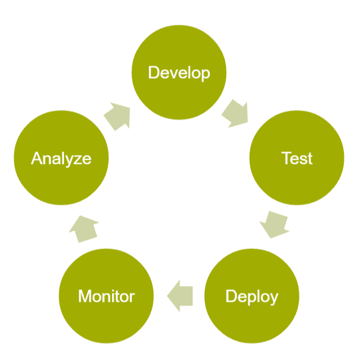
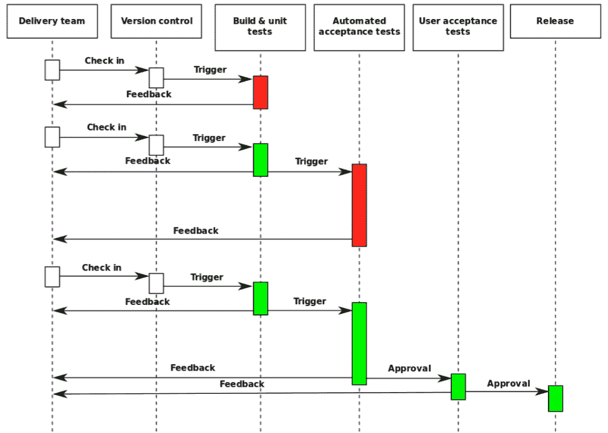
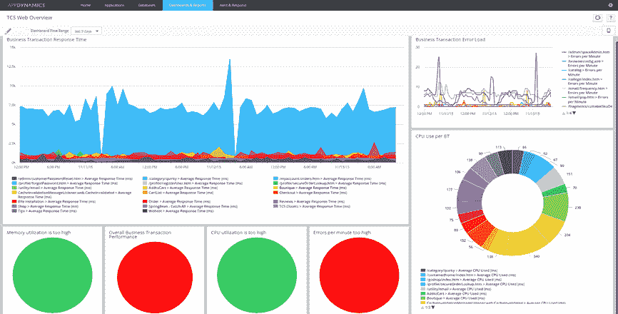
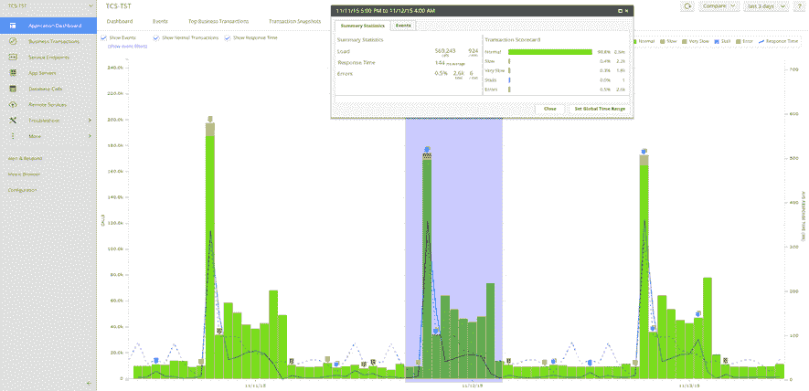
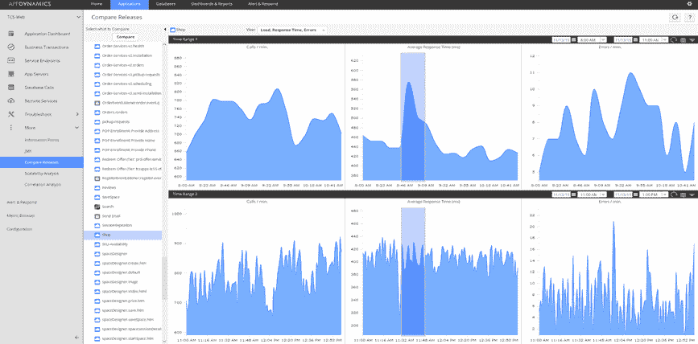

# APM 在持续集成和持续发布中的作用

> 原文：<https://devops.com/role-apm-continuous-integration-continuous-release/>

当今软件定义和驱动的业务需要业务模式的快速变化，这是一种渗透到成功企业中的现象。这意味着几乎每个公司都在学习如何在他们的业务中，尤其是在软件系统中，进行小而快速的改变和调整。因此，IT 感受到了巨大的发展压力，最终结果是在我们的大型企业客户群中，私有云环境(尤其是 Apprenda、Pivotal Cloud Foundry 和 Red Hat OpenShift)和公共云(尤其是 Amazon 和 Microsoft)出现了大幅增长。这些新平台能够更快地开发、测试和发布软件。

通过使用自动化来驱动软件生命周期，包括持续集成，甚至试验和使用持续发布过程，企业客户变得越来越聪明。这不再是一个启动场景；这是我们大型企业客户的战略。这些公司试图通过改变人员、流程和技术来建立敏捷开发和运营团队，以实现 DevOps 反馈循环:

维基百科对连续交付循环的描述如下:

在这个循环中，应用性能管理(APM)可以是构建、单元、回归和负载测试的一部分，在新代码投入生产之前推动自动化验收测试。事实上，在最近的 AppSphere 2015 用户大会上，我们就这个主题进行了几次精彩的讨论。

第一个演讲由我们的客户 [集装箱商店](http://www.containerstore.com/)[奥古斯特·阿扎雷罗](https://twitter.com/ajazzarello) 主讲，他讨论了“ [集装箱商店如何在开发生命周期中使用 AppDynamics。](https://www.youtube.com/watch?v=gEVTbp8YYe8) “公司从生产中的 APM 开始，力图在生产前提高软件质量。它通过在测试中安装 APM 开始扩展，将它集成到功能和性能测试套件中。它还支持来自开发/测试的警报，以便开发人员和测试人员在生产之前都了解何时出现性能偏差和问题。

该公司在前期制作中利用的主要功能包括仪表盘，例如:  

对比分析视图比如这个:

并且能够理解两次发布之间是改进还是降级:

容器商店正在使用开源工具，包括用于功能测试的 Selenium 和用于性能测试的 Locust.io。

在讨论中，August 还解释了公司从在前期制作中实施 APM 中看到的一些主要好处。以下是 August 在他的讨论中概述的一些最佳实践:

*   监控一切
*   连续测试
*   开发生命周期早期的性能测试
*   授权开发& QA 团队成员

根据 8 月份的调查，集装箱商店已经看到的一些好处有:

*   在生产部署前设定性能预期——自从开始在测试中使用 AppDynamics 以来，性能提高了约 40%
*   在生产部署之前微调警报和业务交易策略
*   确定测试要求和测试差距
*   将性能测试结果报告从五个小时减少到 20 分钟

我最喜欢的演讲之一(这也是我选择它作为 AppSphere 深潜课程的原因)是我们的一位高级销售工程师 [史蒂夫·斯特蒂文特](https://twitter.com/s_sturtevant) 的演讲，他两年前从 PayPal 来到 AppDynamics。在他题为“ [DevOps 和敏捷:持续集成环境中的 app dynamics](https://www.youtube.com/watch?v=H1VaZIsR4g4)”的演讲中，他解释了他所做的集成工作。他还深入研究了这样的问题，您能在动态环境中扩展和自动实现监控吗？你量化了变化的影响吗？Steve 还在他的示例中提供了一个集成了 Puppet、Jenkins、ServiceNow 和 AppDynamics 的演示，在整个生命周期中实现了自动化。

我们的一个合作伙伴 [电云](http://electric-cloud.com/) 专门从事持续交付，并拥抱技术提供商和开源软件的开放生态系统。它为那些想探索反馈循环其余部分的人提供了一些很好的资源:

*   部署自动化—[http://electric-cloud . com/wiki/display/release management/Deployment+自动化](http://electric-cloud.com/wiki/display/releasemanagement/Deployment+Automation)
*   Jenkins 集成和发布标记—[http://electric-cloud . com/wiki/display/release management/Deployment+via+Continuous+Integration+Tools](http://electric-cloud.com/wiki/display/releasemanagement/Deployment+via+Continuous+Integration+Tools)
*   整合现有【遗留】流程和框架—[http://electric-cloud . com/wiki/display/Release management/ITIL+Release+相关+流程](http://electric-cloud.com/wiki/display/releasemanagement/ITIL+Release+Related+Processes)
*   定义绩效 KPIs 关联业务绩效指标—[http://electric-cloud . com/wiki/display/Release Management/Release+Management+Metrics](http://electric-cloud.com/wiki/display/releasemanagement/Release+Management+Metrics)