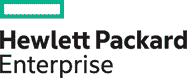
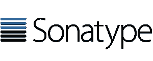

# DevOps Connect:加固型 DevOps @ RSA 会议

> 原文：<https://devops.com/devops-connect-rugged-devops-rsa-conference/>

今年，DevOps.com 与 Sonatype、Nexus Community、Gene Kim、Josh Corman 和 Mark Miller 一起制作了[devo PS Connect:Rugged devo PS](http://www.devopsconnect.com/rsa)@ RSA Conference。

全天活动将于 2016 年 2 月 29 日 RSA 周(每 4 年才举办一次)的周一在 Moscone 中心举行。在排满会议的一天之后，还会有一个鸡尾酒会。*鸡尾酒会需要单独登记。

去年的活动有 700 多人参加，演讲者阵容强大。今年的阵容我们认为更好。它介绍了来自开发运维团队和安全社区的领导者，以及一些关于开发运维如何帮助安全以及安全如何帮助开发运维的优秀从业者。

感谢 RSA 大会上朋友们的慷慨解囊，我们今年有了一个更大的房间来容纳更多的人。欢迎持有任何类型 RSA 通行证的任何人。

什么，你没有 RSA 通行证？没问题。注册 RSA 全票 Expo 时使用代码 1U6DEVXPO，可节省 100 美元。这将使你的通行证免费，如果你马上注册，或者只需 25 美元，如果你稍后注册。

使用 RSA Expo 通票，您不仅可以参加 DevOps Connect: Rugged DevOps 活动，还可以参加为期一周的 RSA Expo 展厅活动。我觉得不错。您可以前往[注册这里](https://www.rsaconference.com/events/us16/agenda/sessions/2339/devops-connect-rugged-devops)。但是不要等了，还有不到 30 天就要 RSA 了！

你还可以得到更多关于演讲者、摘要、背景等的信息。在[devo PS Connect:Rugged devo PS](http://www.devopsconnect.com/rsa)网站上。

所以不要等了。由于座位有限，请立即注册，先到先得。期待在 DevOps Connect: Rugged DevOps 上与您见面！

以下是完整议程的快速浏览:

*   上午 8:30–8:50 |开门
*   上午 8:50–9:00 |欢迎和概述| **艾伦·希梅尔、马克·米勒**
*   上午 9:00–9:20 |巧克力和花生酱(或类似的东西) **|乔希·科尔曼、约翰·威利斯**
*   上午 9:20–9:40 |你的 DevOps 岩石下藏着什么？| **Jez Humble**
*   上午 9:40–10:00 | devo PS 数据科学的现状| **Nicole Forsgren**
*   上午 10:00–10:40 |开发与安全的黑暗面| **布鲁斯·波特**
*   上午 10:20–10:40 |休息
*   上午 10:40-11:00 | 2016 回顾:公共安全和隐私的失败 **|金·泽特**
*   上午 11:00–上午 11:20 |坚固 DevOps 的七个习惯| **Amy DeMartine**
*   上午 11:20–11:40 |应用 DevOps 原则应对网络安全的动态变化| **Aaron Volkman，Hasan Yasar**
*   上午 11:40–下午 12:10 |小组讨论:“DevOps 参与:政治、人员和流程”|**goer lich/付令超/Corrierre/王**
*   中午 12 点 10 分–下午 1 点 20 分|午休时间
*   下午 1:20–1:40 | DevSecOps 之旅| **Shannon Lietz**
*   下午 1:40–2:00 |坚固的 DevOps:速度合规| **Justin Arbuckle**
*   下午 2:00–2:20 |围绕攻击模型建立安全控制，而不是直觉| **Stephan Chenette**
*   下午 2:20–2:40 |发布工程在加固开发中的作用 **| J. Paul Reed**
*   下午 2:40–3:00 |万里行的一线希望:构建安全解决方案的开发人员| **安德鲁·贝切勒，赞的助手**
*   下午 3:00–3:20 |休息
*   下午 3:20–3:40 |安全战争游戏| **山姆·古克尼默**
*   下午 3:40–4:00 |使用攻击驱动的方法将安全性和开发运维联系起来| **Earnest Mueller，James Wickett**
*   下午 4:00–4:20 |架构、设计模式和大规模加固开发的编码| **富豪**
*   下午 4:20–4:50 |一家主要航空公司的罗德岛机场| **丹·格拉斯**
*   下午 4:50–5:00 |最终想法| **艾伦·希梅尔，马克·米勒**

还要特别感谢我们的赞助商:

**HPE，Illumio，Cloud Passage，Evident.io，CA Technologies，TwistLock 和 RSA 大会！**

