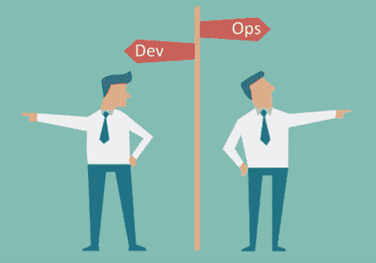
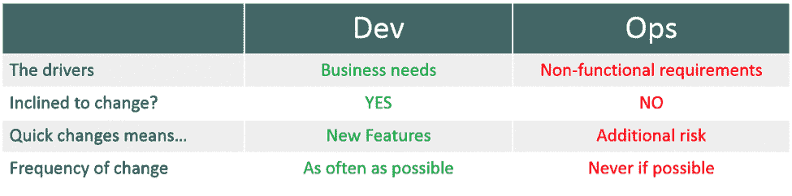

# 拥抱 DevOps 文化，第 1 部分

> 原文：<https://devops.com/embracing-a-devops-culture-part-1/>

DevOps 现在很流行。因此，所有行业的组织都渴望拥抱“DevOps 文化”也就不足为奇了然而，与 ITIL 不同的是，在组织中实施 DevOps 并不是一蹴而就的。

与网飞或亚马逊等公司相比，大多数组织每天不会部署成千上万的应用程序。事实上，通常是较新的公司能够完全接受 DevOps，因为他们所有的业务运营都依赖于它。

## DevOps 理念>程序

有很多文章试图定义 DevOps，但是 DevOps 更多的是一种理念而不是一个过程。如果您对 100 个组织进行调查，了解他们在现有业务流程中实施 DevOps 策略的经验，您可能会得到 100 个不同的答案。

一个组织的 DevOps 之旅通常是独特的，因为有许多不同的因素影响着 DevOps 集成。这些因素包括公司的规模和历史、所处的行业(银行/金融、零售、医疗保健、电子商务、教育、公共服务)、技术的复杂程度、it 的性质(数据中心或 SaaS)、组织结构(孤岛式或集成式)、开发方法(敏捷或瀑布式)、关键任务应用程序的性质(Web 2.0、虚拟化、客户端-服务器……)等等。对于大多数存在于创业生态系统之外并依赖于 Web 2.0 和敏捷应用程序开发的公司来说，开发人员和运营人员就是合不来。

## 开发与运营

如果每个部门的目标不一致，那么尝试与开发人员和运营人员协作就像是尝试混合油和醋。因此，IT 实现最大业务价值的能力大大降低。为了有效地推动业务发展，开发人员和运营人员必须和睦相处。

大多数情况下，开发人员和运营人员之间的冲突是因为一个部门的重点与另一个部门的重点不一致，这在需要相互协作时会造成紧张。虽然开发的重点是不断提供新产品和/或功能以满足业务需求，但 IT 运营部门努力保持 IT 服务的可用性和稳定性以及 IT 成本效益。

## DevOps 不能被工具限制

首先，为了在开发和运营部门之间实现无缝协作，这两个部门必须使用兼容的工具。不匹配的工具集会造成瓶颈、误解和沟通不畅，从而浪费大量时间，以至于实施过程最终会损害业务。

接下来，流程必须保持一致；具有冲突进程的兼容工具集是无用的。例如，发现服务台使用一个独立于用于管理产品缺陷和改进的应用程序开发工具的票务系统并不罕见。

开发人员倾向于依赖为快速开发而优化的工具集来提供代码更改的快速反馈，以自动化构建创建和应用程序发布部署。此外，开发团队可能不知道运行时环境，这使得很难相应地调整代码，而运营团队使用目标运行时环境上的解决方案，在目标运行时环境中，稳定性和性能超过了灵活性要求。

由于每个组织的集成过程都是独一无二的，所以找到适合新过程和新员工的工具非常关键。仅仅因为一个团队使用最新的应用发布自动化工具来一致地驱动应用的可重复部署到生产中，并不意味着他们已经采用了 DevOps。

事实上，版本控制、应用程序发布自动化和应用程序自动发现业务事务都是帮助开发人员实现其目标的工具，但可能无法解决等式的另一部分:运营。

在一天结束时，最重要的决定之一是在您的企业中选择正确的领导团队——从您的高管团队到您的开发和运营团队的负责人。DevOps 的集成过程可能会很困难；为了将两个独立的部门和流程合并在一起以推动协作，开发和运营团队都需要领导者对大局有清晰的愿景，以及每个人需要什么来推动公司向前发展。

## 关于作者/文森特·格弗雷

 Vincent Geffray 是 [Everbridge](http://www.everbridge.com/) 公司产品营销高级总监，主要负责 IT 服务警报&通信自动化和物联网。

他在信息技术业务领域拥有超过 14 年的经验，设计、推广和销售企业 IT 运营管理解决方案，包括关键通信、应用性能管理、IT 流程和工作负载自动化。他也有国际比赛经验，因为他是在欧洲开始职业生涯的。Vincent 拥有麻省理工学院斯隆管理学院的理学硕士学位(机械工程和计算机科学)和高管证书。

文森特的 LinkedIn:[www.linkedin.com/in/vgeffray](https://www.linkedin.com/in/vgeffray)

文森特的推特:@vgeffray