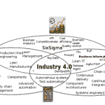
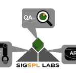
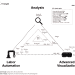

# 一个改变世界的工程智囊团

> 原文：<https://devops.com/a-think-tank-to-change-the-world-looking-for-more-like-minded-people/>

在他的名著《人月神话》中，Fred Brooks 说， “在其他工程学科中被证实的和常规的技术被认为是软件工程中的突破性创新。”

虽然我非常喜欢大规模的工程设计，例如建造数百万辆高端但个性化配置的汽车或双层飞机或宇宙飞船，但我总是问自己，为什么最有前途的行业——软件工程——往往也无法进行大规模的工程设计？或者说，为什么这么多大企业 IT 项目在这么多方面都很痛苦？

带着这些似乎没有人真正感兴趣的问题，有一天我遇到了一些更高级的公司管理层，他们想知道为什么 IT 部门如此不愿意遵循他们的精益转型建议，而是谈论一些敏捷和持续集成的东西。

从那一刻起，我明白了彻底升级软件工程所需的一切都已经存在了！最大的问题是我们沟通不够——此外，没有对整个 IT 价值链的整体看法。

我的意思是我们需要为价值链创造意识，从业务流程的数字化正式模型和书面业务需求开始。

这就是下面这张图表的由来，我仍然喜欢它。显然，大多数令人敬畏的事情发生在分离的知识领域的边界上；你只需要和那些你从没说过话的部门的同事说说话！如果我们将来自大工业的知识、最佳可用的过程改进和质量保证方法相结合，并将所有这些应用于我们如何设计、构建和交付软件，会怎么样？ 

起初，我以为我找到了一个关于 DevOps 的新视角，但现在我相信可能有更多。现在，彻底创新的大门已经打开了！想象一下:如果我们将物联网方法应用到我们的行业会怎么样？也许我们可以在软件开发和测试中关闭流程改进的循环，将它转移到实时并运行优化，不是通过模糊的框架，而是通过来自虚拟传感器的确凿事实，具有前所未有的透明度？

这就是我和几个朋友对我们的基金会产生的想法，我们称之为 SIGSPL(软件生产线特别兴趣小组)。这个公共组织是一个非营利性的智库，围绕三个通用领域构建——人工自动化、分析和高级可视化——我们认为这是后 DevOps 时代即将到来的融合软件工程的三大支柱。 

我们确信这种事情不可避免地会发生，但我们的使命是催化这些过程，使彻底的创新有意识地、更快地发生，这样我们就能建立起震撼人心的信息技术！

我们是一个由六个人组成的小团队，有一些基础设施，在我们的博客上有出版物，有一个完善的但仍在增长的知识库。我们希望能接触到更多志同道合的人，让这个想法成长起来，改变世界。我们的计划是促进 DevOps 专家和其他在这种情况下“意想不到”的专家之间的进一步交流和讨论，例如生产线和供应链管理专家、六个适马黑带、3D 艺术家、黑客、风险投资家和许多许多其他人。

我们的魔力三角图证明了我们并非一事无成，它展示了我们映射到三个通用领域的一些众所周知的工具，这也是风险投资非常感兴趣的。我们对世界的问题是，比如说，五年后，这个三角形的中间会出现什么？

## 关于作者/彼得·穆雷什金

Peter 获得了应用计算机科学的理学硕士学位，并从事侧重于复杂分析和客户满意度的管理咨询工作，包括 IT 业务分析师和变革经理。他目前的科研重点是大型分布式组织中应用于软件工程领域的数字化转型。

*领英:*[*https://de.linkedin.com/in/muryshkin*](https://de.linkedin.com/in/muryshkin) *团队博客:*[*http://sigspl.org/blog/*](http://sigspl.org/blog/)