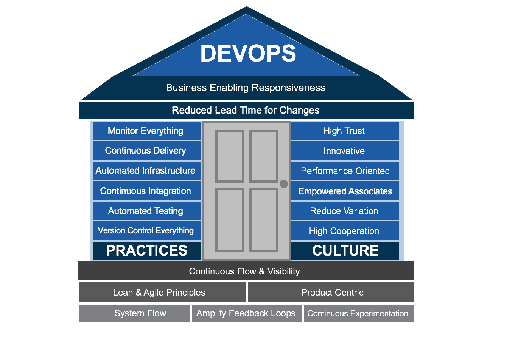
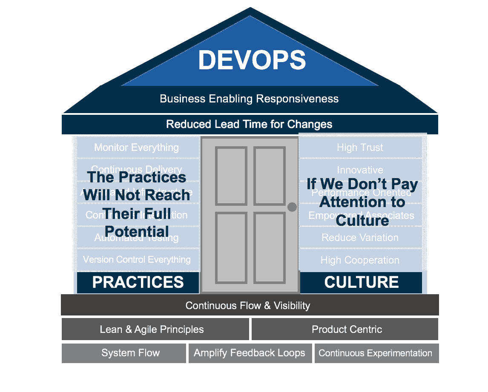
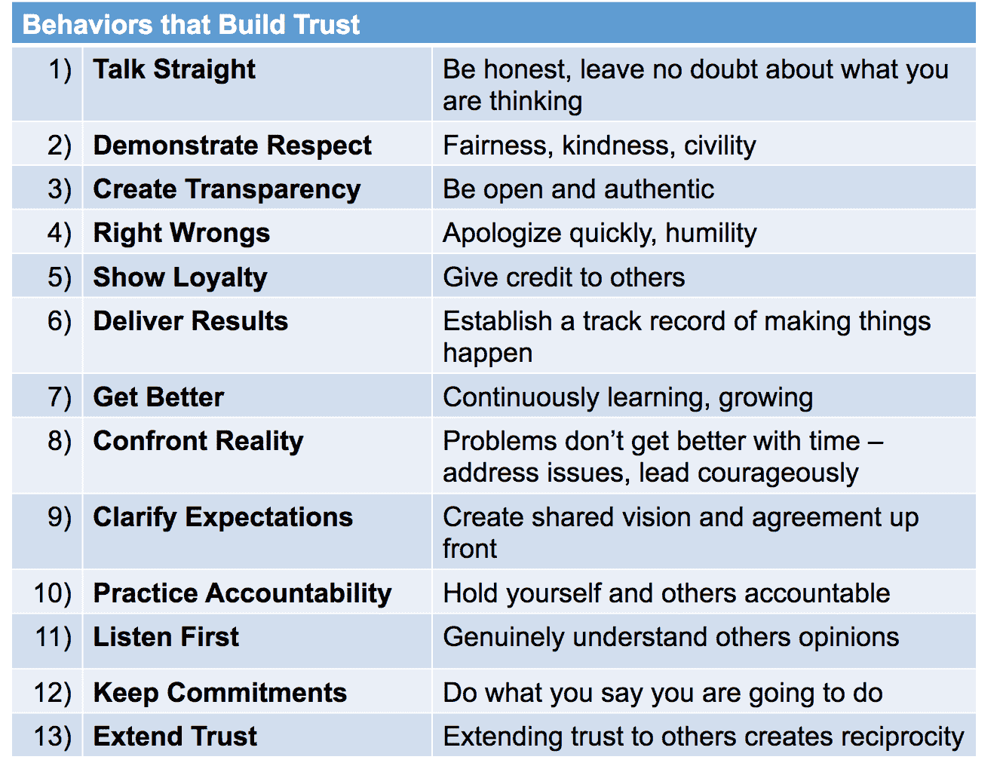

# 互联 2016:文化至关重要

> 原文：<https://devops.com/interconnect-2016-culture-matters/>

最近的 IBM [InterConnect 2016](https://www.ibm.com/cloud-computing/us/en/interconnect/) 聚焦于大量工具和技术，从云/SaaS 解决方案到容器和自动化，但在大厅里听到的另一个热门话题是组织文化。这些对话的基本前提是，除非你获得正确的文化，否则世界上所有的技术都无法让一个组织在持续的数字化转型中竞争。

在 Nationwide，我们开发了一个基本的 DevOps 模型，该模型有两个主要支柱，建立在 Gene Kim 的"["三种方法](https://en.wikipedia.org/wiki/Gene_Kim)"以及精益和敏捷原则之上。

虽然存在实施 DevOps 相关实践的计划，例如使用 Jenkins 的持续集成、使用 TaskTop 和 UrbanCode 的持续交付以及使用 GIT 的版本控制，但是如何影响文化呢？因为很明显，如果文化不正确，技术解决方案将不足以实现 DevOps 在缩短交付周期和使业务领域更好地响应市场需求方面的目标。

## 信任:文化的基础

支撑文化的一个关键因素是信任。李·里德去年写的一篇名为“[devo PS 的简单数学](https://devops.com/2015/06/22/the-simple-math-of-devops/)”的博客强调了这一点

那么，如何建立信任呢？以下是史蒂文·柯维的 13 种建立信任的行为:

科林·鲍威尔(Colin Powell)在一段关于领导力本质(T1)的视频中强有力地谈到了这一点，他说建立信任的一个方法是“言行一致”他还强调，成功的领导者是那些为团队提供无私服务的人。

我并不声称有任何建立信任的神奇公式，但显然一个组织的转型成功必须包括对文化和信任的关注。没有这个，DevOps 的真正承诺就不会实现。

您可以在 InterConnect 2016 上阅读更多关于我的会议“在 DevOps 生命周期中实现持续可见性”的信息。

## 关于作者|卡门·迪尔多

卡门·迪尔多是国家保险公司的技术总监。Carmen 是 DevOps 的热心拥护者，也是 DevOps 和技术相关活动的主要发言人，她负责在移动、分布式和大型机以及其他技术中利用 DevOps、精益和敏捷技术推动持续交付。