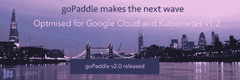

# goPaddle 支持 Google 云和 Kubernetes v1.2 版

> 原文：<https://devops.com/gopaddle-goes-google-cloud-kubernetes-v1-2-friendly/>

西雅图，2016 年 3 月 18 日/美通社/ — [云& DevOps 公司 Bluemeric Inc](http://bluemeric.com/) 今天宣布发布下一版本的 goPaddle v2.0，这是一个面向微服务的 DevOps 平台。

2016 年是开发运维年，IT 组织已经开始关注横向扩展和规模经济，而电子商务公司已经理解了敏捷交付和应用零宕机的影响。正如 Gartner 预测的那样，it 正成为全球 2000 强企业中 25%所采用的主流战略。随着对开发运维的需求不断增长，基于微服务的架构正成为快速应用交付的关键促成因素。微服务是独立的、多语言的和可重用的相当大的执行单元。独立团队/开发人员可以制作这些微服务的版本，将它们打包成 Docker 之类的容器，并部署在他们选择的基础设施上。像 Kubernetes 这样的容器集群提供了一个分布式和可移植的平台，可以管理这些容器的生命周期，并提供一致的环境，以便应用程序可以轻松地跨数据中心和云移动。

虽然市场上出现了一系列 DevOps 就绪解决方案，但专注于微服务的持续构建、集成和部署的平台将是企业节省成本和时间的巨大解决方案。

自去年以来，客户一直在使用 goPaddle 进行持续的构建和部署。在新版本中，goPaddle 针对谷歌云进行了优化，从而使谷歌云开发人员的身份验证、板载微服务和集群供应变得简单无缝。goPaddle 提供了一个强大而简单的设计器界面，开发人员可以使用它来拖放组件，以创建微服务设计并动态生成容器/集群规范。这些设计可以部署到谷歌容器引擎(GKE)或他们选择的集群上。开发人员可以利用谷歌容器注册(GCR)或使用 Docker Hub 来存储/检索容器图像。正如这些功能所表明的那样，goPaddle 将基础设施管理的麻烦从开发人员身上移走，而开发人员可以专注于构建他们的应用程序。

在增加简单性的同时，goPaddle 还提供了审计和监控应用程序的可追溯性和控制。一般来说，像 fluentd 这样的日志聚合平台已经被开发人员和系统管理员广泛用于监控系统、应用程序和访问日志。goPaddle v2.0 利用 Kubernetes v1.2 中的最新功能引入了对 fluentd 的支持。借助 goPaddle，fluentd 可以部署在选择性集群基础架构上，以聚合这些基础架构内运行的微服务的日志。

goPaddle 可作为托管版本在 [https://gopaddle.io](https://gopaddle.io/) 获得，也可作为具有扩展支持的企业就绪内部版本获得。欲了解更多信息，请致电 [【电子邮件保护】](/cdn-cgi/l/email-protection#6c05020a032c0e00190901091e050f420f0301) 与 Bluemeric 团队联系。

图片-[http://photos.prnewswire.com/prnh/20160317/345548](http://photos.prnewswire.com/prnh/20160317/345548)