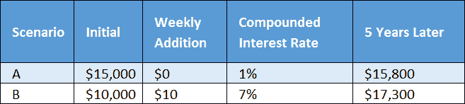

# 持续改进:DevOps 的关键区别

> 原文：<https://devops.com/continuous-improvement-key-devops-distinguisher/>

DevOps 已经成为交付成功的一个广为接受且不断增长的组成部分，在[其他受尊敬的出版物](http://blogs.wsj.com/cio/2015/03/06/devops-moving-deeper-the-mainstream-gartner/)中的 [State of DevOps 报告](https://puppetlabs.com/blog/slideshare-2015-state-of-devops-report)中显示。但是，即使它变得越来越普遍，认为每个组织都将不再有交付问题也是天真的。实现会有很大的不同，坚持基本上是自我报告。那么，是什么将那些多年来为有效的软件交付而奋斗的组织与那些持续超越其竞争对手的组织区分开来呢？

DevOps 的文化和关系方面的模糊性质阻碍了 ISO 或 CMMI 风格认证的潜力——这可能是一件好事，尽管它也为 DevOps 打开了大门，只是一个没有任何牙齿的重新品牌化练习。作为指南， [CAMS 模型](https://www.chef.io/blog/2010/07/16/what-DevOps-means-to-me/)仍然是 DevOps 关键原则的极好概述。它为衡量、反馈和分享奠定了基础，为改进奠定了基础，但在将持续改进作为首要问题之前就停止了。

持续改善的速度相当于复利。只需要一个简单的例子来说明如何从更后面开始，但专注于持续改进，可以让你超越那些拥有更多初始资源的人。

## 优先考虑开发运维，以实现持续改进

专注于 [Kaizen](http://itrevolution.com/japanese-words-for-devops-practitioners/) 或持续改进的开发运维可以提升公司有效交付软件的能力。不幸的是，它正好落在[史蒂芬·柯维的模型](https://www.forbes.com/sites/ericjackson/2012/07/24/the-only-thing-you-need-to-remember-about-the-seven-habits-of-highly-effective-people/#55d74ad1498a)中的重要/不紧急象限，在那里好想法和好意图被持续冻结。无法在这个州保持势头和牵引力影响了许多公司。

为了实现我们在公司中持续改进 DevOps 实施的目标，首先我们必须研究如何成功地推动内部计划。作为一种默认的行为，公司通常将自己降级到仅仅通过一个季度到另一个季度，交付大部分增加的客户特性。更雄心勃勃的计划会在管理层引起很多兴奋的讨论，但在实际实施中经常会停滞和延迟。为什么这种情况太常见了？

有三个主要障碍:

*   **组织所有层级的共同目标和优先事项不一致:**中层管理人员或直线管理人员之间经常会有差距，在这种情况下，积极性可能会下降。过度沟通并确保沟通遍及各个层面是没有坏处的，尤其是在发生重要变化的时候。
*   缺乏个人责任和授权:如果沟通充分，个人是否不仅知道目标，还知道他们可以和应该做些什么来实现这些目标？这方面原则上由官方系统处理，如[目标管理(MBO)](https://en.wikipedia.org/wiki/Management_by_objectives) 或[目标和关键结果(OKR)](https://en.wikipedia.org/wiki/OKR) 。你可以在许多系统中发现成功或失败，所以不要争论各种人员管理系统的优点，确保把重点放在关键目标和选择的行动上。
*   人们真的有时间预算和潜在的资金来采取行动吗？没有时间采取行动，只有模糊的意图——也许还有对没有取得进展的轻微罪恶感。

简单地识别上述障碍并解决它们的存在可能会令人大开眼界，并且可能会导致出现常识性的措施来调整组织。在最初的快速成功之后，肯定会有更多针对每个组织的困难步骤。最终的结果当然是值得的。

消除 DevOps 实施的组织障碍，不是作为一次性项目，而是一个不断发展的持续改进计划，为长期成功开辟道路。

作为进一步的思考，想象你也加快了持续改进的速度，所以它不是一个常数。加速力量的一个惊人例子是太阳帆的概念:每秒钟加速 1 毫米似乎感觉不到，然而一天后，它以 195 英里/小时的速度移动，12 天后，它达到 2300 英里/小时。“天文数字”是对一些著名科技初创公司交付速度的贴切描述。这就是持续改进的力量！