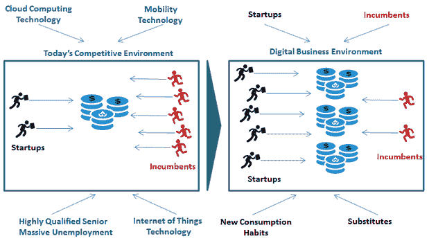
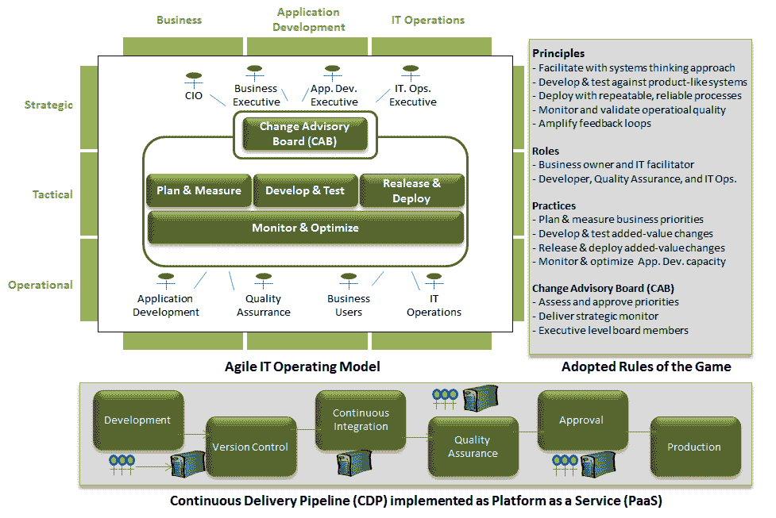
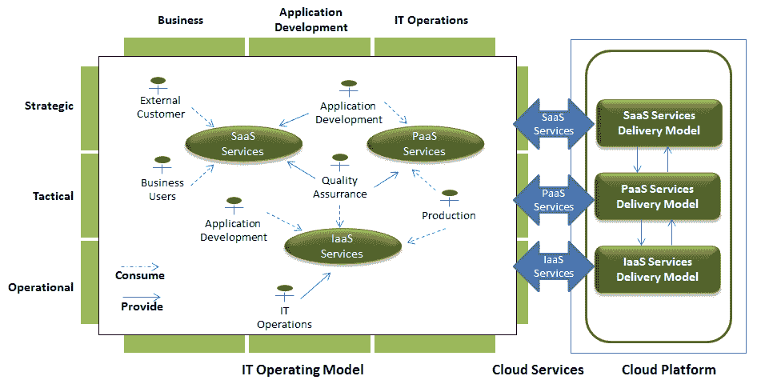

# DevOps 和 ITaaS:一枚硬币的两面

> 原文：<https://devops.com/devops-itaas-two-sides-coin/>

It 从业者似乎还没有意识到数字颠覆的规模。他们深陷于旧的 IT 思维，坚信复杂的工具是企业在持续的数字颠覆浪潮中生存所需的一切。他们中的大多数人警告说，“数字化转型正在改变我们做生意的方式，我们提供 IT 服务的方式必须改变，企业需要适应他们的工作方式。”问题是，他们在帮助企业以“正确”的方式工作方面没有什么新的东西。

事实上，同样的旧 IT 思维的实践仍然在应用，并幻想部署自动化和配置管理工具本身将使企业变得敏捷，对市场机会做出响应，从而应对数字经济的竞争挑战。这种想法没有抓住要点，原因有二:首先，这是对什么是业务敏捷性的错误理解，其次，这是对全球竞争环境转变的误解。

让您的 IT 组织变得精简和敏捷是您的业务线迫切需要的竞争优势。真正的 DevOps 实现才是出路。这是为了跟上谷歌、苹果、优步等新锐公司的步伐而付出的代价。

### 不断变化的竞争环境迫使企业关注创新、市场响应和及时创收

数字经济威胁着所有企业的生存。是的，你没看错，他们的存在岌岌可危。这一事实被 IT 供应商和咨询公司低估了。

如图所示，我们正从老牌企业(现有企业)控制大部分细分市场的商业环境转向竞争激烈的环境， 在惊人的数字机遇和采用云技术显著降低基础设施支出的吸引下，越来越多的初创公司颠覆了整个行业:

The changing competitive environment (Credit: [Philippe Abdoulaye ITaaS Now LLC](http://www.itaasnow.com/#!services/c5ro))

高素质失业老年人和创意企业家创建的创业公司的激增，加上替代传统服务的高度创新的数字服务(如物联网[IoT]应用)的传播，已经扰乱了绝大多数行业。

几个例子证实了这一事实:出租车行业受到优步(Alibaba)等技术驱动型公司崛起的冲击，银行业面临包括 PayPal、谷歌(Google)和苹果(Apple)在内的新型竞争对手；医疗保健行业日益受到 GlowCap 等公司的干扰。

要在数字时代成长和繁荣，你的规模、品牌资产或市值已经不够了。为了取得成功，您的业务线必须处于数字经济的竞争标准之上:竞争创新(持续改善客户体验的能力)、市场响应能力(在正确的时间向正确的细分市场提供增值服务的能力)和及时收入(持续增加客户价值的能力)。

### 数字经济已经把它带到了一个转折点——部署复杂的工具是不够的；精益和敏捷是必由之路

对于技术人员来说，业务线关注创新、市场响应和及时收入的义务是前所未有的；它迫使他们思考工具之外的问题，解决像组织和运营效率这样不寻常的问题。
事实上，创新、市场响应能力和及时收益需要更大的跨职能协作，IT 关注业务优先级、组织灵活性和加速上市时间。毫无疑问，仅通过部署工具，您永远无法实现这些目标，但通过主动消除阻碍跨职能协作、快速解决问题和做出决策的组织和运营功能障碍，也可以使您的 IT 运营模式变得灵活。

这就是让业务变得敏捷的含义。

新的 IT 思维可以概括为简单的算术:**数字竞争力=精益敏捷的运营模式+有效且高效的工具。**没有精益和敏捷的运营模式，创新和及时的收入只是一厢情愿的想法。如果没有有效和高效的工具，创新和市场响应也只是一厢情愿的想法。

组织和技术层面是互补的。大厨的首席技术官亚当·雅各布(Adam Jacob)在一篇非常翔实的文章中证实了这一事实，文章名为“[devo PS 的秘密:它一直是关于人，而不是技术](http://readwrite.com/2015/07/29/devops-people-not-technology/)”这就是 DevOps 可以帮助企业取得成功的地方。

### 开发运维是企业在数字经济中取得成功所需的 IT 资产

与现在(不幸的是)已确立的信念相反，DevOps 不是一种技术；厨师，木偶，詹金斯，OpsWorks，都不是 DevOps，他们只是其中的一部分。清楚这一点很重要。

正如我一直在实施的那样，DevOps 是一个由原则、实践、角色和职责、治理结构和工具组成的系统，旨在建立跨职能协作，加快应用交付，进而使业务能够响应市场机遇:

DevOps Model (Credit: [Philippe Abdoulaye ITaaS Now LLC](http://www.itaasnow.com/))

如图所示，开发运维即业务能力由三个部分组成:游戏规则、IT 运营模式和持续交付管道(CDP)。让我们来探索它们。

#### DevOps 游戏规则为精益和敏捷的 IT 环境创造了条件

游戏规则是 DevOps 的一个基本维度:它们支持精益和敏捷环境的建立。我把它们称为 DevOps 非技术作品。

实际上，它们是一组制度化的原则、实践、角色和责任以及工具，以确保加速应用交付。

它们是具体的组织和操作有效实践的催化剂。让我们以原则“用系统思维(所有相关利益相关者的参与)促进”为例——它迫使应用程序开发利益相关者采取协作的心态，这反过来打破了组织的孤岛，以消除操作灵活性的障碍，并使跨职能协作制度化。

他们是当今 DevOps 实践的穷表亲，devo PS 实践忽略了他们，而倾向于更多的技术和技术问题。这是一个可怕的错误，降低了 DevOps 对数字经济挑战的影响力。

#### 敏捷 IT 运营模式建立了精益敏捷的工作环境

IT 运营模型反映了在您的应用程序开发价值流中发生的交互。实际上，它代表了来自 DevOps 游戏规则应用的工作环境。

我总是提醒我的客户，DevOps 的游戏规则不是理论，它们是有形战略能力的基础:精益和敏捷的 IT 环境。它们要求彻底转变您的应用程序开发工作空间，以将业务、应用程序开发和运营整合在一起:

The lean and agile IT work space for the digital era illustrated (Credit: [O.C. Tanner](http://www.octanner.com/))

这幅图说明了精益和敏捷 IT 环境的含义，它证实了 Adam Jacob 的观点，即“从根本上说，DevOps 是关于将我们作为人聚集在一起的行为和信念，将它们与对客户需求的深刻理解相结合，并使用这些知识向客户提供更好的产品。"

it 运营模式是当今 DevOps 实践的穷亲戚，devo PS 实践忽略了 IT，而倾向于更多的技术和技术问题。再一次，这是一个可怕的错误，降低了 DevOps 对数字经济挑战的影响力。

#### 毫无疑问，技术至关重要，CDP 有助于应对数字技术挑战

游戏规则的重要性以及由此产生的 IT 运营模式并不意味着技术无关紧要。毫无疑问，CDP 至关重要；我称之为 DevOps 技术作品。通过部署自动化和配置管理工具，它显著加快了应用程序开发、测试、资源供应和部署。

然而，需要注意的一点是，数字经济提出了超越快速交付问题的技术挑战。它们包括:

*   物联网的重要性
*   预测分析的关键作用
*   API 日益增长的重要性

事实上，物联网设备会产生大量数据，利用这些数据来创造收入需要大数据技术来整合、自动化和分析这些数据。

另一方面，这个物联网数据的海洋产生了 API 业务；这个想法是，为了将他们的数据货币化并产生收入，企业必须为他们的客户和合作伙伴提供能够轻松访问他们系统的 API。

将 CDP 实施为 PaaS 云服务的一部分有助于在数字经济中取得成功；它允许企业受益于云提供的廉价和按需计算、存储和网络资源。

### 外卖食品

事后来看，从以业务为导向的角度来看，ITaaS 交付模式和 DevOps 遵循相同的目标:为业务线提供他们需要的精简和敏捷的 IT 环境，以具有足够的灵活性和响应能力来应对数字经济的竞争挑战:

The ITaaS Delivery Model (Credit: [Philippe Abdoulaye ITaaS Now LLC](http://www.itaasnow.com/))

与 DevOps 一样， [ITaaS 交付模式(…)](https://www.linkedin.com/pulse/why-complete-itaas-delivery-model-next-evolution-beyond-abdoulaye) 利用灵活的 IT 运营模式来帮助企业在数字时代取得成功。它在整个 It 价值流中实施消费者-提供商关系，以确保组织的灵活性和运营的敏捷性。

首席信息官必须认识到，对企业来说，重要的是通过改善客户体验和增加客户价值来持续创造收入。为了速度而以光速部署应用程序从商业角度来看没有意义；只要预期的商业利益没有实现，速度就是一个无用的小玩意。

按原样实现 DevOps:三维 it 能力，包括游戏规则、IT 运营模式，当然还有持续交付渠道。