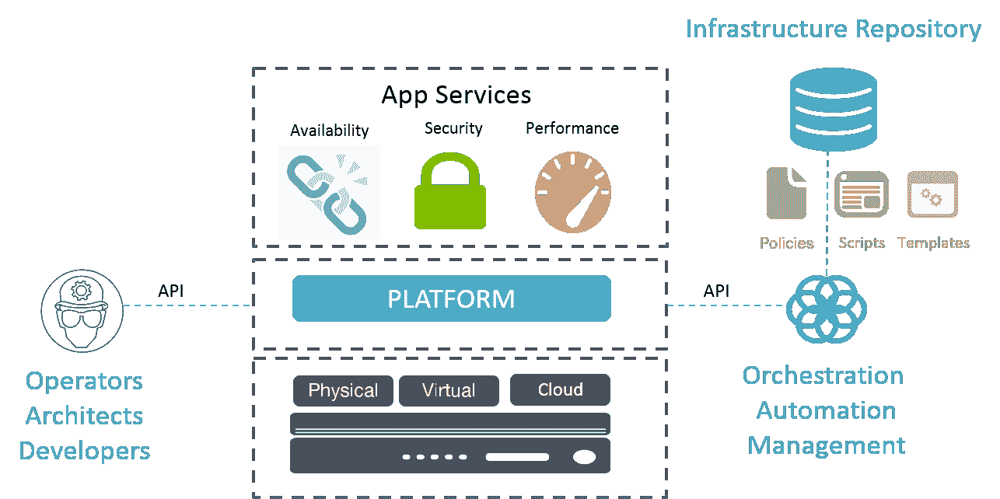

# 基础设施代码是面向运营的 SDN

> 原文：<https://devops.com/infrastructure-code-sdn-ops/>

随着我们不断认识到 DevOps(尤其是其自动化和流程编排方面)对于实现应用持续部署所需的敏捷性的重要性，术语“基础设施即代码”(IaC)如何适用于传统的网络系统和服务的问题必然会更加频繁地出现。毕竟，除了应用程序通信和提供内容所需的基于 IP 的核心网络特征之外，还必须考虑支持、保护和扩展 it 的整个应用程序服务生态系统。

IaC 是由网络基础设施开发原则的应用所驱动的。配置、脚本、模板、配置文件等被视为代码，因为它们应该从集中的存储库([希望是本地的](https://devcentral.f5.com/articles/what-infrastructure-should-learn-from-npm-javascript-debacle-18563))进行审查、版本控制和供应，而不是作为离散的网络元素进行管理。

在 TechBeacon 最近的一篇文章中，[stacken engine](http://www.stackengine.com/)的宣传主管 Boyd Hemphill 指出，“基本原则是操作员(管理员、系统工程师等。)不应登录到新机器并从文档中配置它。

这篇文章的作者兼 Null Media 的首席执行官 Christopher Null 接着写道，“……但是 IaC 是一个超越简单的基础设施自动化的概念。IaC 要求将 DevOps 实践应用于自动化脚本，以确保它们没有错误，能够在多台服务器上重新部署，能够在出现问题时回滚，并且能够由运营和开发团队参与。”

其思想是，您可以将任何给定的服务描述为一组工件，并随意部署(和重新部署)它们。因此，与其建立一个系统并直接配置它，不如将它的配置和任何相关的工件(比如概要文件或模板)视为代码并存储在一个公共存储库中。控制器——orchestrator——负责在必要时分发这些工件。控制器使用 API(或 OpenFlow 之类的协议)来管理分布式基础设施上的服务配置。它将服务定义从服务及其平台中分离出来。

再读一遍。它将服务定义从服务及其平台中分离出来，并将供应和配置的责任分配给控制器。有点像将控制平面从实际的转发和交换操作(数据平面)中分离出来，并将操作职责分配给外部控制器。

简而言之，将基础架构视为代码就是将配置从平台中分离出来，并启用软件驱动或软件定义的方法来调配、配置和管理基础架构。它将软件定义网络(SDN)的原则应用于运营，而不是设备和系统。

但是正如 Null 在他的文章中所阐明的，IaC 不仅仅是自动化和流程编排，它采用了与代码审查、版本控制和“代码”管理相关的最佳开发实践，以确保一致、可预测和可重复的部署。

这一切最终都由软件驱动，由软件部署，由软件定义，但总是在运营专家(工程师和架构师)的支持下进行。

将基础设施视为代码基本上是将 SDN 的架构原则应用于运营本身。是 SDN for ops。