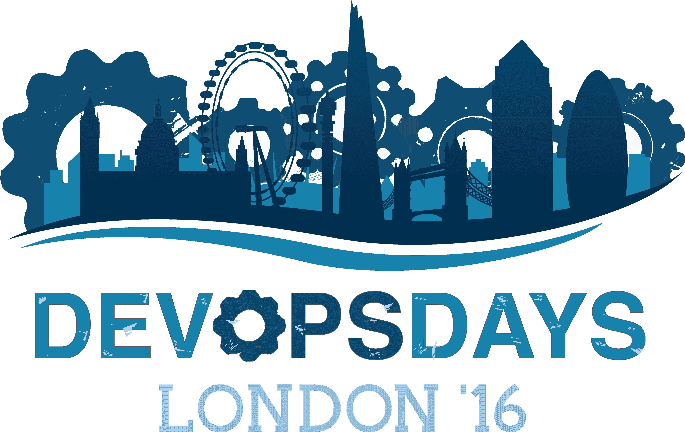

# 2016 年伦敦发展日:制造快乐

> 原文：<https://devops.com/devopsdays-london-2016-making-happy/>

自 2013 年以来，我们没有在伦敦举办过 DevOpsDays 活动。我记得上次的活动是在 4 月 19 日至 20 日举行的，今年的观众人数大致相同，但大约 85%的观众是第一次参加 DevOpsDays 活动。很高兴看到这么多新面孔，我猜高比例的首次访客可能是 DevOps 思维成熟和扩散的标志。

我将在 4 月 26 日发布一个名为“ [DevOps for Architects](http://www.ranger4.com/webcast-devops-for-architects) ”的网络广播，所以在去参加活动的路上，我阅读了这本[的书](https://www.amazon.co.uk/DevOps-Software-Architects-Perspective-Engineering-ebook/dp/B00XCF9VCI/ref=sr_1_1?ie=UTF8&qid=1461062027&sr=8-1&keywords=devops+for+architects)。在 Ranger4，我们会问人们很多问题:“你今天过得好吗？”或者，“你怎么知道你今天过得很好？”关于这一点，总有一些事情让我有点困惑，就像“好看起来像什么？”还有，“刚刚好”让我很困扰。我们不能目标更高吗？“伟大”是什么样子的？在书中，作者谈到了“快乐的日子”，这让我很开心。这是我在 2016 年伦敦 DevOpsDays 的第一天学到的主题——DevOps 让快乐。

以下是几个原因:

第一个上台的是布丽奇特·克罗姆胡特，一位 DevOpsDays 的组织者，我最后一次看到她是在 2014 年根特的 DevOpsDays 五周年庆典上。她的演讲名为“多云，有发展机遇”——这是对发展机遇的简明介绍，包括一些关键要点:

*   ***“自动化不是一切。”**先从文化说起。*
*   ***“devo PS 是练出来的，不是买来的。”*** 你可能会惊讶地发现我们支持这一点，因为我们以销售 DevOps 为生。但是我们没有。我们相信，使用 DevOps 原则帮助组织转型的最佳方式是与他们合作，指导、激励、引导、挑战并帮助他们完成他们的旅程。这就是我们的工作。
*   ***“没必要换。生存不是强制性的。”*** 这是引自“枭雄教父”戴明的话。

布丽奇特之后是乔安妮·莫莱斯基，她是《[精益企业](https://www.amazon.co.uk/dp/B00QL5MSF8/ref=dp-kindle-redirect?_encoding=UTF8&btkr=1)的合著者，这是 DevOps 爱好者经常引用的必读书目。

Joanne 演讲的关键信息是她断言技术不再是瓶颈，特别是在传统商业模式受到攻击的情况下。乔安妮还提到量子计算是她认为在不久的将来会出现的主要颠覆性技术。想到她所说的关于[特斯拉](https://www.linkedin.com/pulse/tesla-dangerous-disruptor-humble-innovator-julian-kezelman)的颠覆，特别有趣，不是因为该公司设计了更好、更实惠的电动汽车，而是因为它正在改变个人如何接入电网的游戏。

Bridget 认识到，并非所有公司都接近实现 DevOps 的速度承诺和随后的幸福，Joanne 发现的主要障碍包括缓慢的决策过程和许多企业长期以来固有的相互冲突的目标。她描述了“流程疯狂”以及大多数企业如何“计划、执行”并忘记了 [PDCA 循环](https://en.wikipedia.org/wiki/PDCA)中的“检查、行动”部分。她解释了有多少组织建立了“不”之墙——实际上是“文化说不”；在她的会议结束后，我们采访的许多人都有同感。

乔安妮在推特上多次引用的一句名言是:“只有当你不能学习时，你才会失败。”

在与正在转向敏捷和开发运维的组织交谈时，他们中的许多人谈到了从以项目为中心的思维转向以产品为中心的思维的困难，Joanne 重申了这一点。她推荐[三个地平线框架](http://www.mckinsey.com/business-functions/strategy-and-corporate-finance/our-insights/enduring-ideas-the-three-horizons-of-growth)作为在管理当前状态的同时规划和实施变革的有用工具。她还为试图应对法规要求的组织提供了一些非常有用的建议:“理解意图。”组织有误解和混淆法规内容的习惯。

“最好的代码是你不写的代码” *—* 有点像给作家的建议:“杀死你的宝贝。”这是关于精益，合理规划和去除多余的努力。

Joanne 还强调了衡量重要事物的重要性，这一点与我们的内心非常接近。类似地，她指出，具有典型的“命令和控制”结构的组织没有希望能够执行 DevOps。当组织进行文化变革时，他们必须在各个层面扩大反馈回路。通过使用像 [holacracy、](http://www.holacracy.org/)这样的原则，组织可以了解谁是他们业务中的传感器，并学会倾听想法，如何让疯狂的过程变得理智，让想法发芽开花。

我经常引用约翰·威利斯的话:

> “DevOps 最终证明了它可以成为一种战略优势，让企业在竞争中脱颖而出。这是我们期待已久的时刻。”

很长时间以来，它一直被视为地牢里的家伙，见过 IT 人群吗？)但正如约翰所说，这对 IT 界的我们来说是激动人心的时刻。正如 Joanne 所说，我们过去说 it 支持业务，然后我们说 IT 与业务保持一致，现在我们说 IT 集成到业务中，或者更好的说法是 IT *就是*业务。这应该让我们都高兴。

克里斯·萨克斯顿(Kris Saxton)接着乔安妮做了一个我们非常期待的演讲:“双模 IT 和其他蛇油。”我们[最近也在挑战这个术语](https://www.linkedin.com/pulse/offensive-language-helen-beal?trk=prof-post)，所以我很高兴地发现更多的支持，这是对组织所处情况的过度简化，并且适得其反，通过创造更多的筒仓、更多的“他们和我们”来破坏我们试图创造的文化类型简而言之，克里斯说:“双模 IT 是毒药。”

正如 Jez Humble 最近所说的:

> “Gartner 的模型基于一个错误的假设，该假设在我们的行业中仍然普遍存在:我们必须在响应性和可靠性之间进行权衡…这一假设是错误的。”

克里斯说，有一个“快乐的地方”，在那里我们可以同时拥有响应性和可靠性、速度和质量、速度和稳定性。DevOps 通过左移、多学科团队、以人为本的小范围可扩展文化等等帮助我们做到这一点。

第一天剩下的时间里，活动的许多赞助商提供了很多机会，Pivotal、Ignites 和 Open Spaces 提供了演示。我留给你们的最后三个想法是:

1.  赞助商 [ServerDensity](https://www.serverdensity.com/) 用它的宣传来强调健康和幸福；#拥抱。该公司正在伦敦为 HumanOps 建立一个 [MeetUp 小组，强调 DevOps 不仅仅是自动化，它是为了让人类快乐](https://www.meetup.com/HumanOps-London/)
2.  微软的 Thiago Almeida 分享了微软 DevOps 计划如何对员工的工作/生活分数产生积极影响的数据
3.  约翰·克拉彭讲述了他是如何放火烧自己的汽车的，这件事让他了解了[同理心的力量](https://currencyofempathy.files.wordpress.com/2012/10/picture-for-blog-empathy-and-innovation-why-final1.jpg)以及如何用它来改善工作生活

请回来查看伦敦 DevOps 第二天的报道。