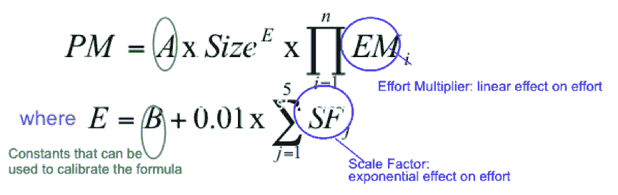
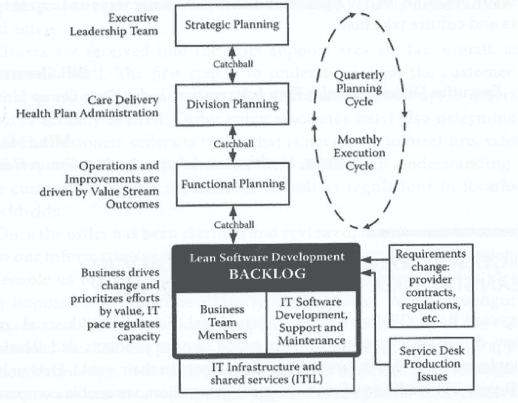
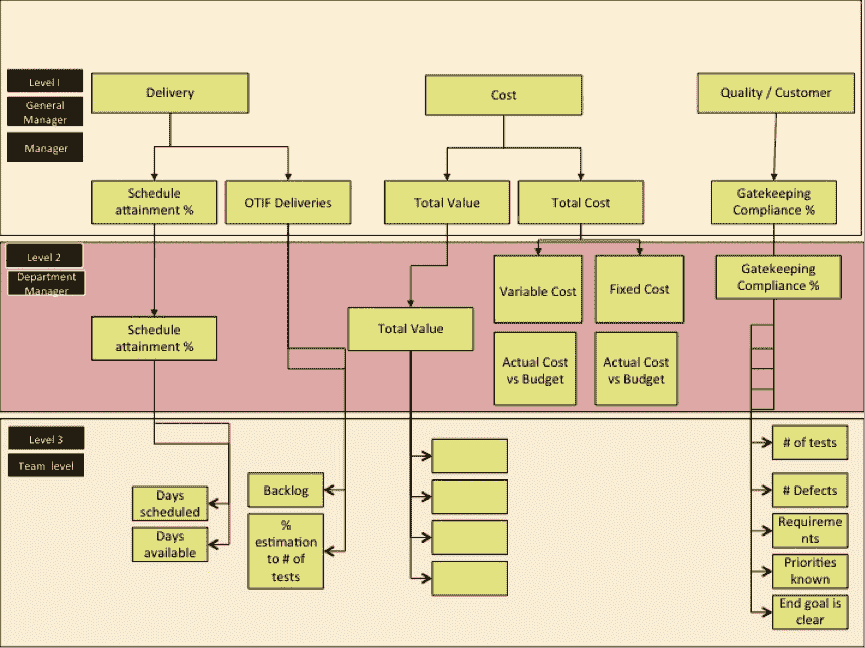

# DevOps:指标很重要

> 原文：<https://devops.com/devops-metrics-matter/>

关于指标或 KPI，我最喜欢的一句话来自 GE Capital 的首席信息官 Jim Fowler:“不要用成本或传统的 IT 指标来衡量我，而要用业务指标来衡量我。”

对我来说，在 DevOps 的背景下谈论度量标准是一个完美的开端。

DevOps 是通过技术或查看业务流程和问题的能力来缓解或实现目标，从而实现业务的运动。

## 度量的重要性

DevOps 的五大原则之一是衡量的概念(CLAMS:文化、精益、自动化、衡量和共享)。DevOps 帮助企业了解如何使用和受益于仅次于人的第二大资源:技术。这就是关键绩效指标(KPI)的用武之地，尽管希望不是这样的 KPI:

创建这个特定的 KPI 是为了显示开发人员的生产力，使用编写的代码行作为度量。你能使用或解释这个吗？这是一个很好的例子，度量标准或 KPI 是基于过去的复杂、与业务目标脱节或通过将数量置于质量之上来推动错误行为的时代。

## 接住球

DevOps 使每个人都能朝着一个共同的目标一起工作。DevOps 生命周期方法创建一个策略，弄清楚如何做，介绍这些步骤，检查结果，并通过反馈(人或工具)改进该策略或产品，这有助于改进其使用并证明其优势。

DevOps 可以使用精益(Hoshin Kanri)的一个技巧，将高级管理层的策略传递到每个级别(“catchball”)，这样每个团队都可以创建自己的方式来支持该策略。Hoshin Kanri 允许每个人设定自己的工作方式来实现目标。这有多过分？

*经许可，史蒂夫·贝尔:LeanIT @全球版权所有*

KPI 的设计应该有助于回答这些问题:

*   我们是进步了还是退步了？
*   我们在航线上吗？
*   这种影响会影响我们的组织吗？
*   我们需要帮助吗？

关键绩效指标引发是/否的回答，并迫使立即采取行动/做出决定。如果不是，它们仅仅是可能支持 KPI 的度量标准，而不是帮助实现战略或要求的关键。

## 如何创建 KPI？

首先，看一个业务目标。你能看到需要什么来帮助实现目标或消除实现目标的障碍吗？那么你能确定你如何知道这正在发生，你是否能证明它？所有答案都必须是是/否。

我喜欢做一棵树，它也可以作为一个仪表板，快速显示不同级别的绩效指标及其状态。

这有助于使关键绩效指标(如延迟成本、平均维修间隔时间、缺陷 2 事故等)在正确的时间与正确的人相关。你甚至可以勇敢地用红色和绿色来显示状态:红色=我们有问题，需要帮助来克服或改进，绿色=一切正常。不要躲在琥珀色背后——看看只用两种颜色如何帮助更容易、更快、更好和更安全地引导。

KPI 应该是协作和交流的工具。明智地创造和使用它们，让你的组织保持业务和方向。

## 关于作者/丹尼尔·布雷斯顿

Daniel Breston 是 Ranger4 的 DevOps 转换主管。Daniel 在 IT 服务、运营、应用、数据中心和服务合作伙伴领域拥有 30 多年的领先经验，致力于技术支持业务流程和功能的管理。他还为欧盟和英国的领导团队提供了 15 年的咨询和指导，帮助他们发展人员、流程和技术应用，从而更好、更快、更安全地提供技术服务。Daniel 拥有 IT 服务管理方面的资格(ITIL、COBIT 等)。)，精益和 DevOPS。