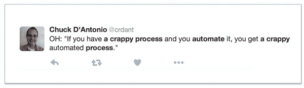

# 更快、更智能的 DevOps

> 原文：<https://devops.com/faster-smarter-devops/>

无论您是否称之为 DevOps，如果您关注更快更高质量地发布更多代码，那么最终的软件交付链和过程将看起来和闻起来都像 DevOps。但是对于现有的开发团队来说，无论速度目标是什么，从这里到那里没有计划是不可能完成的。

将您的发布节奏从几个月移动到几周不仅仅是学习敏捷实践和获得一些自动化工具。它涉及人员、工具和过渡计划。我将讨论一些好处和实现这些好处的方法。

[瀑布](https://en.wikipedia.org/wiki/Waterfall_model)到敏捷，[敏捷](https://en.wikipedia.org/wiki/Agile_software_development)到持续集成，[持续集成](https://en.wikipedia.org/wiki/Continuous_integration)到[持续部署](https://puppetlabs.com/blog/continuous-delivery-vs-continuous-deployment-whats-diff)。无论您的过程是什么，主题都是相同的:找到一种方法，在不牺牲质量的情况下，更快地将代码提供给用户。但是速度和质量有时是相互对立的。走得更快意味着事情可以破得更快，当我们只把 DevOps 当做发布的时候，很容易陷入这个陷阱。

已建立的开发商店不能只是从一个流程跳到另一个流程。除非你是全新的，否则你的目标是在不延迟发布三个月或更长时间的情况下引入新的流程，以便一次性完成产品化。这通常是使用一种钳形方法来完成的，这种方法同时处理自下而上的策略和自上而下的监督和文化。

然而，由于采用 DevOps 工具非常容易，因此趋势是只关注战术，自下而上地采用，而不考虑整个管道。结果是发布自动化工具为您规定了您的交付链，而不是相反。

### 结构化自动化

DevOps 需要自动化。但是，经常没有考虑到的是，自动化是整个交付链的支柱和组成部分。必须考虑治理、工件组织和库存、度量和安全性。如果一个组织为所有新的自动化建立一个审查过程，以及它如何适应管道的编排，那么新的自动化将支持现在和未来的存在。

例如，许多沿着 DevOps 道路前进的组织在尝试整合来自安全或治理团队的实践时遇到了挑战。历史上，这些团队驻留在开发和运营回音室之外，并且他们的过程与正在完成的工作不同步。许多组织面临的挑战是确定最佳方式，在不减慢速度的情况下将支持这些计划的人员、流程和技术纳入进来。最好的组织正在寻找新的方法，通过在生命周期的早期从手工的、异步的方法转移到同步的过程，来自动化来自安全和治理团队的策略。

让我们看一个应用程序安全性的例子。应用安全领域的许多技术供应商都将“自动化”吹捧为其解决方案的关键价值点，以更好地适应 DevOps 工具链。在某些情况下，自动化意味着机器现在完全负责以线速监控、分析和修复这些应用程序的安全漏洞。在其他情况下，自动化意味着简化以人为中心的工作流，这些工作流可能代表不适合连续操作的数小时或数天的异步分析。在这两种情况下，这些技术可能实现相似的目标，但是它们的方法可能会有很大的不同。

此外，一个解决方案可以支持安全专业人员的异步调查，而另一个解决方案可以在软件开发生命周期的设计和构建阶段为开发人员提供同步支持。建立一个审查过程可以帮助确定一个团队或过程所需要的自动化水平是否能够在投资之前真正交付。同样值得注意的是，在诸如“自动化”、“集成”、“配置”和“连续”这样的词中，经常存在模糊的层次。

在构建开发运维环境的过程中，还有其他一些容易被忽略的方面。完整的故事可以在这里找到[。](http://www.infoq.com/articles/faster-smarter-devops)