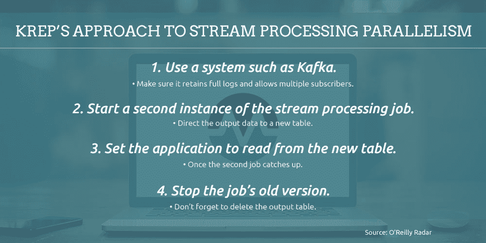

# 管理混合云中的应用性能

> 原文：<https://devops.com/managing-application-performance-in-hybrid-clouds/>

跟上网络、系统和应用程序变化的步伐就像是一份全职工作。随着应用程序在更加分布式的环境中支持更多的数据类型(通常是实时的)，清楚地了解您的端到端计算环境变得非常必要。

同样重要的是，确保您的应用程序利用微服务、文档数据模型和其他以云为中心的技术的适应性和效率。

如果您的应用程序没有按预期执行，云计算的所有这些大肆吹捧的好处—效率、敏捷性、可扩展性—都将化为乌有。混合云基础架构的日益普及使得管理应用性能比以往任何时候都更加棘手。根据 Riverbed 最近进行的一项调查，Riverbed 营销总监 Steve Brar 在 1 月 29 日的数据中心杂志上发表的一篇文章[中报告，89%的 IT 专业人员声称糟糕的应用程序性能阻碍了他们的运营，58%的人每周报告应用程序性能故障，36%的人每天都遇到应用程序性能问题。](http://www.datacenterjournal.com/make-closing-the-application-performance-gap-a-priority-in-2016/)

更糟糕的是，71%的受访 IT 经理对应用程序运行如此糟糕的原因“一无所知”，37%的受访 IT 经理在出现此类问题时转向不受支持的应用程序来填补漏洞，这加剧了日益严重的影子 IT 问题。从积极的一面来看，管理人员认为，提高应用程序性能的可见性可以提高工作效率(58%)、客户服务(54%)、产品质量(49%)、员工参与度(46%)和创收(43%)。

Brar 确定了确保端到端应用性能可见性的五项要求:

1.  网络和应用感知的路径选择将流量定向到三个分支之一:一个基于 MPLS，一个受 IPSec 保护的互联网链路，一个直接通向互联网。
2.  通过中央控制平面的动态隧道允许通过 IPSec 链路将分支数据回传到数据中心。
3.  将安全 web 网关与高级威胁检测结合使用。
4.  使用 QoS 功能来管理来自源(入站)而不是来自目的地(出站)的流量，以避免不必要地减慢业务关键型入站数据流。
5.  实施统一的管理平台，该平台具有直观的界面，并基于应用程序、站点、上行链路或网络等高级抽象，具体取决于您的 IT 基础架构的独特特征。

### 云应用程序管理:IT 基础仍然适用

当 It 部门将应用程序迁移到云中时，他们常常会感到自己正在失去对网络基础架构的控制。Cahit Akin 在 2015 年 4 月 22 日的一篇关于网络计算的文章中写道，容量管理、变更控制和其他 it 基础设施对于管理您的云基础设施同样重要，如果不是更重要的话，考虑到可能导致的网络流量增加。

关键是考虑你的内部网络架构的云部分。三种广域网优化技术可轻松转移到云基础架构管理:

1.  在本地设备上缓存图像和其他常见元素有助于确保为最重要的数据预留网络带宽。
2.  重复数据消除通过确保仅更新已更改的数据，最大限度地减少了备份和其他辅助网络流量。
3.  压缩从文件中删除不必要的数据，使文件变得更小，并减少整体带宽使用。

TechTarget 指出，典型广域网优化工具的相同功能也适用于提高基于云的应用程序的性能。

IT 面临的挑战是跟上应用程序本身性质的巨大变化。Ravi Dharnikota 在 2 月 5 日关于 DataInformed 的文章[中写道，数据是从不同来源收集、汇总和分析的，包括物联网传感器、点击流、日志和社交媒体数据。Dharnikota 表示，它必须支持“任何时间、任何地点的任何事情”](http://data-informed.com/the-3-as-of-enterprise-integration/)

您必须基于通过轻量级 REST APIs 进行通信的微服务来重新构建您的系统，而不是点对点的集成方法。通过这种方式，您可以分散集成的执行，从而降低成本并提高效率。如果您还没有，那么您需要打破行和列的惯例，采用支持半结构化和非结构化数据的文档数据模型。

### 设计应用程序以利用批处理和实时处理

交付满足现代应用随时随地特性的基础设施的唯一方法是具有足够的适应性，以支持批处理和实时处理。随之而来的是能够确定哪些应用程序需要实时关注，哪些可以转移到批处理模式。Dharnikota 引用 Lambda 体系结构作为一个例子，通过平衡延迟和吞吐量来适应批处理和实时处理。

然而，LinkedIn 的 Jay Kreps 在 2014 年 7 月 2 日的一篇关于 O'Reilly Radar 的文章中解释了 Lambda 架构的缺点。最终，您必须维护在两个复杂的分布式系统中产生相同结果的代码。根据 Kreps 的说法，改进流处理系统以支持批处理和实时模式要简单和高效得多。这样做需要通过“非常、非常快速地重放历史”来增加系统固有的并行性。

双处理模式 Lambda 架构的替代方案增强了单模式系统的流处理，以重新处理完整的数据日志，从而模拟批处理和实时模式。

在这个模型中，只有当代码改变时才需要重新处理。您只需更新单个集合，而不是代码的两个完整副本。重新计算是由仅仅是相同代码的改进版本的作业完成的:它运行在相同的框架上，并接受相同的输入数据，尽管需要增加并行性以确保快速性能。

为了进一步优化性能，您可以合并两个输出表。但是，拥有两个独立的表，至少在一段时间内，可以让您通过一个按钮立即恢复到旧的逻辑，该按钮将应用程序重定向到旧的输出表。为了防止新版本的代码与旧版本相比降低性能，添加一个自动 A/B 测试或 bandit 算法，让您可以控制转换。