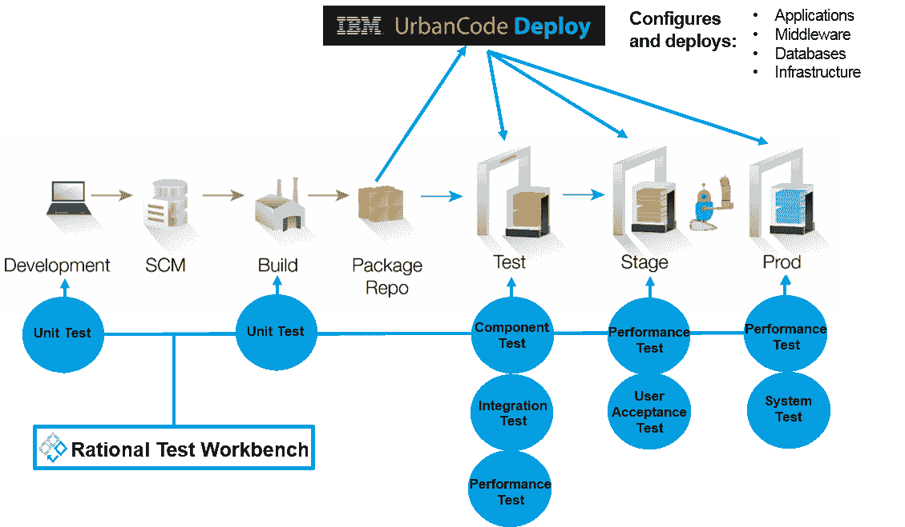

# DevOps:左移减少失败

> 原文：<https://devops.com/devops-shift-left-avoid-failure/>

DevOps 就是要增加从想法到客户再到想法的反馈循环。在自动化和工具方面已经取得了巨大的进步，大大减少了在发布过程中涉及的手工劳动量。但是，在竞争激烈的市场中，任务关键型应用程序承受不起下降的代价。复杂的应用程序、环境和基础架构会增加风险，从而导致失败。

生产部署的失败率仍然很高。研究表明，生产中断的平均成本约为每分钟 5，000 美元，而每小时关键应用程序故障的平均成本为 50 万至 100 万美元。

为什么失败这么多？我们仍然经常看到整个发布渠道缺乏一致性。很多时候，供应和部署过程在管道的两端非常不同。但是通过转移对运营的关注，你可以在生产中取得更大的成功。

## 了解如何向左移位

术语“左移”指的是软件开发中的一种实践，在这种实践中，团队关注质量，致力于问题预防而不是检测，并且比以往任何时候都更早地开始测试。目标是提高质量，缩短长测试周期，减少开发周期结束时令人不快的意外的可能性——或者更糟，在生产中。

左移需要两个关键的 DevOps 实践:持续测试和持续部署。持续测试包括自动化测试，并尽可能早和经常地运行这些测试，以及服务虚拟化来模拟不可用的系统。持续部署自动化了新构建的供应和部署，使持续测试能够快速高效地进行。

转移左侧操作的第一个也是最明显的方法是在创建部署和测试过程中与开发部门并肩工作。生产中观察到的故障通常在生命周期的早期是看不到的。很多时候，这些失败可以直接归因于部署过程中的差异。开发可能会创建自己的部署过程，这些过程与生产运营所使用的过程有很大不同。有时生产程序更加手工化，甚至可能使用不同的工具。运营和开发需要在构建标准部署过程中承担责任。在进入生产环境之前，部署过程可能要在测试环境中实践数百次。这样，您就更有信心生产部署会成功。

降低故障率的另一个方法是使管道中的所有环境看起来尽可能像生产环境。使用传统的资源调配流程，这几乎是不可能的。生产环境通常比开发所需的要沉重和详细得多。但是通过使用云和模式功能，您可以更加接近。

使用模式来定义一致环境的能力消除了仅仅由于配置不一致而发生的故障。这再次要求运营和开发部门在创建供应流程时协同工作，这样开发人员就可以像在生产环境中一样创建他们的测试环境。以 IBM UrbanCode 为例，这可以通过将 UrbanCode Deploy 连接到自动化自助服务供应系统(如 OpenStack HEAT 或连接到 OpenStack 的 IBM Cloud Orchestrator)来实现。

这些标准模式可用于为管道的所有阶段创建环境。通过使用云功能，您可以像创建环境一样快速地取消配置这些环境。这也让企业对他们的环境模式充满信心。它们每天都要接受测试，因此运营部门可以确信测试是在类似生产的环境中进行的。

没有人想经历生产失败——尽全力防止失败符合每个人的最佳利益。开发运维的根本是消除开发和运营之间的孤岛。通过运用这些左移操作原则，你就能很好地降低失败率。

实现左移的要素是真实且可用的:自动化测试和部署工具、服务虚拟化技术、敏捷实践和云环境。仍然存在的主要障碍是交付组织的思维模式。从最新更新的[虚拟应用部署和发布](https://www-01.ibm.com/marketing/iwm/iwm/web/signup.do?source=ibm-cloud-weborganic&S_PKG=ov19195&S_TACT=000000NU&dynform=20786&cm_mmc=Owned_Other-_-IBM+Cloud_Hybrid-_-WW_WW-_-Interconnect+-+blog++Dummies+eBook&cm_mmca1=000000NU&cm_mmca2=10000348)电子书中了解更多信息。

## 关于作者/达雷尔·r·施拉格博士

Darrell R. Schrag 博士( [@devopsdrs](https://twitter.com/devopsdrs) )是一位经验丰富的软件生命周期顾问，专门研究 IBM 云解决方案，帮助客户在整个企业中建立云战略。他专注于通过包含云和供应解决方案的交付渠道实现软件应用程序的持续交付。他在帮助客户过渡到“云上诞生”应用方面经验丰富，利用微服务来利用灵活敏捷的云平台。