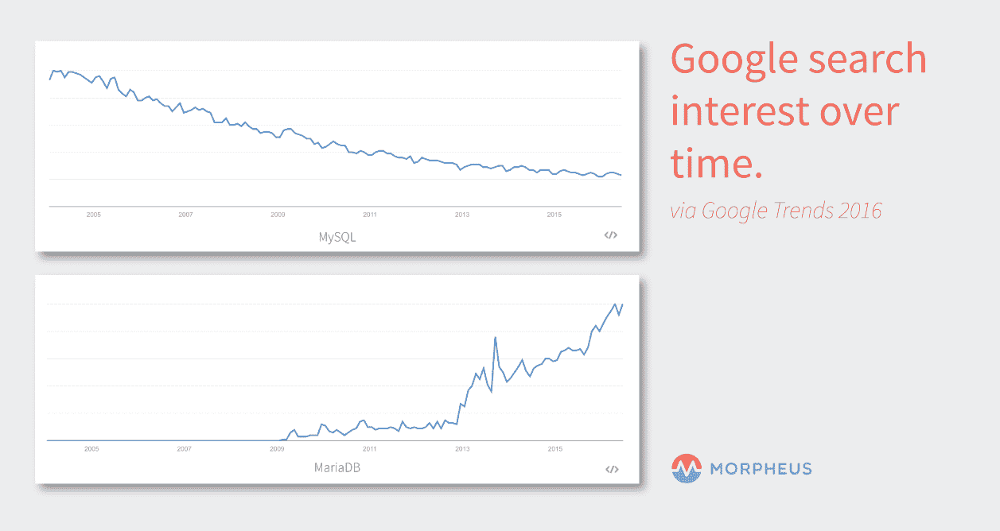

# MariaDB 会很快取代 MySQL 吗？

> 原文：<https://devops.com/will-mariadb-soon-replace-mysql/>

MariaDB 是一个越来越受欢迎的数据库。它的首席开发人员是 Michael“Monty”wide nius，他是创建 MySQL 团队的一员。当 MySQL 被 Oracle 收购时，Widenius 和其他一些最初的 MySQL 开发人员决定推出 MariaDB 作为 MySQL 的一个分支，并保持其开源，以减轻 Oracle 对 MySQL 所有权的任何问题。

2009 年，太阳微系统公司收购了 MySQL。Sun 随后被甲骨文收购，引发了一场由维德纽斯领导的“拯救 MySQL”运动。Widenius 和开源社区中的许多其他人认为甲骨文的所有权可能会有利益冲突，因为甲骨文已经有了一个与之竞争的闭源商业数据库。他们认为 Oracle 会在进一步开发 MySQL 数据库方面进展缓慢，因为他们可能会更关注商业 Oracle 数据库。

为了应对这种情况，Widenius 开始研究 MariaDB，并帮助成立了 MariaDB 基金会，该基金会采用社区治理模式。由于基金会的开源和商业方面的分离，开源社区通常认为基金会的治理是积极的。这与 Oracle 形成对比，Oracle 的商业 Oracle 数据库和开源的 MySQL 都在同一个治理之下。这通常被认为是利益冲突，尤其是在保持 MySQL 更新的时候。

## MariaDB vs. MySQL

虽然 MariaDB 还没有取代 MySQL，但它已经在两者之间带来了良好的竞争，这对创新是有益的。有了甲骨文的支持，MySQL 可能至少在不久的将来独领风骚；然而，从技术上讲，如果一家公司决定进行转换，MariaDB 可以取代 MySQL。

开发人员将其设计为 MySQL 的替代产品。因为它是从 MySQL 派生出来的，所以基本上 MariaDB 使用的所有结构都是相同的。这意味着从 MySQL 转换几乎肯定不会要求公司以任何方式改变其应用程序，因为数据和数据结构不需要调整。

事实上，命令行工具，如 mysqladmin、mysqldump、daemon 和其他工具都保留了它们原来的名称，所以 MariaDB 也是数据库管理员的替代产品。事实上，许多组织已经转而使用它，或者只是开始单独使用它:它取代 MySQL 成为 Fedora 和 Red Hat 中的默认数据库。它也被 Booking.com、CraigsList 和维基百科等网站使用。

## MariaDB 还提供什么？

脸书、Twitter 和谷歌等知名组织已经对 MariaDB 进行了社区改进。例如，Google 在 10.1.3 版本中贡献了静态数据加密，考虑到在这个不断变化的环境中可能会快速出现的安全问题，这非常有帮助。此外，它还提供了性能改进，如子查询优化和更快的连接。它还增加了基于行的复制。

虽然 MariaDB 可能不会立即取代 MySQL，但它值得关注:它正在成为市场上一个潜在的有力竞争者。