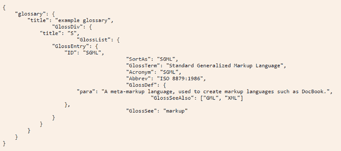
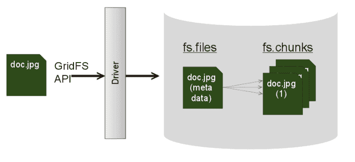

# JSON 是什么？我如何使用它？它打败 BSON 了吗？

> 原文：<https://devops.com/json-use-beat-bson/>

TL；DR:如果你曾经想知道 JSON——它是什么，如何使用它或者它与 BSON 有什么关系——那么你来对地方了。在本文中，我将探索这些缩写代表什么，以及这些格式在编程和数据库领域中的作用。

## JSON 是什么？

JSON 代表 JavaScript 对象符号。基本上，它使用源自 JavaScript 的语法以人类和机器可读的方式表示数据。例如，JSON 网站上的一个例子用 JavaScript 对象符号描述了一个术语表，如下图所示。

## 如何使用 JSON

如您所见，创建了一个层次结构，将每个级别都包含在一组花括号({})中。在每一层，都有名称/值对，比如“title”:“example glossary”。与 JavaScript 对象的工作方式相同，该对的值部分可以通过开始一组新的花括号来打开另一个级别。这创建了一个结构良好的数据布局，可以由机器轻松扫描信息，也可以由人类查看以找到所需的信息。

这种符号允许表示多种数据类型——数字、字符串和布尔值、散列(用{})和数组(用[])都可以用这种格式表示。

一旦数据用这种符号表示，JSON 解析器就可以用在几乎任何编程语言中，将这种符号转换成该语言的本地数据类型，从而允许程序员使用该语言的自然语法访问数据。由于这种符号非常普遍，大多数程序员在存储和检索这种类型的数据方面都有丰富的经验。

## 它在数据库中使用吗？

文档数据库通常以 JSON 格式或基于该格式的格式存储数据。与关系数据库使用的表和行不同，文档数据库将通过使用 JSON 格式来存储和查询信息。

这些数据库将每组 JSON 数据称为一个文档。由于结构是分层的，所以每个文档都可以在其任意键上有子文档。这种设置使得熟悉该语言的程序员能够非常容易地在数据库中存储和查询数据。

## 什么是 BSON？

BSON 代表二进制 JSON。这种格式是 MongoDB 专门为其文档数据库使用的。其背后的想法是提供 JSON 格式的实用程序，而且能够以二进制格式的速度使用该格式。

## JSON 对 BSON

虽然 JSON 只是表示一种数据结构，但 MongoDB 可以使用 BSON 在任何级别的键上构建数据库索引，从而有助于提高该领域的速度。MongoDB 还提供了一个名为 GridFS 的规范，可以与 BSON 结合使用，以存储超过 BSON 16MB 文档大小限制的数据。这对于存储大文件很有用，因为它将大文件分成“块”以允许存储在数据库中正常工作。

在很大程度上，JSON 和 BSON 非常相似，但是 BSON 却是可以提供额外的出拳速度。两者都是为应用程序存储和检索数据的非常方便的方式。