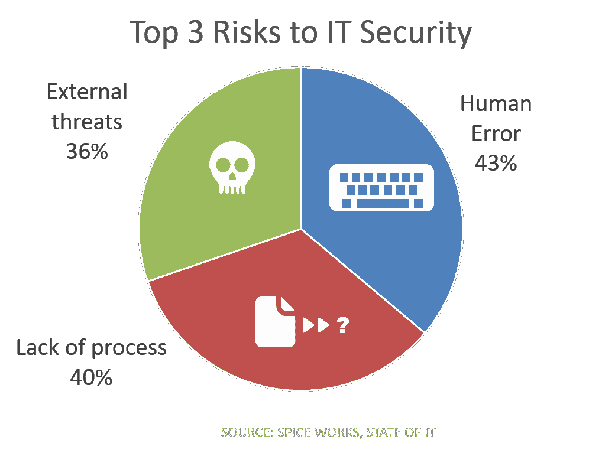

# 开发运维如何帮助提高安全性

> 原文：<https://devops.com/devops-can-help-improve-security/>

自动化和标准化以及基于开发的审查可以解决 IT 安全的三大风险。

如今,“DevOps”一词往往会让人联想到应用程序开发人员需要时的自动化和按钮式应用程序部署。这是一种无政府状态，是一种混乱，对于那些把核心业务网络的稳定性和安全性放在首位的人来说，这是一种可怕的想法。毕竟，DevOps 阵营的人通常会为“混乱猴子”欢呼，它的唯一目的就是破坏生产网络。从表面上看，这似乎不利于稳定或安全。

因此，发现用 DevOps 构建和交付应用程序的表面上自由放任的方法实际上是应对 it 安全重大风险的最佳方式之一，可能会令人惊讶。

不是开玩笑。

首先，让我们来看一下由 [SpiceWorks](http://www.spiceworks.com/marketing/state-of-it/report/) 进行的调查，在调查中，IT 专业人员被要求按照 IT 安全风险的顺序对一系列威胁进行排序。

根据该报告，受访者将以下威胁列为其组织 IT 安全的三大风险，分别是人为错误、流程缺失和外部威胁。

DevOps 可以对所有这三个方面产生积极影响，而不会对核心业务网络的稳定性或可靠性产生负面影响。让我们检查一下如何，好吗？

## 人为误差

我们以前都有胖手指配置和代码。通常我们会抓住他们，但偶尔他们会潜入生产并对安全造成严重破坏。许多“大人物”都遇到过这种情况，一个简单的输入错误就带来了安全风险。这种情况经常发生，因为我们太熟悉我们正在键入的内容，以至于我们看到了我们期望看到的内容，而不是我们实际键入的内容。毕竟，我们已经输入*命令一百次了；我们知道它应该是什么样子，但我们并不像我们(可能)应该的那样小心，因为今天是星期五，快 5 点了。不管什么原因，我们已经做到了，这是野兽重复的本性，实际上最终咬了我们的屁股。*

将这些命令编译成脚本，或者更好的是，编译成模板，意味着一旦它是正确的，它就是正确的。不可避免的现实是，我们最终会忽略一些东西，因为我们不会一遍又一遍地输入，每次注意力越来越少。依赖编码、模板、API 和脚本作为自动化任务的手段，不仅仅是速度的问题，还有可重复性的问题。和精确的可重复性。这是您需要的一种保证，以防止“人为错误”使应用程序和业务面临广泛的风险。

为了通过 DevOps 降低人为错误的风险，您可以:

1.  使用模板来标准化通用服务配置；
2.  自动化常见任务，以避免简单的印刷错误；和
3.  读取两次，执行一次。

## 缺乏过程

这可能是我最喜欢的风险(不仅仅是因为它让我说出了六个适马和一些令人毛骨悚然的数学方程)，因为它包含了如此广泛的一类问题。首先，事实上几乎没有对人们已经用来在生产网络中配置、更改、关闭和启动服务的脚本进行审查。不要让任何人告诉你他们不使用脚本来消除网络和基础设施中存在的问题。确实如此。但是它们不一定被审查，它们肯定不像代码工件那样被版本化，并且它们很少被重用。每个人都有他们“自己”最喜欢的语言和脚本，他们是 IT 界的弗兰克·辛纳屈:他们以自己的方式做这件事。(是的，我知道你可能还太年轻，无法获得这样的参考，但在你的音乐偶像有更好的参考之前，这是我正在使用的一个，因为我这一代人也没有更好的。)

另一个问题是根本没有治理的过程。这是部落知识。鲍勃做 X，然后爱丽丝按 Y，火箭队的某个人按下按钮，让它上线。可能发生的——有时确实会发生——是某个步骤被忽略了。并不是没有过程，而是没有真正的标准化和总体的管理过程。没有人在鲍勃和爱丽丝以及火箭队之间进行协调，以确保过程顺利进行。事实是，该应用程序可能会上线，并在生产中实际工作，但如果这些服务以任何方式与安全相关(例如锁定端口)，那么您对部署流程的懒散做法只会将业务置于风险之中。

降低流程缺失的风险:

1.  清楚地定义部署过程。了解先决条件和依赖性，消除冗余或不必要的步骤。
2.  转向使用编排作为部署流程的最终执行者，仅在必要时采用手动步骤。
3.  审查和管理用于协助该过程的任何脚本。

## 外部威胁

乍一看，这似乎是最不可能用 DevOps 处理的候选对象。鉴于恶意软件和多层 DDoS 攻击是当今企业面临的最大威胁，这是可以理解的。有许多种类的漏洞只能由开发人员或审查代码的专家手动检测。这其中有 DevOps，但它并没有真正扩展到生产中，在生产中，当风险被利用时，它就变成了现实。

DevOps 可以降低风险的一种方式是，在开发期间进行更广泛的测试，并开发 web 应用安全策略，然后在生产中进行部署。采用 DevOps 方法来开发这些策略——也像对待代码一样对待它们——提供了更快、可能更彻底的策略，在整体上更好地防止存在性威胁成为太真实的噩梦。

为了降低威胁变成现实的风险:

1.  将 web 应用安全策略开发和测试转移到应用开发生命周期中。
2.  像对待代码一样对待 web 应用安全策略。审核并标准化。
3.  即使在生产中，也要经常测试。使用动态应用安全测试(DAST)等技术实现自动化，并在可能的情况下，将结果集成到开发生命周期中，以便更快地进行补救，从而尽早降低风险。

除了完全断电之外，没有任何技术、方法或途径可以完全消除风险。鉴于这不是一个可行的选择，最好的方法是将风险降低到可接受的水平(可接受的定义是你的业务的容忍度、监管要求以及你的 MBO 在多大程度上是基于本季度被黑的*而不是*)。DevOps 和 security 是一个很好的组合，因为前者可以帮助标准化、编纂、自动化和扩展跨生产和开发/测试的安全实践。

所以出去吧，在你的安全系统里放些 DevOps。当你这么做的时候，把安全放在你的 DevOps 里。

是的，这是一个神奇宝贝的参考。把弗兰克·辛纳屈扔进去后，我觉得我需要更现代的东西。如果你两样都有，给自己+5 点极客积分。