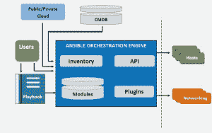

# 可行的最佳实践:自动化、供应和配置管理

> 原文：<https://devops.com/ansible-automation-provisioning-configuration-management/>

什么是 Ansible？

Ansible 是一个 IT 自动化引擎，是一个无故障的模型驱动的配置管理和命令执行框架。它专为多层部署而设计，通过描述所有系统如何相互关联来设计您的 it 基础架构，而不仅仅是一次管理一个系统。Ansible 是用 Python 写的，不使用任何代理。它使在目标上使用 SSH 服务器，并且不需要额外的定制安全基础设施，从而使部署变得容易。

Ansible 提出了以下用途:

**1)。正常配置管理**

*   以模板为媒介创建系统文件
*   在 yum、apt、gem 或类似工具的帮助下管理软件安装
*   管理服务或守护进程，如启动、停止、启用、禁用

**2)。编排任务**

*   从负载平衡器中移除服务器
*   禁用监控或更改
*   通过 git 执行代码部署

**3)。持续集成**

*   将代码部署到 QA 服务器
*   运行测试，如果测试通过，将软件升级到生产环境

有什么不同？

Ansible 是一个集配置管理、部署和特定任务执行于一体的工具。它不需要守护程序或任何其他软件来启动远程机器的管理。因为它使用 SSH，所以很容易通过安全审核，并且可以用在难以运行带有自定义 PKI 基础设施的根级守护程序的地方。

Ansible 模块不仅可以用 Ruby 或 Python 编写，还可以用任何能够高效返回 JSON 或 key 的语言编写。通过这种方式，Ansible 设法避开了流行的 Python 和 Ruby 语言之战，对于两者都喜欢或者都不喜欢的人来说，ansi ble 很有吸引力。

**可行架构:**

随着一个简单的框架的到来，Ansible 与你的节点连接，并推出被称为 **Ansible Modules、**的小程序，这些模块被认为是系统的主力，负责执行所有繁重的工作。这些程序被编写成系统预期位置的资源模型。此后，Ansible 默认在 SSH 上执行这些模块，并在完成时删除它们。

不使用服务器、守护进程和数据库，您的与模块相关的库可以在任何机器上被继承，因此提供了使用您最喜欢的终端程序、文本编辑器和最可能的版本控制系统来跟踪您的内容变更的优势。

**宋承宪钥匙你最大的伴侣**

虽然支持密码，但是最好的方法是使用 SSH 密钥和 SSH-agent。不需要 root 登录；您可以以任何用户身份登录。Ansible“授权密钥”模块有助于控制哪些机器可以访问哪些主机。您还可以使用其他可用的选项，如 Kerberos 或身份管理系统。

**用简单的文本文件管理库存**

Ansible 默认使用一个 INI 文件来表示被管理的机器。这些文件有助于将所有托管计算机放入您自己选择的组中。为了添加新机器，您不需要任何额外的 SSL 签名服务器。因此，决不会有一个问题，在决定为什么一个特定的机器没有得到链接，由于模糊的 NTP 或 DNS 问题。

Ansible 还可以插入另一个真实的来源，如果在你的基础设施中可用的话，比如 drawing inventory、group，以及 EC2、Rackspace、OpenStack 等来源。一旦列出清单主机，就可以在名为“group_vars/”或“host_vars/”的子目录中的简单文本文件中为其分配变量，或者直接在清单文件中分配变量，或者如前所述，您可以使用动态清单从 EC2、Rackspace 和 OpenStack 等数据源中提取清单。

**剧本，一种简单而强大的自动化语言**

剧本是 Ansible 的配置、部署和编排语言。他们可以解释您希望远程系统应用的一系列操作，或者一般 IT 流程中的一系列步骤。

在基础阶段，行动手册可用于管理配置和远程机器的部署。在更高级的层面上，它们可以对涉及滚动更新的多层部署进行排序，并可以将操作委托给其他主机，同时与监控服务器和负载平衡器进行交互。最重要的是，这种语言仍然是可读的、透明的，并且是用基本的文本语言开发的。您不需要声明显式的排序关系，也不需要用编程语言编写代码。有很多方法可以组织行动手册及其包含的文件。

**拓宽 Ansible:模块、插件和 API**

Ansible 模块可以用任何可以返回 JSON 的语言编写，比如 Ruby、Python、Bash 等。通过编写一个与数据源对话并返回 JSON 的程序，inventory 还可以插入任何数据源。有多个 Python APIs 用于传播 Ansible 的连接类型回调——SSH 不是唯一可能的传输方式——甚至用于添加新的服务器端行为。

**AnsibleWorks (AWX)**

AnsibleWorks 也赞助 Ansible 社区，也生产 AWX。这是一个基于网络的解决方案，使 Ansible 更简单，并为 It 公司提供一个无故障的使用。它也被设计用来完成各种自动化任务。

AWX 允许您管理访问，甚至允许共享 SSH 凭证，而没有人能够转移这些凭证。清单既可以图形化管理，也可以与各种各样的云资源同步。它记录了你所有的工作，并将它们与 LDAP 集成。它还有一个惊人的可浏览 REST API。如果需要，命令行工具也可用于与 Jenkins 轻松集成。

**结论**

Ansible 的简单性和降低其他工具复杂性的能力使它成为您的环境的可靠应用程序。它最关心的是安全性和可靠性。它使用 OpenSSH 进行传输，这种语言是围绕可审计性设计的，即使是那些不熟悉该程序的人也可以使用。Ansible 非常适合管理只有少量实例的小型设置以及企业环境。