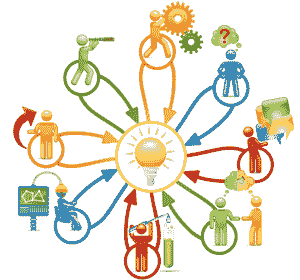

# 模特在 DevOps 有一席之地吗？

> 原文：<https://devops.com/modeling-place-devops/>

随着组织采用 DevOps，他们不仅更快地发布更小的变更，而且还改变了他们开发软件的方式。此外，应用程序不再被视为巨大的整体，而是分散在许多服务中，这些服务可能构建在不同的平台上(从 Node。JS 到。NET)，这取决于当今的团队和技术。更复杂的是，随着技术的变化，业务需求也在变化。

这就是应用程序模型的用武之地。它节省了时间，确保了质量，并增加了应用程序及其组件的组织知识，这些知识是不断变化和重建的。本文将解释什么是应用程序模型，谁参与了应用程序模型的创建，以及如何开始使用它。

## 什么是应用程序模型

应用程序模型是*而不是*一组特定的统一建模语言(UML)图或模型，与代码有直接的一对一关系。相反，它是一个高级文档，可以加深对应用程序的理解，并帮助提供关于该应用程序的见解。

该模型需要对许多不同业务角色的人员都是可接近的，包括开发人员、项目经理、IT 管理员甚至用户。可能使用该模型的人群应该给出一个大概的技术水平。

应用程序模型之所以如此不同、如此有用和如此重要，是因为它不仅定义了应用程序的领域，还定义了特定的领域，这也是为什么它可以被称为领域模型。

### 领域与领域

例如，银行的一个核心职能是承销贷款，但他们也做许多不同类型的贷款。承销领域可以像超过 500 万美元的贷款的商业承销一样具体。无论是哪家银行，这一领域都有许多相似之处，因为承销是一种受监管的做法；因此，用于做出决策的信息大多是相同的。

但是，该字段不够具体，不足以创建应用程序模型，因为它不包括特定银行的独特因素——如系统对任意数量的贷款因素(信用评分、库存现金等)赋予的权重。)、个别银行特有的流程，甚至银行使用的特定术语。所有这些因素都会影响到应用程序模型的创建。

最后，聚集的团队将构建一个完整的应用程序及其当前工作方式的模型。重要的是，正在创建的模型反映了实际的应用程序，而不是它的理想化版本。因为许多业务应用程序非常大，所以为整个应用程序建立一个宽泛的模型，为特定的部分或功能建立几个更复杂的模型通常是有意义的。

### 一口大小的块

例如，一家银行将根据规模、收入甚至业务类型制定不同的商业承销标准。虽然整个应用程序涵盖了承保的所有不同类型的业务，但不同的部分可以很容易地根据需求进行划分，并作为整体的一部分单独建模。

最后，重要的是，模型要反映在代码库中，以便于开发团队理解。如果模型是用来作为关于改变和改进应用程序的对话的中心枢纽，那么在这些对话中发现的决策和见解可以更容易地为开发团队传递和记录，如果模型和代码库之间有紧密的关系，效果会更好。

## 如何创建模型

如前所述，该模型必须易于被不同业务角色和不同背景的个人理解，因为它是围绕着改变和改进进行对话的。因此，创建模型的第一个逻辑步骤是组建团队。

核心团队应该共享成功的几个属性。他们都应该非常熟悉应用程序和当前流程(无论他们的职务是什么);这不是学习事物如何运作的地方。

至少，团队应该包括开发人员、运营人员和项目经理，但是有知识的用户也是无价的。每个人都应该是高于平均水平的沟通者，因为他们将努力与核心团队建立理解，并将这种理解传达给非团队成员。

### 沟通很重要

对于模型团队的任何成员来说，沟通都是一项极其重要的技能。例如，可能有一个非常有天赋的开发人员，他对正在建模的应用程序有着丰富的知识，但是他把本地语言作为第二语言来讲，并且没有高级和细微的熟练程度。当他们正在进行的变更通过标签系统记录下来，并且可以通过阅读标签和查看代码库来理解时，这是很好的；但是，它不适合建模团队。

最好的情况是，开发人员将会减慢整个建模过程，因为他们将不得不问许多问题来完全理解非开发人员所说的内容。最坏情况是，开发人员不会提出问题来获得所需的理解，因此无法与建模团队分享他们的见解，也无法向其他开发人员充分解释模型。

一旦创建了一个团队，最好的开始是谈论应用程序本身*，因为它是*。目标是对应用程序如何工作*和如何使用*达成共识。一些好的开始话题是:

*   它擅长什么，不擅长什么？
*   申请缺什么？
*   应用程序中有哪些没有被使用的内容？
*   它与哪些其他应用程序交互，与哪些流程交互？
*   应用程序是否被误用(例如:一个标记为一件事用于另一件事的字段)？
*   流程和数据流是怎样的？
*   数据和对象之间有多少重叠？
*   安全需求有多细化？
*   应用程序部署的细节是什么？
*   哪些用户需要访问权限？
*   将使用哪些 API？
*   性能和运行状况监控要求是什么？

在白板周围交谈通常有助于快速绘制草图和列表，每个人都可以看到。您会注意到上面有非技术性和半技术性的主题，所以一个熟悉应用程序两端的优秀项目经理对于促进讨论是非常宝贵的。

### 错误传达

例如，如果一个从事商业贷款的承销商正在向一个构建承销应用程序模型的小组描述该过程，他们可能会告知该小组，信用评级是用于确定贷款价值的因素之一，并且需要记录在应用程序中。信用评级是每个有过信用卡、房屋贷款甚至汽车保险的人都熟悉的东西。然而，这也为误解提供了机会。

个人贷款(如抵押贷款)使用的信用评级最高可达 850 分。开发人员可能从个人经验中了解到这一点，并在应用程序中创建一个字段来记录信用评分。该字段的限制只能是数字，范围为 300 到 850(这将有助于确保只输入有效分数)。然而，企业被赋予字母和符号的信用评级，而不是数字，例如 AAA。

在这个例子中，如果没有后续的问题，也没有使用的例子，即使团队中的许多人都在使用同一个术语，并且认为他们使用的是正确的，仍然存在沟通上的错误，这将导致最终软件中的错误，然后需要修复。

随着讨论的进展(这需要时间)，建模团队正在开发的是对应用程序的共同理解，以及如何谈论它的共同知识。这允许精确地使用单词，并保证团队中的每个人都以同样的方式使用它们。

有时，这种理解被称为通用语言，因为通过提问、沟通不畅、解释、演示和讨论，核心小组创造了一种轻松、流畅地谈论应用程序而不会产生任何误解的方式。

使用这种共享的理解来记录应用程序应该是可以实现的。因为应用程序模型不是一系列的图表或地图，所以没有一个确定的模板来创建一个，但是许多团队发现数据流、活动、用例、序列和组件图表的组合在足够高的水平上，每个人都可以理解和使用它们，同时仍然具有足够的技术性，对开发团队有用。将笔记的文本文档、样本代码片段甚至白板绘图的照片作为模型的一部分也是有帮助的。

当然，一系列的图表和注释可能会很难使用和组织，所以思维导图作为一种跟踪不同部分和图表并保持易用性的方法常常是有帮助的。

## 开发建模

拥有一个模型当然很好，但是模型如何帮助开发呢？通过不仅仅从开发人员的角度定义应用程序，将会获得关于什么需要调整，什么需要大规模检修，什么需要彻底拆除的洞察力。

不仅仅要知道什么需要改变，还要知道为什么会坏，是什么导致了坏，这使得改变软件不仅仅是一个问题，而是一幅完整的图画。此外，注意诸如数据重叠、对象重用和抽象层之类的应用特征允许核心开发团队能够快速开发和迭代，而不用担心以未计划的方式改变功能，从而节省测试时间和成本。

### 建模以节省时间

例如，如果引入了新的联邦法规，并且必须为特定规模(或更大)的贷款记录几条新的信息，则域模型可能会显示:

*   已经收集了一些信息，只需要稍加更新。
*   在这个规模的贷款中没有收集到任何信息；但是它是针对不同的大小，并且该功能可以很容易地添加到应用程序的这一部分。
*   这些数据不是针对任何规模的贷款收集的，可能会有一场对话，以确定是否值得包括新监管以外的贷款的相同数据要求。
*   该信息可以基于现有的程序进行计算，并且只需要准确地记录和保存。

当然，一个模型只有在它是当前的时候才是有用的。对应用程序的任何更改都需要输入到模型中。过时的模型可能比没有模型更糟糕，因为围绕它展开的对话是从错误的数据和假设开始的。如果一个模型没有得到维护，那么所有投入其中的组织时间和精力以及它所创造的共享知识都将丢失。

维护模型是确保它在首次“完成”后很长时间内有用的关键。一旦创建了一个模型，建模团队的成员与他们的部门同事一起展示和讨论它也会很有帮助。超越少数人的知识共享确保了无论将来发生什么样的人员变动或实现什么样的发展趋势和方法，模型都可以作为教学和文档工具继续使用并保持有用性。

## 运营建模

随着应用程序和基础设施越来越紧密地交织在一起，开发人员和运营人员都参与创建应用程序模型变得至关重要。根据该模式考虑的任何变化都必须考虑到安全、应用程序监控和项目事务处处理的许多其他标准等因素。

### 与开发人员和运营人员一起设计变更

当评估一个组织的贷款时，需要获得该组织的信用评级。有一些供应商执行对其他组织进行评级的任务，单个银行会有针对该指标的首选供应商。

如果收集这些评级的任务是自动化的，开发人员可能希望实现一个简单的过程，其中应用程序通过其 API 查询供应商并等待回复。这简单明了，只需要两部分数据:查询和报告。但是，运营部门肯定会介入，因为这种情况会带来安全风险。它要么涉及双向通信，要么需要让通信信道长时间开放。

使用来自操作的输入可以创建一个更好的解决方案，这个解决方案可能包含一个额外的数据:一个查询 ID。然后，交互将由多个步骤组成，例如进行查询、返回查询 ID，然后，定期向供应商发送查询 ID，直到报告准备就绪。

运营将参与应用程序开发，从一开始就可以帮助定义开发团队必须遵循的实践和程序，或者在应用程序发布之前提出危险信号和安全问题，开发团队必须在发布更改之前遵守这些问题。运营部门从一开始就参与进来会更有效率。

## 获取建模

组织拥有专有软件，因为这是他们根据业务需求创建自己的应用程序的竞争优势。因为业务需求是不断变化和发展的，包含它们的软件也必须变化和适应。

在任何组织中，寻找允许更快的变更，同时确保更好的变更质量的方法应该是一个目标。创建应用程序模型，以及随之而来的共同理解，对于任何面临维护或检修的应用程序来说，都是非常宝贵的一部分。

## 关于作者/斯科特·里斯

Scott Reece 是 DevOps 带来的更大可见性和沟通能力的忠实粉丝。作为 Astah 的朋友，Scott 已经通过使用模型和团队建设成功地缩小了项目沟通的差距。Scott 拥有超过 10 年的项目管理经验，目前在 Inedo 担任合伙人总监。