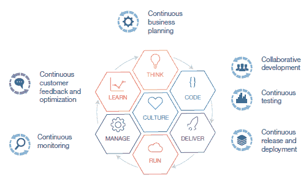

# 持续监测:DevOps 和 APM 的作用

> 原文：<https://devops.com/continuous-monitoring-role-devops-and-apm/>

为了能够更快、更好地响应不断变化的客户需求，企业正在提高应用程序的发布频率。这反过来要求业务线、开发和 IT 运营之间的协调和协作比以往更加紧密，从而推动了这些部门之间增强协作、自动化和信息透明度的需求。为了实现无缝的内部协作，许多企业客户正在采用 DevOps 方法。

DevOps 是一种企业能力，支持软件的持续交付和持续部署。它减少了处理客户反馈所需的时间。DevOps 将曾经孤立的开发和运营整合在一起，以提高敏捷性并实现以下优势:

*   通过使用共享的 DevOps 工具，改善开发人员和运营专家之间的协作。
*   通过在整个开发和发布过程中支持协作测试，促进软件的持续交付。
*   自动化发布管理、基础架构配置、流程编排、监控、容器化和虚拟化的手动流程。
*   通过在开发人员和运营部门之间建立更紧密的联系，纠正人员和目标的不一致。
*   在开发过程中结合客户反馈，以促进敏捷开发。

IBM 已经确定了 DevOps 生命周期中的六个阶段，加上必要的文化考虑，以成功实现 DevOps 方法(图 1)。

图 1–devo PS 生命周期的六个阶段

在 DevOps 生命周期的管理阶段，对生产环境中应用程序的持续监控通常通过应用程序性能管理(APM)解决方案来实施，这些解决方案可以智能地监控、分析和管理云、本地和混合应用程序以及 IT 基础架构。这些 APM 解决方案使您能够监控用户体验，并提高应用基础设施的稳定性。它有助于快速确定问题的根本原因，以主动预防停机并让用户满意。

借助 DevOps 方法，我们还看到更多客户将持续监控的范围扩大到了试运行、测试甚至开发环境。这是可能的，因为遵循 DevOps 方法的开发和测试团队正在努力尽可能多地使用类似生产的环境进行测试。通过在生命周期的早期运行 APM 解决方案，开发团队可以提前获得应用程序在生产中最终表现的反馈，并可以更早地采取纠正措施。此外，现在为开发团队提供建议的运营团队获得了先进的知识和经验，以更好地准备和调整生产环境，从而使产品发布更加稳定。

应用程序比以往任何时候都更加关键。他们必须永远向上，永远快速，永远进步。采用 DevOps 方法将允许您将周期时间从几个月减少到几个小时，但是您必须继续确保良好的用户体验！对整个 DevOps 生命周期的持续监控将确保开发和运营团队协作优化每一步的用户体验，为您的下一个重大创新留出更多时间。

这个持续监控博客是关注开发和运营团队之间协作的系列博客中的第一篇。我们将在接下来的博客中详细探讨这个话题:

*   综合监控:开发人员、测试人员和操作人员都需要确保他们的 internet 和 intranet 移动应用程序和 web 应用程序能够从世界各地的不同位置成功地测试和运行。
*   警报管理:当开发、测试或生产环境中发生特定情况或事件时，开发人员、测试人员和运营人员都需要通过电子邮件、语音邮件、文本、移动推送通知和 Slack 消息发送通知，以获得正确的人的注意并管理他们的响应。
*   部署自动化:开发人员、测试人员和运营人员使用不同的工具来调度和部署复杂的应用程序，并在开发、测试和生产环境中对其进行配置。我们将讨论这些团队有效协作的最佳实践，并避免潜在的重复和错误信息。
*   分析:开发人员需要能够在日志消息中寻找模式，以确定代码中是否存在问题。运营部门需要跨多个日志文件进行根本原因分析，以确定复杂应用程序和系统中的问题根源。

敬请关注本系列中关于合成监控的下一篇博客，并[注册](https://bit.ly/2bwak1v)收听即将到来的交互式网络广播“了解为什么我们必须在 DevOps 生命周期中向左转移 APM”

## 关于作者/ Arun Biligiri

Arun Biligiri 是 IBM 应用性能管理产品管理团队的领导者。Arun 在技术领域拥有超过 20 年的经验，担任过各种不同的职务，包括企业家、开发、产品管理和销售工程。他曾与创新型企业密切合作，在解决云、分析需求以及高效管理数据中心和云方面拥有丰富的经验。他拥有沃顿商学院的 MBA 学位和加州大学伯克利分校的硕士学位。在 [Twitter](/cdn-cgi/l/email-protection#165677747f7a7f717f647f) / [LinkedIn](https://www.linkedin.com/in/biligiri) 上与阿伦联系