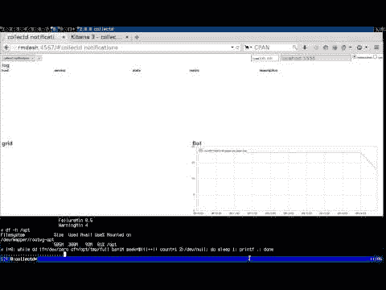
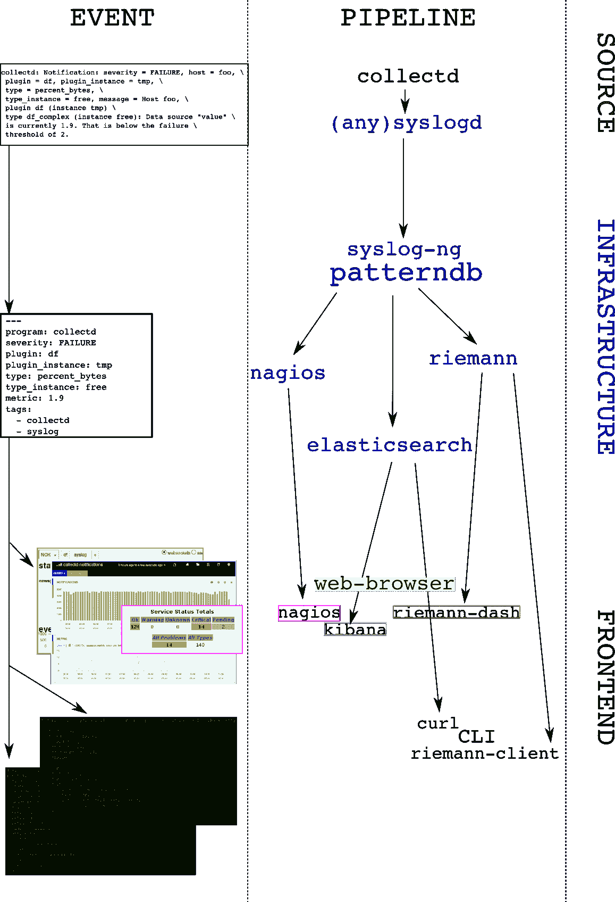

# a .现代监测和警报指南

> 原文：<https://devops.com/guide-modern-monitoring-alerting/>

# syslog-ng、riemann、collectd-notifications、elasticsearch:将它们放在一起

## 语境

在我们的组织( [CCIN2P3](http://cc.in2p3.fr) )中，我们正在构建一个基于事件的基础设施，以将结构化消息推送到不同的子系统，用于警报、报告和存储。使用 *syslog-ng* ，每个消息都被规范化为一个结构化事件，可选地与其他消息相关联，并有条件地路由到下一个系统，包括:

*   一个同步网络仪表板，
*   不同的异步报警系统，以及
*   可搜索的存储后端。

收集的事件本质上是系统和应用程序日志。以下是一些有趣信息的例子:

```
puppet-agent[16528]: Finished catalog run in 44.06 secondskernel: Killed process 29959, UID 42046, (hadd) total-vm:202363492kB, anon-rss:13069860kB, file-rss:60kBata2.00: exception Emask 0x0 SAct 0xffff SErr 0x0 action 0x0EXT3-fs error (device dm-1): ext3_journal_start_sb: Detected aborted journal
```

这种管道的统一性质使得人们可以很容易地在所有可用的后端和前端中识别一个事件。

在这篇文章中，你将学习一种实现这个模型的方法，并达到以下目的:

*   **收集**系统指标
*   **监控**事件中的异常值
*   **正常化**和**关联**这些事件
*   **将事件路由**到实时流处理器和可搜索的存储后端

我们将描述您必须更改的配置文件，并解释处理事件的工作流。对于不耐烦的人，我们将通过一个简短的演示来说明最终结果。

## 演示

[](https://www.youtube.com/watch?v=iVoTPD8HKkw&vq=hd720)

## 要求

我们将假设您对以下工具有基本的了解，并且每个工具都有一个运行实例:

*   [*syslog-ng*](https://syslog-ng.org) 开源版> = 3.5
*   [*-syslog-ng-孵化器*](https://github.com/balabit/syslog-ng-incubator) > = 0.2.1
*   [*黎曼*](http://riemann.io) > = 0.2.5
*   [](https://collectd.org)*>= 5.1*
*   *[](http://elasticsearch.org)*>= 0.90**

## **工具**

**下面是我们将使用的所有工具的列表，还有一个简短的总结，以及它们在管道中的主要功能:**

**在客户端:**

*   ***collectd* :“一个接收系统统计数据并以多种方式使它们可用的守护进程”

    *   定期**轮询**系统指标
    *   基于预定义的**阈值**触发通知** 
*   **(任意)系统日志:“系统错误记录协议”

    *   **监听**系统日志消息，包括收集的通知
    *   将它们转发到远程目的地** 

**在服务器上:**

*   ***syslog-ng* :“灵活且高度可扩展的系统日志应用”

    *   **监听**远程通知消息
    *   *patterndb* :通过**解析**平面*收集通知*消息创建结构化事件
    *   **将事件**路由到下一阶段(*黎曼*、*弹性搜索*、*纳吉奥斯*、*电子邮件*、…)** 
*   ***riemann* :“用强大的流处理语言聚集来自服务器和应用程序的事件”

    *   **监听**远程结构化消息(*协议缓冲区*
    *   为**订阅**公开一个 *websocket* 和/或 *sse* 服务
    *   向下一阶段发送异步**警报**(*例如* *Nagios* 或*电子邮件*)** 
*   ***riemann-dash* :“一个基于 javascript 和 websockets 的 riemann 仪表盘”

    *   同步**实时**浏览器内显示
    *   使用 *websockets* 或 *sse* 订阅以收集流的 web 应用程序** 
*   ***elasticsearch* :“灵活而强大的开源、分布式、实时搜索和分析引擎”

    *   **存储**和**索引**所有事件
    *   为**查询** *公开一个 API，例如*基巴纳*的*
    *   “*你知道的，为了搜索！*** 
*   **kibana*:“elastic search 的浏览器数据可视化引擎”

    *   基于浏览器的搜索界面进行**查询** *弹性搜索** 

## *体系结构*

*为了清楚起见，我们将选择一个例子:让我们跟踪文件系统的使用情况。`collectd-df`插件收集这些信息。这里有一个描述数据流的图表:您可以在左栏从用户的角度跟踪事件在管道中传播的过程(右栏):*

**

*细节如下:*

1.  **collectd-df 插件*轮询文件系统利用率:
    `df-tmp/percent_bytes-free`为`1.9`*
2.  **收集阈值插件*发布*通知*当达到失败阈值:`Notification: severity = FAILURE, host = foo, plugin = df, plugin_instance = tmp, type = df_complex, type_instance = free, message = Host foo, plugin df (instance tmp) type df_complex (instance free): Data source "value" is currently 1.9\. That is below the failure threshold of 2.0`*
3.  **collectd-network plugin* 接收这个*通知*并将其发送到本地 *syslog* 服务器*
4.  *本地*系统日志*服务器将平面消息转发到远程目的地*
5.  *远程 *syslog-ng* 服务器接收消息，并使用*模式 b* 对其进行解析*
6.  **模式数据库*提取相关值并创建一个*散列表*(名称-值对):*

*   *程序:`collectd`*
*   *主持人:`foo`*
*   *标签:`syslog`，`collectd`*
*   *collectd.plugin: `df`*
*   *collectd.plugin_instance: `tmp`*
*   *collectd.type: `percent_bytes`*
*   *collectd.type_instance: `free`*
*   *collect d . thresh _ type:thresh 类型(`above` / `below`)*
*   *collectd.thresh_value:失败阈值:`2`*
*   *collectd.metric:当前读数的值:`1.9`*

*这个结构化事件然后被路由到 *syslog-ng 目的地*，在我们的例子中是*黎曼*和*弹性搜索*。然后，这两个应用程序都可以用于以全面的方式查询事件，*例如*、*“显示所有收集到的关于插件`df`和实例`tmp`的通知”**

## *配置*

*由于格式问题，有关配置此解决方案组件的详细示例，请参见下面的[链接](https://github.com/faxm0dem/guide-modern-monitoring-alerting)。*

## *结论*

*在本文中，我们展示了如何向中央 *syslog-ng* 服务器发送 *collectd* threshold 通知消息，以及如何从中提取数字度量信息。我们还展示了如何将结果路由到两个后端，其中一个可用于实时查看数据(*黎曼*)，另一个用于查询历史数据( *elasticsearch* )。该系统可以多种方式扩展，例如:*

*   *通过编译大的*模式 b* 来匹配多个子系统消息*
*   *通过*标记*重要的消息，并将它们路由到相关的目的地。例如:“将所有硬件错误发送到 *nagios**
*   *通过使用*关联上下文*信息生成警报，排除自我修复组件:“如果文件系统已满并且在 5 分钟内没有恢复正常，请发送电子邮件”*
*   *通过使用*关联上下文*信息在消息数量达到阈值时生成警报:“如果每分钟有超过 100 条消息引用同一个 *scsi* 设备，则运行此命令”*
*   *将公制数据发送到*石墨**

## *配置文件*

*[tarball](https://www.balabit.com/support/documentation/pdf/syslog-ng-riemann-elasticsearch.tgz)*

*[这里的](https://github.com/faxm0dem/guide-modern-monitoring-alerting#configuration-files)是一个 shell 会话对这些配置文件进行操作的脚本。*

*[链接到完整文章，包括 github 上的配置](https://github.com/faxm0dem/guide-modern-monitoring-alerting/blob/master/full-article.md)*