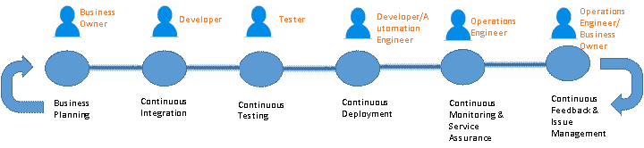
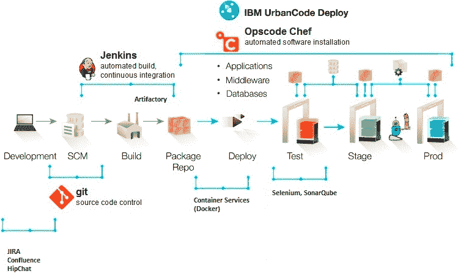

# 混合模式下的开发运维

> 原文：<https://devops.com/devops-in-a-hybrid-model/>

随着企业开始揭开云采用价值主张的神秘面纱，一些最佳实践、优化技术和交付模型已经在技术社区中围绕云支持和大规模采用进行了描述。虽然选择私有云还是公共云模式的争论由来已久，但企业一直在寻求减轻这种大规模转型所导致的软件中断水平。因此，混合模型是一个非常有吸引力的前景，因为企业仍然可以在技术上控制安全策略和治理模型，同时还可以利用云的容量爆发和其他优势。

与大多数技术一样，采用混合云解决方案也不是免费的午餐。随着企业在这种模式中逐渐成熟，我们发现了一些复杂因素。最大的挑战之一是保持软件开发生命周期在多个目标环境中同步，这些环境是混合云模型的基础。因此，拥有一个健壮的 DevOps 解决方案是让混合模型工作的关键要素之一。

**混合云模式的业务案例**

在当今复杂的商业世界中，企业或出于选择，或出于环境，正在选择混合模式的 IT 解决方案。实施“同类最佳”解决方案可以为企业提供最佳服务，这意味着结合了多个领域特定的 SaaS(软件即服务)和 PaaS(平台即服务)解决方案。这也消除了任何“供应商锁定”的风险。

因此，根据设计，混合动力车型将结合以下特点:

*   企业架构中的多个平台
*   传统平台和虚拟平台
*   特定领域的 PaaS 平台即服务解决方案，通常在多供应商场景中
*   缺乏跨云平台的标准化(虚拟机管理程序、支持的硬件类型等等)

现在的挑战是让 IT 交付围绕这些特征无缝地工作。这只有通过交付过程、运营过程以及业务规划过程的高度自动化才有可能实现。这些正是 DevOps 平台试图解决的问题。

**云采用的挑战**

让我们快速了解一下大型企业中内置的一些核心现有 IT 功能。

*   *安全模式*

采用云的最大挑战之一是扩展或改造现有企业云安全模型的概念(因此，也是开发运维解决方案的一部分)。如何确保在公共云模型上应用相同的数据分类和用户管理安全策略？现有的审计流程在云模型中是否足够？现有的安全策略是否可以原样利用或稍加修改后仍然能够利用云模型？这些挑战将推动企业采用混合解决方案。

*   *支持和治理模式*

许多企业已经围绕 IT 治理和支持结构建立了历史和成熟的最佳实践(想想 ITIL)。云模式在许多方面颠覆了这些实践。减轻中断的方法之一是采用某种形式的混合模型，以便在利用云的同时仍然可以利用一些最佳实践和核心支持功能。

企业的新兴业务模式之一是利用更“受管服务”的模式，这样他们就可以更专注于核心业务能力，而不是 IT。在托管服务模式中，一个或多个服务提供商将负责整体云解决方案的各个部分，而企业将保留对安全等集中功能的责任。因此,“混合”性质不仅限于物理环境，还包括支持模型。

实施 DevOps 策略有助于缓解这些问题。

**混合开发运维场景**

典型的 SDLC(软件开发生命周期)DevOps 如下所示。

图 1—*典型的 DevOps 管道*

图 1 中的上述参与者可能是也可能不是真正的“人”，因为在真实的 DevOps 世界中，这些参与者被某种程度的自动化所取代。但是它设置了在典型的管道中期望什么类型的角色和职责的背景。

现在，想象一下这个跨越几个应用程序或组件的多层次管道。这是部署和发布管理问题的真正噩梦，因为在混合模型中，人们必须考虑这些问题。这些应用程序/组件中的每一个在技术上可能驻留在完全不同的环境中，由具有不同服务级别协议的完全独立的组开发和管理。

成功采用混合解决方案需要一个集中的 DevOps 平台，该平台跨这些应用程序环境边界(在很大程度上)进行标准化，以提供对代码、发布和部署管理的单一控制。

以下是解决上述部署和发布管理问题的指示性集中式架构:

图 2—*devo PS 平台架构示例*

图 2 中列出的组件纯粹是指示性的，不应被误解为任何产品营销或信息。主要的挑战将是尽可能地标准化组件(这说起来容易做起来难),并将一个有意义的平台整合到一个企业中(基于现有的工具和流程、技能、资金等)。).请记住，关于 DevOps 平台，我在本文中仅仅触及了皮毛，并且仅限于工具讨论。更大的挑战确实存在于过程和组织转换的形式中，这也是使 DevOps 实现成功的必要条件。我将在另一篇文章中讨论这些主题🙂

**总结**

面向混合云实施的 DevOps 将很快成为大型企业流程转型的事实模型。除此之外，没有其他方法可以以纯粹的方式进行如此大的转变。混合模型有各种各样的用例，大多数企业情况都属于其中的一个或多个类别。一个强大的 DevOps 平台对于成功采用混合云绝对至关重要。

**关于作者/ Sunil Joshi**

 Sunil 是 IBM 的执行架构师。他目前是全球商业服务的应用开发创新(AD & I) DevOps 产品负责人。他是 IBM 高级认证和 Open group 认证的杰出架构师。他的专业领域是混合云解决方案、平台即服务和 DevOps 战略。他为大型企业创建了复杂的云和 DevOps 混合解决方案。Sunil 写过几本 IBM 红皮书、博客，也是 IBM 云计算参考架构(CCRA)的合著者。

Sunil 热衷于国际音乐、多元文化美食、积极运动，并在职业道路和技术方面为学校和大学学生提供指导。

联系上  