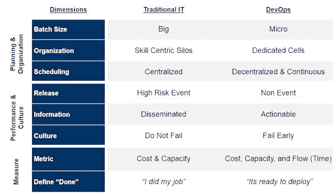

# DevOps 与传统 IT 的比较:八个关键差异

> 原文：<https://devops.com/comparing-devops-traditional-eight-key-differences/>

你可以证明在软件交付生命周期(SDLC)中，价值是在两个地方产生的。第一，当软件被创建(开发)时，第二，当软件被交付给客户并收到反馈时。剩下的就是交通了。将代码从开发人员手中转移到客户手中并获得反馈的速度越快，双方就能实现越多的价值。不要误解我的意思，各种“运输”活动(测试、QA、试运行等)都有好处。).但这些不是创造价值的活动，而是降低风险的过程。

DevOps 组织了解这个价值等式。他们专注于增加价值的流程，围绕这些行动组织自己，并尽最大努力将风险降至最低。传统 IT 也明白这一点——至少在概念上是这样。然而，他们同等重视 SDLC 中的所有阶段，甚至强调错误的阶段。

一般来说，当将开发运维组织与传统 IT 进行比较时，开发运维将在以下八个关键方面拥有不同于传统 IT 的策略和实践:

**策划&组织**

1.  **批量大小:从大批量到小批量**

传统 IT 偏向于做大，这是有充分理由的。首先，大多数开发商店都是从瀑布方法发展而来的，这种方法本质上需要花费大量的时间。其次，由于发布成本高且具有破坏性，operations 每年只允许开发人员使用几个窗口来发布软件。第三，这一点也不性感——做大才是你升职的途径。因此，开发组织通过规划大项目来最大化生产力，这些大项目涉及大量代码，被捆绑(有时很匆忙)成一个版本，并被塞进生产中。

DevOps 组织持相反观点，认为小即是美。他们明白大批量生产本质上是复杂的、有风险的(因为有如此多的移动部件)，并且很难协调。另一方面，小批量是简单的，易于理解和严格测试，风险更小。如果出了问题，影响是最小的，修复起来也更容易更快。换句话说，通过变小，组织能够执行更频繁的发布，并对客户做出更快的响应。

2.  **组织:从以技能为中心的筒仓到专用单元**

传统 IT 是围绕以技能为中心的孤岛组织的。在很大程度上，孤岛是可行的，它们将相似的技能结合在一起，推动更高的利用率，并从规模经济中受益。然而，这些“成本优化”的孤岛在哪里崩溃就在手边。在典型的 IT 环境中，一项新功能至少要经过 3 到 4 个阶段才能被客户接受。一个想法/代码花费 80%的时间等待或在竖井之间来回切换并不罕见。

一个 DevOps 组织也在一个筒仓中运行，但是在不同的横截面上。在这里，团队被安排在“单元”中，由专门的跨职能团队组成，只专注于一个应用程序。通过创建这个由开发人员、测试人员、业务分析师和操作人员组成的自给自足的单元，一个想法可以在没有移交的情况下从一个阶段进入另一个阶段，促进交叉培训/理解(协作的关键)，使团队专注于最终目标，并鼓励“左移”思维。至于利用率和规模效益，响应的[规则指出，周期时间每减少一次，生产率将提高 2 倍，运营成本将降低 20%。](https://www.amazon.com/Competing-Against-Time-Time-Based-Competition/dp/0743253418/ref=sr_1_8?ie=UTF8&qid=1423012886&sr=8-8&keywords=time+compression)

3.  **调度:集中到分散&连续**

高效的调度是传统 IT 组织的核心。由于资源是集中在一起的，项目通常都要求进入中小企业和/或基础设施。为了解决这个问题，企业已经投资于复杂的调度计划系统。虽然这些系统非常敏感，但它们本身就不准确，需要花费大量时间来管理，在某些情况下，还会成为他们试图缓解的瓶颈。

在 DevOps 组织中，调度被推到本地单元级别。更小的批量、专门的团队和自动化流程相结合，使得调度更易于操作。怎么会？首先，预测仅限于非常近的未来(2-3 周),在此期间团队有更好的洞察力。第二，既然是敬业的团队，就没有争人的时间。第三，无需等待基础架构，因为它已经被定义并自动调配。第四，它消除了向管理层反馈上报和决策的耗时过程。

**表演&文化**

4.  **释放:将高风险事件转为非事件**

在传统的 IT 组织中，将软件发布到产品中是一个高风险的提议。它充满了问题、升级和持续的冲突。该过程受到严格的管理，由最高层进行治理，并需要组织所有部分的参与。在发布前后的几个星期里，It 部门设立 24×7 工作人员的作战室并不罕见。

另一方面，DevOps 组织尽可能将软件的发布变成非事件。他们通过每日将代码集成到主干中、自动化测试、确保所有环境同步、减少批量(如上所述)等来降低风险。换句话说，他们只有在确信代码可以在生产中运行之后，才会将代码从一个阶段提升到另一个阶段。因此消除了所有关于发布窗口的宣传，他们能够以更快的速度将新功能投入生产。

5.  **信息:重点在于传播和可操作性**

这两种类型的组织都生成并共享大量数据。区别在于团队使用数据的方式。在传统的 IT 中，信息由专家(例如运营团队)生成，与其他数据捆绑在一起形成一个大规模的报告，经过管理层批准，然后与其他经理共享，然后由他们将报告发送给他们的专家(测试人员、开发人员等)。).在大多数情况下，报告未被阅读，只是因为数据太多，不够及时，和/或没有正确的数据。换句话说，信息被共享但很少被消费，很少被用来采取任何行动。

在 DevOps 组织中，收集和创建数据的是团队单元。由于数据将在本地使用，他们只收集团队认为必要的数据(也是自动化的)。由于数据是在团队内部处理的，它消除了创建冗长报告、经理批准和排队时间(坐在一些人的电子邮箱中)的时间滞后。因此，团队能够快速阅读数据并做出反应，从而缩短反馈时间。

6.  **文化:不要失败与过早失败**

传统 IT 从根本上来说是一个规避风险的组织。首席信息官的首要任务是不损害业务。这就是它投资如此多繁文缛节、流程、审批等的原因。都专注于防止失败。然而，尽管进行了所有这些投资，但它有一个糟糕的记录——30%的新项目交付延迟，50%的新增强由于质量问题而被取消，40%的延迟是由基础设施问题造成的。

DevOps 组织也厌恶风险，但他们也明白失败是不可避免的。因此，他们宁愿选择失败的时间和方式，而不是试图消除失败。他们更喜欢小失败，早失败，快速恢复。他们围绕它建立了自己的结构和流程。同样，我们在本文中提到的构建模块——来自测试驱动开发、日常集成、可部署、小批量、单元结构、自动化等。所有这些都强化了这种心态。

**测量**

7.  **度量:成本&产能到成本，产能，&流量**

孤岛适用于传统 IT，因为它们与 IT 的衡量模型(成本和容量)直接相关。它是根据用最少的钱(成本)能完成多少工作(能力)来衡量的。难怪过去二十年来，在保持产能不变的同时削减成本在 It 界风靡一时。这也是外包如此受欢迎的原因之一。

虽然这种模式非常适合稳定的遗留应用程序，但较新的“参与系统”应用程序需要一个额外的指标-时间元素。DevOps 组织理解这种范式转变，并增加了“流”作为额外的度量。流程迫使一个组织审视其端到端的周期时间，确定浪费的领域，计算真正的生产时间，量化质量，并专注于增加最大价值的活动。

8.  **完成的定义:“我完成了我的工作”与“可以部署了”**

度量差异的另一个来源是两种类型的组织如何定义完成。在传统的 IT 中，完成被定义为专家“仅仅”做他们的工作并移交。从本质上说，他们的工作更侧重于满足移交截止日期，而不是确保所做的事情是可部署的。这种不同的定义导致了一些坏习惯，比如低于标准的工作，质量损失，相互指责，以及整个次优化的过程。

摆脱相互指责的心态是 DevOps 组织更喜欢创建专门的跨职能团队的另一个原因。在这个“单元”结构中代表了 IT 各个部分的每个成员，并且他们所有人都只对一件事情负责，他们最终都只有一个完成的定义——将高质量的软件推向市场。

如果您想了解关于这个主题的更多信息，请参加我在 [IBM InterConnect 2015](https://www.ibm.com/cloud-computing/us/en/interconnect/) 举办的活动。我将主持几个关于 DevOps 的研讨会。

* * *

## 关于作者/穆斯塔法·卡帕迪亚

 Mustafa Kapadia 是 IBM devo PS practice 的服务线负责人，这是一项专注于帮助大型企业转变软件应用交付的业务咨询业务&。他在技术领域有超过 17 年的经验。空间，既是服务提供商，又是管理顾问。

在加入 IBM 之前，Mustafa 是德勤战略与运营部的管理顾问。他住在旧金山湾区，是一个狂热的博主(如果时间允许的话)，一个演说家，也是初创企业的顾问。

连接穆斯塔法[领英](https://www.linkedin.com/in/kapadiamustafa) *|* [推特](https://twitter.com/mkapadiatweets)