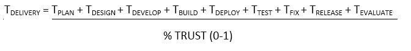

# DevOps 的简单数学

> 原文：<https://devops.com/the-simple-math-of-devops/>

我们生活在一个充满信息的社会，非常依赖于我们周围发生的各种技术创新。在这种情况下，随着消费者之间的联系越来越紧密，他们可以获得更多的信息和选择。他们希望随时都能获得快速一致的信息。同样，我们的业务领导希望他们的 IT 团队构建相关的应用程序，并通过出色的客户体验领先于客户的需求。

我和我的 IBM 同事一直在与主要的企业客户密切合作，因为他们开始了他们的 DevOps 转换工作。我们发现，在受到移动、大数据、分析、云和物联网技术的影响后，需要为其团队设定新路线的决策者很少能产生共鸣的关键点和信息。

那么 DevOps 到底有什么吸引人的地方呢？首先也是最重要的一点是，DevOps 完全是为了实现速度和价值。现在速度是王道，因为我们合作的许多商业领袖都面临尽快交付价值的压力。然而，由于技术债务的高成本，他们已经到了一个速度必须是可持续的状态。随着移动应用程序的出现，走出组织去完成高优先级的关键项目不再是一件容易的事情。他们需要一种基于现有能力的整体方法。

这和数学有什么关系？事情是这样的，每个人都在努力减少传递价值和获得反馈的时间。我们可以把交货时间想成下面的等式。

T [交付] = T [计划] + T [设计] + T [开发] + T [构建] + T [部署] + T [测试] + T [修复] + T [发布] + T [评估]

在完全自动化的理想世界或软件工厂中，T [交付]通过最小化完成交付所需的每个任务的时间来优化。大多数组织都遵循基于这个简单数学的 SDLC。他们估计完成每个部分所需的时间，然后整个项目计划就是各个部分的总和。此外，他们倾向于将工作定义为相对较大的块或者预先定义的工作风格，这必然会增加每项任务的时间(T [X] )。因此，当在预计时间内完成一个项目时，这个行业有大约 50%(或者更糟)的失败率。这造成了很多困难，因为企业不能指望 IT 在预计的时间范围内向客户交付价值，更不用说速度了。

因为应用程序交付是一组非常人性化的任务，所以信任是决定价值实现速度的关键因素。当你画出在给定的客户地点如何完成工作的价值流图时，这是非常明显的。当软件交付团队的成员在工作流过生命周期的过程中失去对工作有效性的信任时，就会引入大量的返工和浪费。用数学术语来说，我们的等式变成了:

也就是说，我们在交付周期中所做的任务受到我们在从一个到另一个的移交中的信任程度的影响。如果我们的信任度为零，那么我们的 T [交付量]将是无穷大(除以零)。100%的信任和我们的测试[交付]将只受到每项任务的执行速度的限制。

检查代表我们在研讨会中从客户那里听到的内容的场景:

“在一个给定的项目团队中，计划有大约 50%的机会是正确的，设计大约有 85%是正确的，开发人员将有大约 90%的实现正确，测试人员有大约 90%的测试用例正确，发布团队有大约 95%的可靠性将正确的东西放在一起发布，那么您的信任因素是这样的

. 5 x .85 x .9 x .9 x .95 = 32%的信任度”(而且这比我们通常听到的要好得多)

哎哟！无论我们完成所有交付任务的速度有多快，都需要 3 倍的时间。换句话说，我们总是受到信任因素的限制。这个乘数与我们必须添加到等式中的额外任务一起发挥作用，以平衡信任的缺乏。那么我们的等式就变成了这样:

T [交付] = T [计划] + T [重新审视] + T [设计] + T [拱审] + T [开发] + T [技术债务] + T [构建] + T [重建] + T [部署] + T [返工] + T [测试] + T

这就是我们的客户目前面临的问题。由于缺乏信任，我们的交付过程中出现了许多浪费的任务、检查和平衡。

那么，DevOps 如何帮助解决这个问题呢？这很简单。DevOps 方法是正面解决信任问题，同时减少任务时间(T [x] )以缩短交付的总时间。例如，如果我们应用 DevOps 的实践，将工作分成小块，尽早发布给用户，并获得反馈，我们可以立即影响整个 T [交付。]这是因为我们通过这种实践对分子和分母产生了积极的影响。也就是说，通过限制范围，我们使它更容易理解，更容易转换到工作代码、测试和部署，更快地获得反馈，并且更有可能知道我们是否在正确的轨道上。

其他做法也一样！

> 关键是找到平衡，对于给定的组织和他们当前的瓶颈&浪费，应用什么实践来最大化这个等式。

DevOps 实践解决了三个主要影响点:

价值实现的速度取决于信任

信任通过以下方式实现:

1.  清晰:对预期结果的清晰定义
2.  协作:团队范围的沟通和可见性
3.  一致性:系统的和可重复的步骤

当一个团队能够掌握这三个要素时，执行每项任务的时间将会缩短，信任度将会增加。DevOps 实践影响这些建立信任的要素:

清晰度:

*   将工作分成更小的块并迭代
*   寻求最小可行产品(MVP)
*   定义清晰的结果，“赞助”用户和回放(设计思维)
*   减少对松散耦合架构(容器、微服务、SOA)的依赖

协作:

*   组建跨职能团队(端到端)
*   使用大的视觉辐射器
*   对所有的开发资产——需求、代码、可部署的资产、基础设施代码等——有一个“真实的单一来源”
*   通过指标保持透明
*   经常计划和重新安排优先级
*   积极寻求用户反馈

一致性

*   自动化，自动化，自动化
*   通过用自动化替代手动任务来持续改进

通过消除因缺乏信任而产生的瓶颈和浪费，可以加快价值实现。组织的关键是要认识到，当试图以更高的速度前进时，当前的实践已经达到极限，是不可持续的。大数据、分析、云、移动和 IOT 正在形成一场完美风暴，要么推动客户快速进行开发运维转型，要么成为这场风暴的受害者。尝试使用这个简单的数学来帮助组织了解如何前进，以及如何应用我们的 IBM 解决方案来实现价值的速度。

今年，我有幸与我们的 DevOps 首席技术官 Sanjeev Sharma、我们的客户思想领袖(如 Nationwide 的 Carmen DeArdo)以及我们在世界各地解决 DevOps 转型问题的现场团队合作。Sanjeev，Carmen 和我决定在一个由三部分组成的博客中总结我们的经历。这是三部分系列的第一部分。

要了解更多关于 IBM devo PS 方法的信息，请查看[www.ibm.com/devops](https://www.ibm.com/devops)。此外，观看最近变速 DevOps 网络直播的[重播](https://ibm.biz/devopswebcastondemand1)，我有机会与 Sanjeev Sharma 和 Carmen DeArdo 一起介绍。

* * *

关于作者/李·里德

 Lee Reid，IBM 高级 IT 专家，是一名高级解决方案架构师，专注于软件工程工具、软件交付解决方案、应用生命周期管理和 DevOps 的实际应用。他在软件工程、设计、编程、测试、开发、工具&方法、团队领导和战略规划方面拥有超过 25 年的经验。