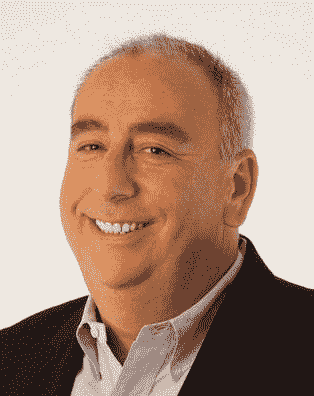
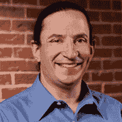
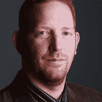

# 网络研讨会:DevOps 商店的安全基础知识

> 原文：<https://devops.com/webinar-security-fundamentals-for-devops-shops/>

DevOps 方法没有适用于所有组织的单一途径，但是 DevOps 精英使用的基本原则和技术给了他们独特的优势。将 DevOps 原则应用于安全运营不是一次性的实践或独立的过程，而是一种全新的方法，需要跨部门协作的新方式。在对您的日常安全实践和操作进行根本性改变时，总会有学习曲线和初始障碍，但是如果做得正确，收益远远超过成本。

Join DevOps.com Editor-in-Chief Alan Shimel, Evident.io cofounder and CEO Tim Prendergast, and former Chief Security Architect and a Distinguished Engineer for Dell Software David Mortman, as they discuss the fundamentals required to renovate your organization’s processes and behaviors to gain huge efficiencies for your security operations in the cloud.

* * *

## 日期:2015 年 11 月 5 日星期四

## 时间:东部标准时间下午 1:00

## 报名链接:([点此](https://attendee.gotowebinar.com/register/8079651615580342786))

* * *

## 你的主持人

**Alan Shimel，总编辑 DevOps.com**，Alan 是安全和技术界经常被提及的人物，也是行业和政府活动中广受欢迎的演讲者，他将强大的商业背景与深厚的技术知识相结合，帮助建立了几家成功的技术公司。

## 关于小组成员

****

**戴尔软件首席安全架构师 David Mortman**

David Mortman 是前首席安全架构师、戴尔软件的杰出工程师和 Securosis 的特约分析师。在此之前，他是 C3 有限责任公司的安全和运营总监。David 和他的团队以前是 Siebel Systems，Inc .的首席信息安全官，负责 Siebel 的全球 IT 安全基础设施，包括内部和外部。Mortman 先生是 RSA、BlackHat 和 DEFCON 等会议的定期发言人。

**Tim Prendergast，Evident.io 联合创始人**

首席执行官蒂姆·普伦德加斯特共同创立了 [Evident.io](http://evident.io/) 来帮助其他人避免他在帮助 Adobe 大规模采用云时所忍受的痛苦。经过多年在 AWS 中构建、运营和保护服务，他开始让各种规模的公司都可以使用和重复使用安全性。Tim 曾领导 Adobe、Ingenuity、Ticketmaster 和 McAfee 的技术团队。