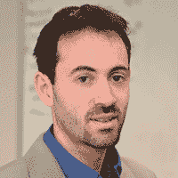

# 网上研讨会:世界上最安全的 15 家银行之一如何战胜技术颠覆者

> 原文：<https://devops.com/rabobank-software-delivery/>

金融服务业在过去 15 年中的变化超过了过去 1000 年。客户希望通过与提供商的安全移动交互持续访问；不再发生在银行内部的互动。与此同时，金融服务公司正在应对日益增多的监管。

加入 Rabobank Linux 基础设施服务经理 Sander Ettema 和 XebiaLabs 产品副总裁 Andrew Phillips 的行列，了解 Rabobank 如何通过实施敏捷开发、持续集成和持续交付来转变其软件交付。学习如何在这个时代保持领先，竞争格局正在以光速变化，并迅速超越其他金融服务公司，包括谷歌和苹果等科技巨头。

参加并学习如何:

*   创造创新文化，让您的 IT 组织适应快速变化。
*   借助一个开放的持续交付平台，实现 IT 软件交付环境的现代化，从而满足客户的期望。
*   快速开始，利用您现有的 IT 基础架构快速获得结果，并了解一路上需要关注的关键指标。
*   在高度监管的金融服务环境中引领 IT 转型。

* * *

## 录制时间:2015 年 7 月 22 日星期三

## 录音

## 

[https://www.youtube.com/embed/WSFwSiyKEMU?rel=0&showinfo=0](https://www.youtube.com/embed/WSFwSiyKEMU?rel=0&showinfo=0)

## 幻灯片

[seoslides embed_id=”4d4ddd2a9c8e” script_src=”https://devops.com/embed-script/8598/8629/” overview_src=”https://devops.com/slides/8598/” site_src=”https://devops.com” site_title=”DevOps.com” title=” ” /]

* * *

## 你的主人

** Alan Shimel，主编 DevOps.com**，Alan Shimel 是安全和技术界经常被提及的人物，也是行业和政府活动中广受欢迎的演讲者，他将强大的商业背景与深厚的技术知识相结合，帮助建立了几家成功的技术公司。

## 关于小组成员

** 安德鲁菲利普斯**

**XebiaLabs 产品副总裁**

Andrew Phillips 负责 XebiaLabs 的产品管理，推动产品方向、定位和规划。他是 DevOps、云和交付自动化领域的倡导者和思想领袖。

**砂粒所镶嵌的**

**荷兰合作银行基础设施 Linux 服务部经理**

Sander Ettema 为 Rabobank 管理 Linux/Unix 基础设施服务，Rabobank 是食品和农业融资以及可持续发展导向型银行业务的全球领导者。除了是 DevOps 工作组的成员之外，Sander 还负责监管 Linux/Unix/Appliances 托管、Java 持续交付服务以及日志管理服务。